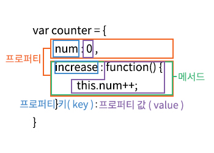

># 객체 리터럴
## 10.1 객체란?
#### 원시 값을 제외한 나머지 값(함수,배열, 정규표현식 등)은 모두 객체다.

`원시 타입` : 단 하나의 값만 나타냄

`객체 타입` : 다양한 타입의값을 하나의 단위로 구성한 복합적인 자료구조


#### 객체는 0개 이상의 프로퍼티로 구성된 집합

`프로퍼티` : 키(key)와 값(value)으로 구성됨

<p align="center">
    
</p>

자바스크립트에서 사용할 수 있는 모든 값은 프로퍼티 값이 될 수 있다

함수도 프로퍼티 값으로 사용 할 수 있다<br>
프로퍼티 값이 함수 일 경우 일반 함수와 구분하기 위해서 `메서드` 라고 부른다.

<p align="center">
    
</p>

프로퍼티와 메서드 역할

- 프로퍼티 : 객체의 상태를 나타내는 값
- 메서드 : 프로퍼티를 참조하고 조작할 수 있는 동작

## 10.2 객체 리터럴에 의한 객체 생성
자바스크립트는 프로토타입 기반 객체 지향 언어로서 다양한 객체 생성 방법을 지원함

#### 1. 객체 리터럴
```javascript
var person = {
    name: "victolee",
    email: "asdf@example.com",
    birth: "0225"
};
```

#### 2. Object 생성자 함수
```javascript
var person = new Object();

person.name = "victolee";
person.email = "asdf@example.com";
person.birth = "0225";
```
#### 3. 생성자 함수
```javascript
function Person(name,email){
    this.name = name;
    this.email = email;
    this.walk = "직립 보행"
};

var person1 = new Person("victolee", "foo@example.com");
```
#### 4. Object.create 메서드
```javascript
Object.create(proto[, propertiesObject]);
```
참고자료 https://developer.mozilla.org/ko/docs/Web/JavaScript/Reference/Global_Objects/Object/create

#### 5. 클래스
```javascript
class Person {
	constructor(name, age, hasJob) {
		this.name = name;
		this.age = age;
		this.hasJob = hasJob;
	}
	speak() {
		console.log("hello");
	}
	eat() {
		console.log("먹는다");
	}
}


let person3 = new Person("aaa", 30, false);
```
<br>

- 객체 리터럴의 중괄호는 코드블록을 의미하지 않는다
- 객체 리터럴은 값으로 평가되는 표현식이다
- 객체 리터럴의 닫는 중괄호 뒤에는 세미콜론을 붙인다.
- 객체 생성한 이후에 프로퍼티를 동적으로 추가할 수 있다.


## 10.3 프로퍼티
#### 객체는 프로퍼티의 집합이며, 프로퍼티는 키와 값으로 구성됨
```javascript
var person = {
    // 프로퍼티 키는 name, 프로퍼티 값은 'Lee'
    name: 'Lee',
    // 프로퍼티 키는 age, 프로퍼티 값은 20
    age: 20
}
```
### ⚠️객체 생성 시 주의할 점
- 프로퍼티를 나열할 때는 쉼표( , )로 구분함(마지막 프로퍼티 뒤에는 사용 안해도됨)
- 식별자 네이밍 규칙을 따르지 않는 이름에는 반드시 따옴표(' ', " ")를 사용 해야한다.

<br>


```javascript
var person = {
  firstName: 'Ung-mo', // 식별자 네이밍 규칙을 준수하는 프로퍼티 키
  'last-name': 'Lee'   // 식별자 네이밍 규칙을 준수하지 않는 프로퍼티 키
};

console.log(person); // {firstName: "Ung-mo", last-name: "Lee"}
```

#### 네이밍 규칙을 따르지 않고 따옴표도 사용하지 않을 경우 에러가 발생한다 <br>
ex) last-name
 <br>- 는 연산자가 있는 표현식을 해석함
```javascript
var person = {
  firstName: 'Ung-mo',
  last-name: 'Lee' // SyntaxError: Unexpected token -
};
```

#### 프로퍼티 키를 동적으로 생성 할수 있다<br>
프로퍼티 키로 사용할 표현식을 대괄호([...])로 묶어야 함

```javascript
var obj = {};
var key = 'hello';

// ES5: 프로퍼티 키 동적 생성
obj[key] = 'world';
// ES6: 계산된 프로퍼티 이름
// var obj = { [key]: 'world' };

console.log(obj); // {hello: "world"}
```
#### 빈 문자열을 프로퍼티 키로 사용해도 에러가 발생하지 않음(권장하지 않음)
```javascript
var foo = {
  '': ''  // 빈 문자열도 프로퍼티 키로 사용할 수 있다.
};

console.log(foo); // {"": ""}
```

#### 프로퍼티 키로 숫자 리터럴을 사용하면 암묵적으로 문자열로 변환된다

```javascript
var foo = {
  0: 1,
  1: 2,
  2: 3
};

console.log(foo); // {0: 1, 1: 2, 2: 3}
```
#### 예약어(var, function등)을 프로퍼티 키로 사용해도 에러가 발생하지 않음(권장하지 않음) 

```javascript
var foo = {
  var: '',
  function: ''
};

console.log(foo); // {var: "", function: ""}
```
#### 프로퍼티 키를 중복선언하면 나중에 선언한 프로퍼티로 덮어쓴다(에러발생 x)

```javascript
var foo = {
  name: 'Lee',
  name: 'Kim'
};

console.log(foo); // {name: "Kim"}
```

## 10.4 메소드
메서드는 객체에 묶여 있는 함수를 의미한다

```javascript
var circle = {
  radius: 5, // ← 프로퍼티

  // 원의 지름
  getDiameter: function () { // ← 메서드
    return 2 * this.radius; // this는 circle을 가리킨다.
  }
};

console.log(circle.getDiameter()); // 10
```

## 10.5 프로퍼티 접근
프로퍼티 접근 방법 2가지
- 마침표 표기법
- 대괄호 표기법

```javascript
var person = {
  name: 'Lee'
};

// 마침표 표기법에 의한 프로퍼티 접근
console.log(person.name); // Lee

// 대괄호 표기법에 의한 프로퍼티 접근
console.log(person['name']); // Lee
```
대괄호 표기법 사용할 때 대괄호 안에 따옴표를 사용한 문자열이어야한다<br>
따옴표를 사용 하지 않으면 자바스크립트 엔진에서 식별자로 해석한다

```javascript
var person = {
  name: 'Lee'
};

console.log(person[name]); // ReferenceError: name is not defined
```

객체에 존재하지 않는 프로퍼티에 접근하면 undefined을 반환한다.

```javascript
var person = {
  name: 'Lee'
};

console.log(person.age); // undefined
```

⚠️ 네이밍 규칙을 준수하지 않고 따옴표로 생성된 프로퍼티에 접근하려면 반드시 대괄호 표기법을 사용해야한다 

```javascript 
var person = {
  'last-name': 'Lee',
  1: 10
};

person.'last-name';  // -> SyntaxError: Unexpected string
person.last-name;    // -> 브라우저 환경: NaN
                     // -> Node.js 환경: ReferenceError: name is not defined
person[last-name];   // -> ReferenceError: last is not defined
person['last-name']; // -> Lee

// 프로퍼티 키가 숫자로 이뤄진 문자열인 경우 따옴표를 생략할 수 있다.
person.1;     // -> SyntaxError: Unexpected number
person.'1';   // -> SyntaxError: Unexpected string
person[1];    // -> 10 : person[1] -> person['1']
person['1'];  // -> 10
```

## 10.6 프로퍼티 값 갱신

```javascript
var person = {
  name: 'Lee'
};

// person 객체에 name 프로퍼티가 존재하므로 name 프로퍼티의 값이 갱신된다.
person.name = 'Kim';

console.log(person);  // {name: "Kim"}
```
## 10.7 프로퍼티 동적 생성
```javascript
var person = {
  name: 'Lee'
};

// person 객체에는 age 프로퍼티가 존재하지 않는다.
// 따라서 person 객체에 age 프로퍼티가 동적으로 생성되고 값이 할당된다.
person.age = 20;

console.log(person); // {name: "Lee", age: 20}
```
## 10.8 프로퍼티 삭제
프로퍼티 삭제할 때는 `delete 연산자`를 사용 한다<br>
만약 존재하지 않는 값을 삭제하면 아무런 에러 없이 무시된다

```javascript
var person = {
  name: 'Lee'
};

// 프로퍼티 동적 생성
person.age = 20;

// person 객체에 age 프로퍼티가 존재한다.
// 따라서 delete 연산자로 age 프로퍼티를 삭제할 수 있다.
delete person.age;

// person 객체에 address 프로퍼티가 존재하지 않는다.
// 따라서 delete 연산자로 address 프로퍼티를 삭제할 수 없다. 이때 에러가 발생하지 않는다.
delete person.address;

console.log(person); // {name: "Lee"}
```
## 10.9 ES6에서 추가된 객체 리터럴의 확장 기능
### 🖐️프로퍼티 축약표현
프로퍼티 값이 변수로 사용될 때 프로퍼티 키와 동일한 이름일 경우 프로퍼티 키를 생략할 수 있다
```javascript
// ES5
var x = 1, y = 2;

var obj = {
  x: x,
  y: y
};

console.log(obj); // {x: 1, y: 2}
```
위 아래 코드 비교해 볼 것
```javascript
// ES6
let x = 1, y = 2;

// 프로퍼티 축약 표현
const obj = { x, y };

console.log(obj); // {x: 1, y: 2}
```
### 🖐️계산된 프로퍼티 이름
평가되는 표현식을 사용해 프로퍼티 키를 동적으로 생성할 수도 있다<br>
단 프로퍼티 키로 사용할 표현식을 대괄호로 묶어야함. 이를 계산된 프로퍼티 이름이라고 한다.

### `ES5`
```javascript
// ES5
var prefix = 'prop';
var i = 0;

var obj = {};

// 계산된 프로퍼티 이름으로 프로퍼티 키 동적 생성
obj[prefix + '-' + ++i] = i;
obj[prefix + '-' + ++i] = i;
obj[prefix + '-' + ++i] = i;

console.log(obj); // {prop-1: 1, prop-2: 2, prop-3: 3}
```

### `ES6` 에서는 프로퍼티 내부에서 생성 가능
```javascript
// ES6
const prefix = 'prop';
let i = 0;

// 객체 리터럴 내부에서 계산된 프로퍼티 이름으로 프로퍼티 키 동적 생성
const obj = {
  [`${prefix}-${++i}`]: i,
  [`${prefix}-${++i}`]: i,
  [`${prefix}-${++i}`]: i
};

console.log(obj); // {prop-1: 1, prop-2: 2, prop-3: 3}
```
### 🖐️메서드 축약표현
### `ES5`
```javascript
// ES5
var obj = {
  name: 'Lee',
  sayHi: function() {
    console.log('Hi! ' + this.name);
  }
};

obj.sayHi(); // Hi! Lee
```

### `ES6` 에서는 function 키워드를 생략할 수 있다
```javascript
// ES6
const obj = {
  name: 'Lee',
  // 메서드 축약 표현
  sayHi() {
    console.log('Hi! ' + this.name);
  }
};

obj.sayHi(); // Hi! Lee
```