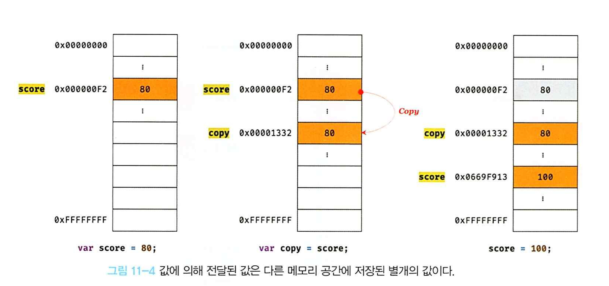
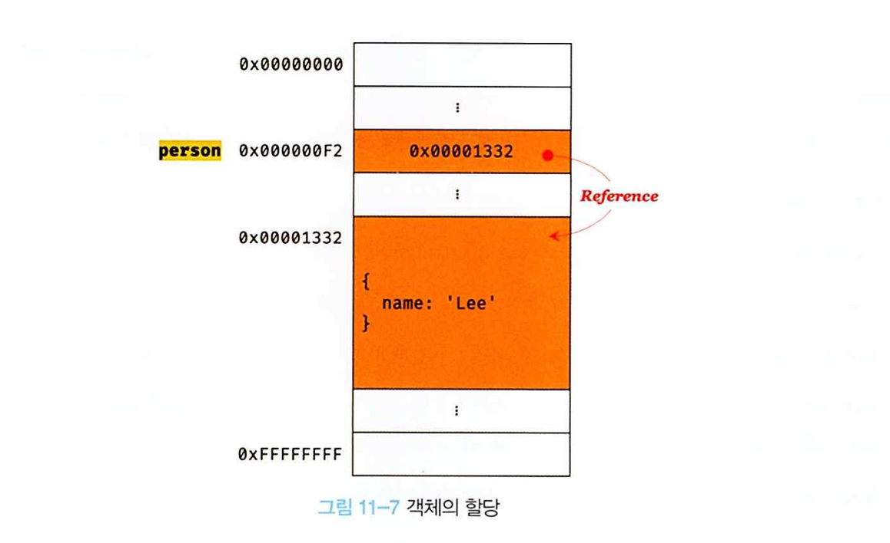
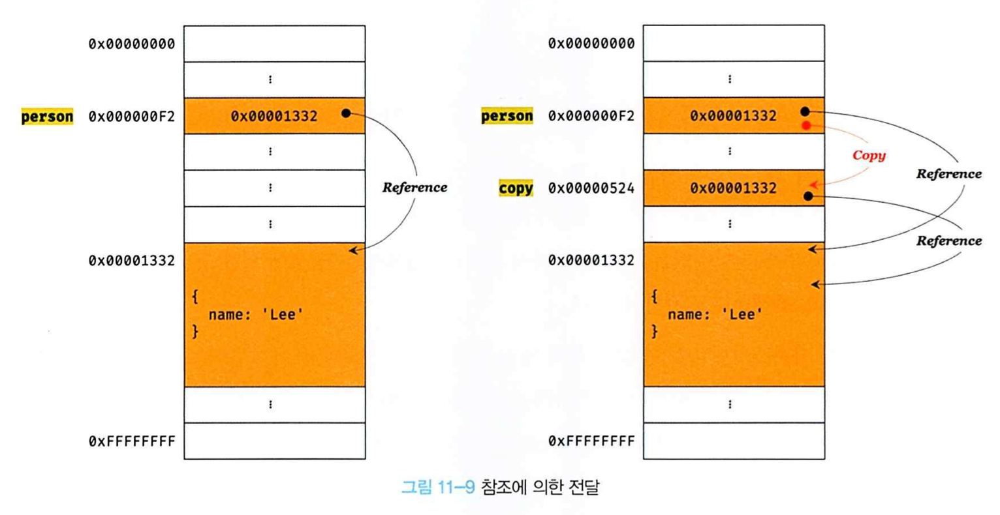

> # 11장 원시 값과 객체의 비교

자바스크립트 데이터 타입은 `원시 타입(Primitive type)`과 `객체 타입(Object/Reference Type)`으로 구성


| 원시 값 | 객체 |
| --- | --- |
| `변경 불가능한 값(immutable value)` | `변경 가능한 값(mutable value)` |
| 원시 값을 변수에 할당하면 변수에는 `실제 값`이 저장 | 객체를 변수에 할당하면 변수에는 `참조 값`이 저장 |
| 원시 값을 갖는 변수를 다른 변수에 할당하면 원본의 원시 값이 복사되어 전달 | 객체를 가리키는 변수를 다른 변수에 할당하면 원본의 참조 값이 복사되어 전달 |

<br/>

## 😀 원시 값

### 1. 변경 불가능한 값
한 번 생성된 원시 값은 읽기 전용 값으로서 변경할 수 없으며, 이러한 특성은 데이터의 신뢰성을 보장.

- `변수` : 값을 저장하기 위해 확보된 메모리 공간 자체 또는 식별하기 위해 붙인 이름
- `상수` : 재할당이 금지된 변수
- `값` : 변수에 저장된 데이터(표현식이 평가되어 생성된 결과)


<p align="center">
    
</p>

원시 값을 할당한 변수에 새로운 원시 값을 재할당하면 기존에 저장되어 있는 재할당 이전 원시 값을 변경하는 것이 아니라, 

**새로운 메모리 공간을 확보하고 재할당한 원시 값을 저장 후, 변수는 새롭게 재할당한 원시 값을 가리킨다.**

<br/>

### 2. 문자열과 불변성

- 원시 값을 저장하려면 먼저 확보해야 하는 메모리 공간의 크기를 결정해야 함.

- `문자열`은 0개 이상의 문자(character)로 이뤄진 집합을 말하며, 1개의 문자는 2바이트의 메모리 공간에 저장. *(ECMAScript 사양에 문자열 타입(2바이트)과 숫자 타입(8바이트) 외의 원시 타입은 크기를 명확히 규정하고 있지 않아 부라우저 제조사 구현에 따라 달라진다. UTF-8 인코딩 방식을 통해 전세계 언어의 글자 코드표를 인코딩 해줌)*

- 문자열은 **유사 배열 객체이면서 이터러블**이므로 배열과 유사하게 각 문자에 접근할 수 있음.

``` js
// 💡유사 배열 객체
// 배열처럼 익덱스로 프로퍼티 값에 접근할 수 있고 length 프로퍼티를 갖는 객체

var str = 'string';

// 인덱스를 사용해 각 문자에 접근 가능
console.log(str[0]); // s

// 원시 값인 문자열이 객체처럼 동작한다.
console.log(str.length); // 6
console.log(str.toUpperCase()); // STRING

// 원시값이므로 변경 불가, 에러는 발생하지 않음.
str[0] = 'X';
console.log(str); // STRING
```

이미 생성된 문자열의 일부 문자를 변경하려고 해도 반영되지 않는다. 

변수에 새로운 문자열을 재할당하는 것은 물론 가능.

<br/>

### 3. 값에 의한 전달
변수에 원시 값을 갖는 변수를 할당하면 할당받는 변수에는 할당되는 변수의 원시 값이 복사되어 전달된다.

``` js
var score = 80;
var copy = score;

console.log(score); // 80
console.log(copy); // 80
console.log(score === copy); // true

score = 100;
console.log(score); // 100
console.log(copy); // ? -> 80
```

💡 변수에 변수를 할당 했을 때 무엇이 어떻게 전달되는가?

copy = score 에서 score는 변수 값 80으로 평가되므로, copy 변수에도 80이 할당된다. 

이때 새로운 숫자 값 80이 생성되어 copy 변수에 할당되는 것이다.


<p align="center">
    
</p>


🤔 `값에 의한 전달`이라는 용어는 사실 자바스크립트를 위한 용어는 아니다. '공유에 의한 전달'이라고 표현하는 경우도 있다. 엄격하게 표현하면, **변수에는 값이 전달되는 것이 아니고 메모리 주소가 전달되기 때문**이다. 이는 변수와 같은 식별자는 값이 아니라 메모리 주소를 기억하기 때문이다.

중요한 것은 변수에 원시 값을 갖는 변수를 할당하면 변수 할당 시점이든, 두 변수 중 어느 하나의 변수에 값을 재할당하는 시점이든 결국은 `두 변수의 원시 값은 서로 다른 메모리 공간에 저장된 별개의 값이 되어 어느 한 쪽에서 재할당을 통해 값을 변경하더라도 서로 간섭할 수 없다`는 것이다.


<br/>

## 😀 객체

객체는 프로퍼티의 개수가 정해져 있지 않으며 동적으로 추가되고 삭제할 수 있다. 또한 프로퍼티의 값에도 제약이 없으므로 확보해야 할 메모리 공간의 크기를 사전에 정해둘 수 없다.

🤔 자바, C++ 같은 클래스 기반 객체지향 프로그래밍 언어와 다르게, 자바스크립트는 `클래스 없이 객체를 생성`할 수 있으며 객체가 생성된 이후라도 `동적으로 프로퍼티와 메서드를 추가`할 수 있다.


### 1. 변경 가능한 값

객체(참조) 타입의 값, 즉 객체는 변경 가능한 값.

객체를 할당한 변수에는 `생성된 객체가 실제로 저장된 메모리 공간의 주소`가 저장되어 있다. 이를 `참조 값`이라고 하며, 변수는 참조 값을 통해 객체에 접근함.

<p align="center">
    
</p>

객체는 재할당 없이 직접 변경 가능함. 프로퍼티를 동적으로 추가하거나 갱신하고 삭제할 수도 있음. 이때 `재할당을 하지 않았으므로 객체를 할당한 변수의 참조 값은 변경되지 않음.` 여러 개의 식별자가 하나의 객체를 공유할 수도 있는 부작용 존재.


💡 얕은 복사와 깊은 복사

- 객체를 프로퍼티 값으로 갖는 객체의 경우 [얕은 복사]는 참조 값 까지만 복사 & [깊은 복사]는 객체에 중첩되어 있는 객체까지 모두 복사.

- 원시 값을 할당한 변수를 다른 변수에 할당하는 [깊은 복사]

- 객체를 할당한 변수를 다른 변수에 할당하는 [얕은 복사]


<br/>

### 2. 참조에 의한 전달

객체를 가리키는 변수(원본, person)을 다른 변수(사본, copy)에 할당하면 원본의 참조 값이 복사되어 전달된다. 이를 `참조에 의한 전달`이라 함.

<p align="center">
    
</p>

원본을 사본에 할당하면, 원본의 참조 값을 복사해서 사본에 저장한다. 

각자 저장된 메모리 주소는 다르지만, 동일한 하나의 객체 참조 값을 공유한다.

❗️ 원본 또는 사본 중 어느 한 쪽에서 `객체를 변경(프로퍼티의 값을 변경하거나 추가/삭제)하면 서로 영향을 주고 받음`


## 😀 QUIZ

``` js
var person1 = {
    name: 'Lee'
};

var person2 = {
    name: 'Lee'
}

console.log(person1 === person2); // ?
console.log(person1.name === person2.name); // ? 
```

<details>
<summary>😎 정답</summary>
<div markdown="1">

console.log(person1 === person2); // `false`

객체 리터럴은 평가될 때마다 객체를 생성함.

person1과 person2가 가리키는 객체는 내용은 같으나 다른 메모리에 저장된 별개의 객체.

<br/>

console.log(person1.name === person2.name); // `true`

프로퍼티 값을 참조하는 person1.name과 person2.name은 값으로 평가될 수 있는 표현식.

모두 원시 값 'Lee'로 평가되므로 true.

</div>
</details>