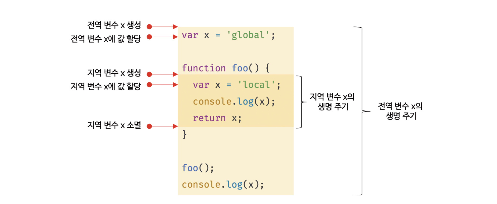

> # 📖지역 변수의 문제점

## 14.1 변수의 생명 주기

### 1. 지역 변수의 생명 주기

변수는 생물과 유사하게 생성되고 소멸되는 생명주기(life cycle)이 있다.

변수에 생명 주기가 없다면 프로그램이 종료할 때까지 영원히 메모리 공간에 점유하게 된다.

함수 내부에서 선언된 지역변수는 함수가 종료하면 소멸한다


예제)
```javascript
function foo() {
  var x = 'local';
  console.log(x); // local
  return x;
}

foo();
console.log(x); // ReferenceError: x is not defined
```

<p align="center">
    
</p>

`지역 변수의 생명 주기는 함수의 생명 주기와 일치한다.`

변수 생명 주기는 메모리 공간이 확보된 시점부터 메모리 공간이 해제되어 가용 메모리 풀에 반환되는 시점까지다.

문제)
```javascript
var x = 'global';

function foo() {
  console.log(x); // ①
  var x = 'local';
}

foo();
console.log(x); // global
```

<details>
<summary>정답</summary>
호이스팅은 스코프를 단위로 동작한다.
<p align="left">
    
</p>
</details>


### 2. 전역 변수의 생명 주기

- 전역 코드는 함수 호출과 같이 전역 코드를 실행하는 특별한 진입점이 없고 코드가 로드되자마자 곧바로 해석되고 실행된다.

- 전역코드에는 반환문을 사용할 수 없으므로 마지막 문이 실행되어 더 이상 실행할 문이 없을 때 종료한다.

- var 키워드로 선언한 전역 변수는 전역 객체의 프로퍼티가 된다.<br>
`즉 전역 변수의 생명 주기가 전역객체의 생명 주기와 일치한다.`

브라우저 환경에서 전역 객체는 window이므로 전역 변수는 전역 객체 window의 프로퍼티이다.

<p align="left">
    
</p>

## 14.2 전역 변수의 문제점

### 1. 암묵적 결합<br>
`변수의 유효 범위가 크면 클수록 코드의 가독성은 나빠지고 의도치 않게 상태가 변결될 수 있는 위험성이 높다`
### 2. 긴 생명 주기
- 전역변수: 생명주기가 길고 메모리 리소스도 오랜기간 소비한다. 그리고 상태를 변경할 시간도 많고 기회도 많다.
- 지역변수: 생명주기가 짧고 메모리 리소스도 짧은 기간만 소비하고 상태 변경에 의한 오류가 발생할 확률도 낮아진다. 
### 3. 스코프 체인 상에서 종점에 존재
`전역 변수의 검색 속도가 가장 느리다` (변수를 검색할 때 전역 변수는 가장 마지막에 검색된다).
### 4. 네임스페이스 오염
하나의 파일이 분리되어 있다해도 전역 스코프는 공유된다.
따라서 `다른 파일 내에서 동일한 이름으로 명명된 전역 변수나 함수가 같은 스코프 내에 존재할 경우 예상치 못한 결과를 가져올 수 있다.`


## 14.3 전역 변수의 사용을 억제하는 방법
### 1. 즉시 실행 함수
모든 코드를 즉시 실행 함수로 감싸면 모든 변수는 즉시 실행 함수의 지역 변수가 된다.
```javascript
(function () {
  var foo = 10; // 즉시 실행 함수의 지역 변수
  // ...
}());

console.log(foo); // ReferenceError: foo is not defined
```
### 2. 네임스페이스 객체
네임 스페이스를 분리해서 식별자 충돌을 방지하는 효과는 있으나 네임스페이스 객체 자체가 전역 변수에 할당 되므로 그다시 유용해 보이지 않는다.
```javascript
var MYAPP = {}; // 전역 네임스페이스 객체

MYAPP.person = {
  name: 'Lee',
  address: 'Seoul'
};

console.log(MYAPP.person.name); // Lee
```

### 3. 모듈 패턴
모듈 패턴은 클래스를 모방해서 관련 있는 변수와 함수를 모아 즉시 실행 함수로 감싸 하나의 모듈을 만든다

캡슐화는 객체의 상태를 나타내는 프로퍼티와 프로퍼티를 참조하고 조작할 수 있는 동작인 메서드를 하나로 묶는 것을 말한다.
(캡술화는 객체의 특정 프로퍼티나 메서드를 감출 목적으로 사용하기도 하는데 이를 정보 은닉이라 한다.)

객체 지향 프로그래밍 언어에 클래스를 구성하는 접근 제한자 public, private, protected 등 
공개 범위를 정할 수 있다.

#### 접근 제어자(참고만 할 것)
사용 이유: 외부로 부터 데이터보호
- private: 같은 클래스 내에서만 접근가능(자신만 접근가능)
- default: 같은 패키지 내에서만 접근가능 (같은 패키지(파일) 클래스)<br>
ex) int a => int 앞에 default 가 생략됨
- protected: 같은 패키지 내, 그리고 다른 클래스의 자손 클래스에서 접근 가능
- public: 접근 제한 없음(누구나 사용 가능)

`접근 범위가 넓은 순: public > protected > default > private`

```javascript
var Counter = (function () {
  // private 변수
  var num = 0;

  // 외부로 공개할 데이터나 메서드를 프로퍼티로 추가한 객체를 반환한다.
  return {
    increase() {
      return ++num;
    },
    decrease() {
      return --num;
    }
  };
}());

// private 변수는 외부로 노출되지 않는다.
console.log(Counter.num); // undefined

console.log(Counter.increase()); // 1
console.log(Counter.increase()); // 2
console.log(Counter.decrease()); // 1
console.log(Counter.decrease()); // 0
```
### 4. ES6 모듈
ES6 모듈을 사용하면 더는 전역 변수를 사용할 수 없다.

ES6 모듈은 파일 자체의 독자적인 모듈 스코프를 제공한다.
(전역 변수로 선언해도 전역변수가 아니고 window프로퍼티도 아니다)

```javascript
<script type="module" src="lib.mjs"></script>
<script type="module" src="app.mjs"></script>
```
### ⚠️type에 module 쓰는거 잊지 말 것!