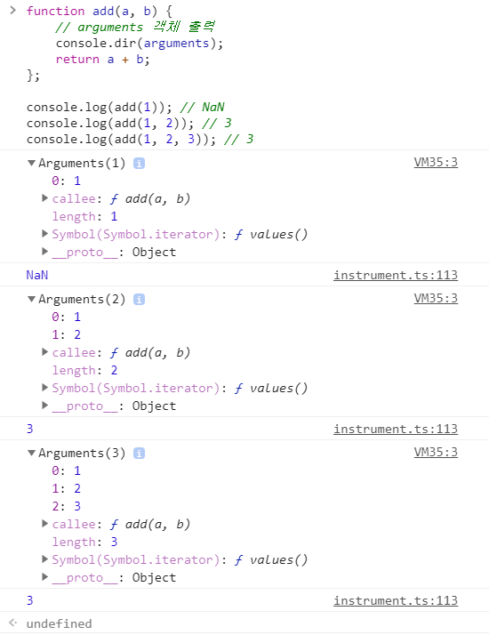

> # 📖 함수와 일급 객체

## 18.1 일급 객체

`일급 객체`의 조건

1. 무명의 리터럴로 생성할 수 있다. 즉 런타임에 생성이 가능하다.
2. 변수나 자료구조(객체, 배열 등)에 저장할 수 있다.
3. 함수의 매개변수에 전달할 수 있다.
4. 함수의 반환값으로 사용할 수 있다.

예제)

```javascript
// 1. 함수는 무명의 리터럴로 생성할 수 있다.
// 2. 함수는 변수에 저장할 수 있다.
// 런타임(할당 단계)에 함수 리터럴이 평가되어 함수 객체가 생성되고 변수에 할당된다.
const increase = function (num) {
  return ++num;
};

const decrease = function (num) {
  return --num;
};

// 2. 함수는 객체에 저장할 수 있다.
const auxs = { increase, decrease };

// 3. 함수의 매개변수에게 전달할 수 있다.
// 4. 함수의 반환값으로 사용할 수 있다.
function makeCounter(aux) {
  let num = 0;

  return function () {
    num = aux(num);
    return num;
  };
}

// 3. 함수는 매개변수에게 함수를 전달할 수 있다.
const increaser = makeCounter(auxs.increase);
console.log(increaser()); // 1
console.log(increaser()); // 2

// 3. 함수는 매개변수에게 함수를 전달할 수 있다.
const decreaser = makeCounter(auxs.decrease);
console.log(decreaser()); // -1
console.log(decreaser()); // -2
```

함수가 일급 객체라는 것은 `함수를 객체와 동일하게 사용할 수 있다는 의미`

사용가능한 곳 : 변수 할당문, 객체의 프로퍼티 값, 배열의 요소, 함수 호출의 인수, 함수 반환문

### 일급 객체 특징

- 일반 객체와 같이 함수의 매개변수에 전달 가능
- 함수의 반환값으로 사용할 수 있다.
- 함수형 프로그래밍이 가능하다.

## 18.2 함수 객체의 프로퍼티

`함수는 객체다!!`

함수도 프로퍼티를 가질 수 있다

<p align="center">
    
</p>

#### Object.getOwnPropertyDescriptors(square) 메서드로 확인

```javascript
function square(number) {
  return number * number;
}

console.log(Object.getOwnPropertyDescriptors(square));
/*
{
  length: {value: 1, writable: false, enumerable: false, configurable: true},
  name: {value: "square", writable: false, enumerable: false, configurable: true},
  arguments: {value: null, writable: false, enumerable: false, configurable: false},
  caller: {value: null, writable: false, enumerable: false, configurable: false},
  prototype: {value: {...}, writable: true, enumerable: false, configurable: false}
}
*/

// __proto__는 square 함수의 프로퍼티가 아니다.
console.log(Object.getOwnPropertyDescriptor(square, "__proto__")); // undefined

// __proto__는 Object.prototype 객체의 접근자 프로퍼티다.
// square 함수는 Object.prototype 객체로부터 __proto__ 접근자 프로퍼티를 상속받는다.
console.log(Object.getOwnPropertyDescriptor(Object.prototype, "__proto__"));
// {get: ƒ, set: ƒ, enumerable: false, configurable: true}
```

- 일반 객체에는 없는 함수 객체 고유의 프로퍼티

### 1. arguments 프로퍼티

arguments 객체는 함수 호출 시 전달된 인수들의 정보를 담고 있는 순회 가능한 `유사배열 객체`이며 함수 내부에서 `지역 변수` 처럼 사용된다.
(함수 외부에는 참조 X)

\*arguments 프로퍼티는 일부 브라우저에서 지원하지만 ES3부터 표준에서 폐지되었다.
Function.arguments 와 같은 사용법은 권정하지 않고 함수 내의 지역 변수 처럼 arguments 객체 참조할 것.

예제)

```javascript
function multiply(x, y) {
  console.log(arguments);
  return x * y;
}

console.log(multiply()); // NaN
console.log(multiply(1)); // NaN
console.log(multiply(1, 2)); // 2
console.log(multiply(1, 2, 3)); // 2
```

- 함수가 호출되면 함수 몸체 내에서 암묵적으로 매개변수가 선언되고 undefined로 초기화된 이후 할당된다.
- 매개변수보다 전달할 인수 개수가 적으면 전달 되지 않는 매개변수는 undefined로 초기화된 상태 유지한다
- 전달할 인수 개수가 더 많은면 초과된 인수는 무시한다(암묵적으로 arguments 객체 프로퍼티로 보관된다.)

<p align="center">
    
</p>

- arguments 객체는 배열 형태로 인자를 담고있는데 실제 배열이 아닌 유사 배열 객체이다.
- 유사배열을 배열 메서드를 사용할 수 없다.

#### 배열 메서드를 사용하려면 `Function.prototype.apply/call/bind 메서드`에 의한 간접 호출 해야한다.

```javascript
function sum() {
  // arguments 객체를 배열로 변환
  const array = Array.prototype.slice.call(arguments);
  return array.reduce(function (pre, cur) {
    return pre + cur;
  }, 0);
}

console.log(sum(1, 2)); // 3
console.log(sum(1, 2, 3, 4, 5)); // 15
```

#### Rest 파라미터

인자로 전달 받은 매개변수를 하나씩 입력하는 방법보다는 rest파라미터로 전달

```javascript
// ES6 Rest parameter
function sum(...args) {
  return args.reduce((pre, cur) => pre + cur, 0);
}

console.log(sum(1, 2)); // 3
console.log(sum(1, 2, 3, 4, 5)); // 15
```

### 2. caller 프로퍼티

caller 프로퍼티는 ECMAScript 사양에 포함되지 않은 비표준 프로퍼티
표준화 될 예정도 없으니 참고만 할것.

- caller 프로퍼티는 함수 자신을 호출한 함수를 가리킨다

```javascript
function foo(func) {
  return func();
}

function bar() {
  return "caller : " + bar.caller;
}

// 브라우저에서의 실행한 결과
console.log(foo(bar)); // caller : function foo(func) {...}
console.log(bar()); // caller : null
```

### 3. length 프로퍼티

length 프로퍼티는 선언한 매개변수의 개수를 가리킨다

⚠️주의)
arguments 객체의 length프로퍼티는 `인자 개수`를 가리키고 함수 객체의 length 프로퍼티는 `매개변수 개수`를 가리킨다.

### 4. name 프로퍼티

name 프로퍼티는 함수이름을 나타낸다.(ES6에서 정식 표준)</br>

⚠️ ES5 와 ES6 동작 다름</br>
ES5 에서는 name프로퍼티에 빈문자열 값을 갖는다</br>
ES6 에서는 함수 객체를 가리키는 식별자 값을 갖는다.

- 함수를 호출 할 때는 함수 이름이 아닌 함수 객체를 가리키는 식별자로 호출

### 5. **proto** 접근자 프로퍼티

모든 객체는 [[Prototype]]이라는 내부 슬롯을 갖는다.<br>
[[Prototype]]은 객체지향 프로그래밍의 상속을 구현하는 프로토타입 객체를 가리킨다.

- [[Prototype]] 프로토 타입 객에체 접근하려면 **proto**라는 접근자 프로퍼티를 사용해야한다(직접 접근할 수 없다)

```javascript
const obj = { a: 1 };

// 객체 리터럴 방식으로 생성한 객체의 프로토타입 객체는 Object.prototype이다.
console.log(obj.__proto__ === Object.prototype); // true

// 객체 리터럴 방식으로 생성한 객체는 프로토타입 객체인 Object.prototype의 프로퍼티를 상속받는다.
// hasOwnProperty 메서드는 Object.prototype의 메서드다.
console.log(obj.hasOwnProperty("a")); // true
console.log(obj.hasOwnProperty("__proto__")); // false
```

### 6. prototype 프로퍼티

prototype 프로퍼티는 생성자 함수로 호출할 수 있는 함수 객체

- constructor만이 소유하는 프로퍼티다.
- non-constructor 에는 prototype 프로퍼티가 없다.

```javascript
// 함수 객체는 prototype 프로퍼티를 소유한다.
(function () {}).hasOwnProperty("prototype"); // -> true

// 일반 객체는 prototype 프로퍼티를 소유하지 않는다.
({}).hasOwnProperty("prototype"); // -> false
```

- 생성자 함수로 호출될 때 생성자 함수가 생성할 인스턴스의 프로토타입 객체를 가리킴
