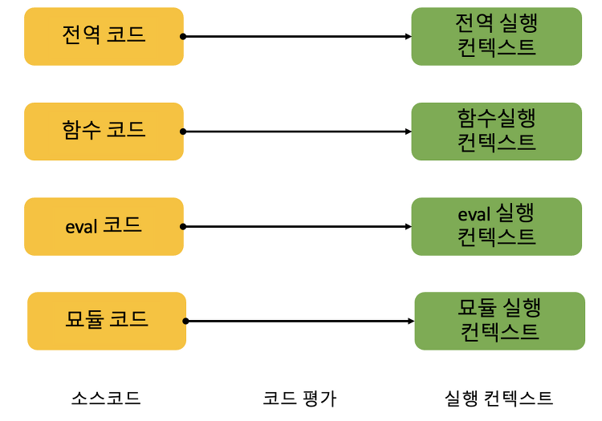
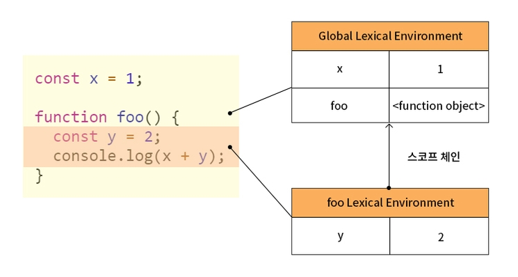
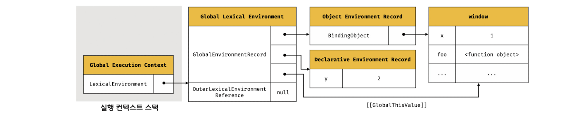
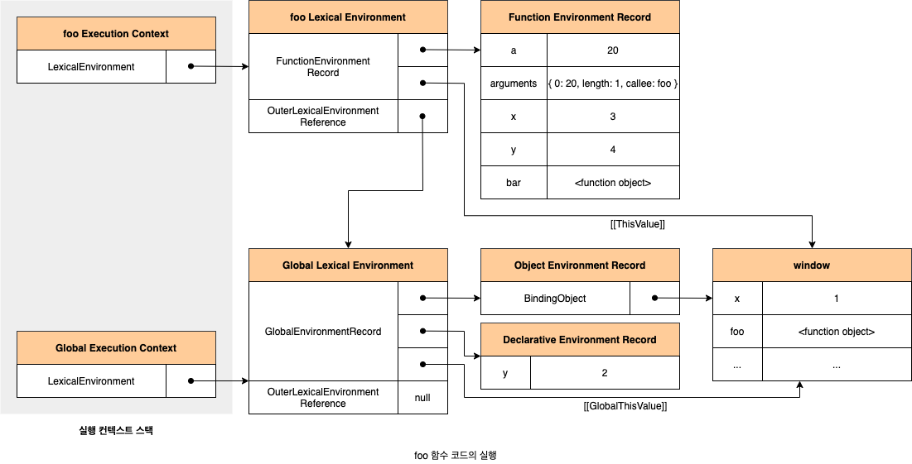
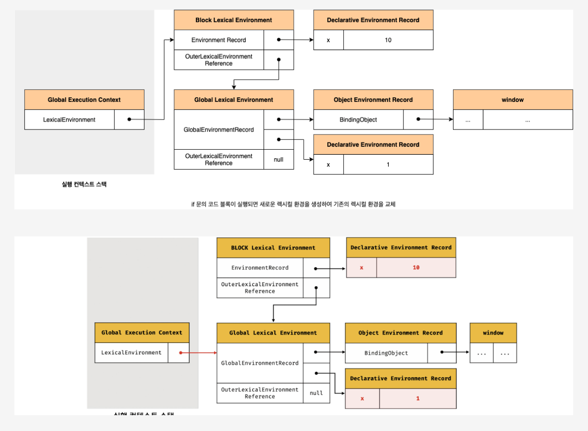

> # 📖 실행 컨텍스트

## 23.1 소스코드의 타입

| 소스코드 타입           | 설명                                                                                             |
| ----------------------- | ------------------------------------------------------------------------------------------------ |
| 전역코드(global code)   | 전역에 존재하는 소스코드. 전역에 정의된 홤수, 클래스 등의 내부 코드는 포함되지 않는다            |
| 함수코드(function code) | 함수 내부에 존재하는 소스코드. 함수 내부에 중첩된 함수, 클래스 등의 내부 코드는 포함되지 않는다. |
| eval 코드(eval code)    | 빌트인 전역 함수인 eval 함수에 인수로 전달되어 실행되는 소스코드.                                |
| 모듈 코드(module code)  | 모듈 내부에 존재하는 소스코드. 모듈 내부의 함수, 클래스 등의 내부 코드는 포함되지 않는다.        |

\*소스코드 타입에 따라 실행 컨텍스트를 생성하는 과정과 관리 내용이 다름

### 추가 내용

1. 전역 코드: 전역 변수를 관리하기 위해 최상위 스코프인 전역 스코프를 생성해야한다.
2. 함수 코드: 지역 스코프를 생성하고 지역 변수, 매개변수, arguments 객체를 관리해야한다.
3. eval 코드: strict mdoe(엄격모드)에서 자신만의 독자적인 스코프를 생성한다.
4. 모듈 코드: 모듈별로 독립적인 모듈 스코프를 생성한다.

<p align="center">
    
</p>

## 23.2 소스코드의 평가와 실행

<p align="center">
    
</p>

소스코드 평가 과정(선언문만 먼저 실행, 실행 컨텍스트 생성&관리(렉시컬 환경의 환경 레코드 등록)) -> 선언문 제외 나머지 소스 코드 순차적 실행 -> 실행 결과는 다시 실행 컨텍스트가 관리 & 등록

### 예제)

```javascript
// 전역 변수 선언
const x = 1;
const y = 2;

// 함수 정의
function foo(a) {
  // 지역 변수 선언
  const x = 10;
  const y = 20;

  // 메서드 호출
  console.log(a + x + y); // 130
}

// 함수 호출
foo(100);

// 메서드 호출
console.log(x + y); // 3
```

1. 전역 코드 평가: 소스코드 평가 과정에서는 선언문만 먼저 실행. 생성된 전역변수,함수가 실행 컨텍스트가 관리하는 전역 스코프에 등록.<br>

- var 키워드로 선언된 전역 변수와 함수 선언문으로 정의된 전역 함수는 전역 객체의 프로퍼티와 메서드가 된다

2. 전역 코드 실행: 평가가 끝나고 순차적으로 코드가 실행 되고 함수가 호출되면 전역 코드 실행 일시 중단하고 함수 내부로 진입
3. 함수 코드 실행: 함수 내부 진입하면 다시 위와 같이 코드 평가한다. 매개변수, 지역변수 선언문 먼저 실행되고 실행컨텍스트가 관리하는 지역 스코프에 등록.(this 바인딩도 결정됨)
4. 함수코드 실행: 평가 과정이 끝나고 순차적으로 코드 실행되고 각 변수에 값이 할당되고 console.log 메서드가 호출됨
5. console이라는 식별자를 스코프 체인을 통해 검색(전역 객체 프로퍼티에 존재함)하고 log 프로퍼티를 console객체의 프로토타입 체인을 통해 검색하고
   console.log메서드에 전달된 인수 표현식을 평가

다시 정리하자면 `실행 컨텍스트는 식별자(변수, 함수, 클래스 등의 이름)를 등록하고 관리하는 스코프와 코드 실행 순서 관리를 구현한 내부 메커니즘으로 모든 코드는 식행 컨텍스트를 통해 실행되고 관리된다.`

- 식별자와 스코프는 실행컨텍스트의 렉시컬 환경으로 관리
- 코드 실행 순서는 실행 컨텍스트 스택으로 관리

## 23.4 실행 컨텍스트 스택

### 예제)

```javascript
const x = 1;

function foo() {
  const y = 2;

  function bar() {
    const z = 3;
    console.log(x + y + z);
  }
  bar();
}

foo(); // 6
```

<p align="center">
    
</p>

1. 전역 코드의 평가와 실행
   <br>자바스크립트 엔진에서 전역 코드 평가하여 전역 실행 컨텍스트를 생성하고 실행 컨텍스트 스텍에 푸시 후 순차적으로 코드 실행 foo 호출

2. foo 함수 코드의 평가와 실행
3. bar 함수 코드의 평가와 실행
4. foo 함수 코드로 복귀
   <br> 자바스크립트 엔진에서 bar함수 실행 컨텍스트를 실행 컨텍스트 스택에서 팝하여 제거

5. 전역 코드로 복귀

```
- 실행 컨텍스트 스택은 코드의 실행 순서를 관리한다.
- 실행 컨텍스트 스택의 최상위에 존재하는 실행 컨텍스트는 언제나 현재 실행중인 코드의 실행 컨텍스트다
```

## 23.5 렉시컬 환경

- 식별자와 식별자에 바인딩된 값
- 상위 스코프에 대한 참조를 기록하는 자료 구조로 실행 컨텍스트를 구성하는 컴포넌트이다.
- 실행 컨텍스트 스택이 코드의 실행 순서를 관리한다면 렉시컬 환경은 스코프와 식별자를 관리한다.

<p align="center">
    
</p>

- 렉시컬 환경은 두개의 컴포넌트로 구성된다

<p align="center">
    
</p>

1. 환경 레코드(Environment Record): 스코프에 포함된 식별자를 등록하고 등록된 식별자에 바인딩된 값을 관리하는 저장소다.
2. 외부 렉시컬 환경에 대한 참조(Outer Lexical Environment Reference): 외부 렉시컬 환경에 대한 참조는 상위 스코프를 가리킨다(상위 스코프는 실행컨텍스트를 생성한 소스코드를 포함한 상위 코드).

## 23.6 실행 컨텍스트의 생성과 식별자 검색 과정

### 23-04 예제)

```javascript
var x = 1;
const y = 2;

function foo(a) {
  var x = 3;
  const y = 4;

  function bar(b) {
    const z = 5;
    console.log(a + b + x + y + z);
  }
  bar(10);
}

foo(20); // 42
```

첫번째로는 전역코드 평가를 할 것 같았는데 그 전에 전역 객체 생성을 먼저 합니다.

전역 객체에는 빌트인 전역 프로퍼티와 빌트인 적역 함수 그리고 표준 필트인 객체가 추가되며 동작 환경에 따라 클라이언트 사이드 Web API 또는 특정 환경을 위한 호스트 객체를 포함함(전역객체도 Object.prototype 상속받는다)

\*`Web API`는 DOM, BOM, Canvas, XMLHttpRequest, fetch, requestAnimationFrame, SVG, Web Storage, Web Component, Web Worer 등 있음

전역 객체 생성 후

### 전역 코드 평가 과정<br>

- 전역 실행 컨텍스트 생성
- 전역 렉시컬 환경 생성
  - 전역환경 레코드 생성
    - 객체 환경 레코드 생성
    - 선언적 환경 레코드 생성
  - this 바인딩
  - 외부 렉시컬 환경에 대한 참조 결정

<p align="center">
    
</p>

### 세부적으로 살펴보자

1. 전역 실행 컨텍스트 생성
2. 전역 렉시컬 환경 생성(2개의 컴포넌트)
3. 전역 환경 레코드 생성<br>
   2개의 레코드로 구성되어있는데<br> 1. 객체 환경 레코드(Object Environment Record)<br>2. 선언적 환경 레코드(Declarative Environment Record)<br>
4. 객체 환경 레코드 생성<br> -객체 환경 레코드는 var키워드로 선언한 전역변수, 함수 선언문으로 정의한 전역함수, 빌트인 전역 프로퍼티와 빌트인 전역 함수, 표준 빌트인 객체를 관리
   <br>\*위 이미지는 실행 단계까지의 이미지이다.(평가과정에서는 값이 undefined)

5. 선언적 환경 레코드 생성<br> -선언적 환경 레코드는 let, const 키워드로 선언한 전역 변수를 관리
   <br>\*위 이미지는 실행 단계까지의 이미지이다.(평가과정에서는 값이 일시적 사각지대(TDZ)로 인해 참조에러 발생)

6. this 바인딩
7. 외부 렉시컬 환경에 대한 참조 결정
   <br> 전역코드를 포함하는 소스코드가 없으므로 전역 렉시컬 환경의 외부 렉시컬 환경에 대한 참조에 null할당 이는 전역 렉시컬 환경이 스코프 체인의 종점에 존재함을 의미
8. 전역 코드 실행(위 이미지 참고)
<hr>
여기까지가 전역 실행 컨텍스트이고<br>
다시 23-04 예제를 보면 다음으로 평가될 foo함수 내부가 평가&실행된다<br>
<br>

### foo함수 코드 평가 과정

1. 함수 실행 컨텍스트 생성
2. 함수 렉시컬 환경 생성
   - 함수 환경 레코드 생성
   - this 바인딩
   - 외부 렉시컬 환경에 대한 참조 결정

<p align="center">
    
</p>

\*전역 코드평가와 비슷하다 복잡해보이지만 겁먹지 말자!!

### 세부적으로 살펴보자(위 이미지도 마찬가지로 실행까지의 이미지이다. 평가과정에서는 초기값인 undefined 할당)

1. 함수 실행 컨텍스트 생성
2. 함수 렉시컬 환경 생성(2개의 컴포넌트)
3. 함수 환경 레코드 생성(a: 매개변수, arguments: 아규먼트 객체, / x,y,bar: 함수 몸체에서 선언된 식별자)
4. this 바인딩(foo함수는 일반 함수로 호출되었으므로 전역객체를 가리킴)
5. 외부 렉시컬 환경에 대한 참조 결정
   <br> 상위 평가된 전역 코드 평가 시점(실행중인 실행 컨텍스트의 렉시컬 환경)을 참조함
6. foo 함수 코드 실행(각 선언된 변수에 값 할당(이미지 참고))

<hr>

### bar함수 코드 평가 과정(foo함수와 동일하다)

<p align="center">
    
</p>

1. bar함수가 실행되고
2. bar함수 내부에 있는 console.log 실행 때 console 식별자를 스코프 체인에서 검색(현재 실행중인 샐행 컨택스트의 렉시컬 환경에서 검색함)
   <br> bar함수에서 검색하고 없으면 상위 스코트 검색....하고 없으면 전역 렉시컬 환경에서 검색
3. log 메서드 검색(console 객체가 직접 소유하는 프로퍼티이다)
4. 인수로 받은 a + b + x + y + z 표현식 평가
5. 값 호출

<hr>
실행이 완료가 되고 더이상 실행할 코드가 없으면

1. bar함수 코드 실행 종료
   <br>bar 함수 실행 컨텍스트가 실행 컨텍스트 스택에서 팝되어 제거되고
   실행중인 foo함수 실행 컨텍스트로 이동
   <br> bar함수는 가비지 컬렉터에 의해 메모리 공간의 확보가 해제되어 소멸된다 만약 누군가 bar함수 렉시컬 환경을 참조한다면 소멸되지 않는다.
2. foo함수 코드 실행 종료
   <br>더이상 실행할 코드가 없으면 foo 함수 실행 컨텍스트가 실행 컨텍스트 스택에서 팝되어 제거되고
   실행중인 전역 실행 컨텍스트로 이동
3. 전역 코드 실행 종료
   <br>더이상 실행할 코드가 없으면 전역 실행 컨텍스트가 실행 컨텍스트 스택에서 팝되어 제거되고 실행 컨텍스트 스택에는 아무것도 남아있지 않게된다.

## 23.7 실행 컨텍스트와 블록 레벨 스코프

### 예제)

```javascript
let x = 1;

if (true) {
  let x = 10;
  console.log(x); // 10
}

console.log(x); // 1
```

- var 키워드로 선언한 변수는 오로지 함수의 코드 블록만 지역 스코프로 인정하는 함수 레벨 스코프를 따른다.
- let, const 키워드로 선언한 변수는 모든 코드블록(함수, if문, while문, try/catch문 등) 지역 스코프로 인정하는 블록 레벨 스코프를 따른다

<p align="center">
    
</p>

- 블록 레벨 스코프도 함수 실행 컨텍스트 평가/실행 과정은 비슷하지만 이 친구는 전역 렉시컬 환경에서 if 문이 실행 되면 블록 렉시컬 환경으로 교체되고 종료되면 전역 렉시컬 환경으로 복귀한다.
