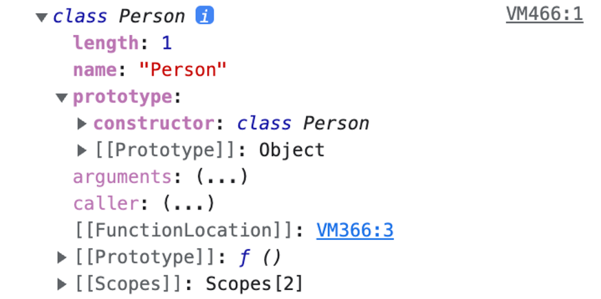
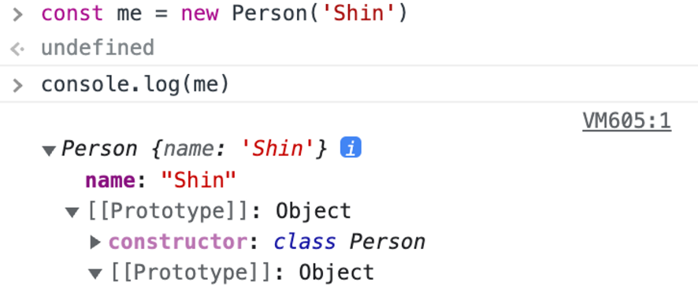
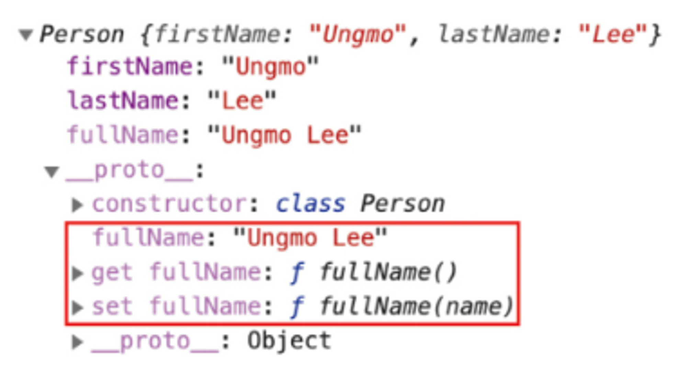
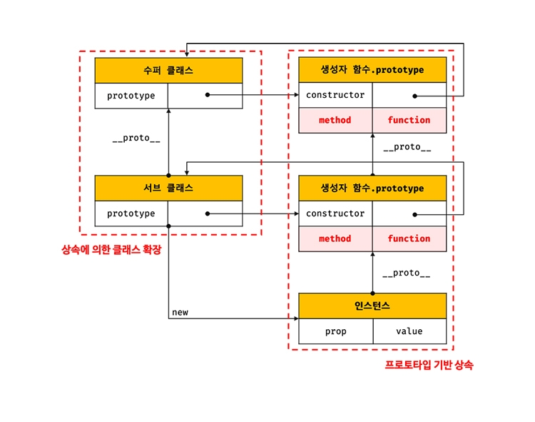
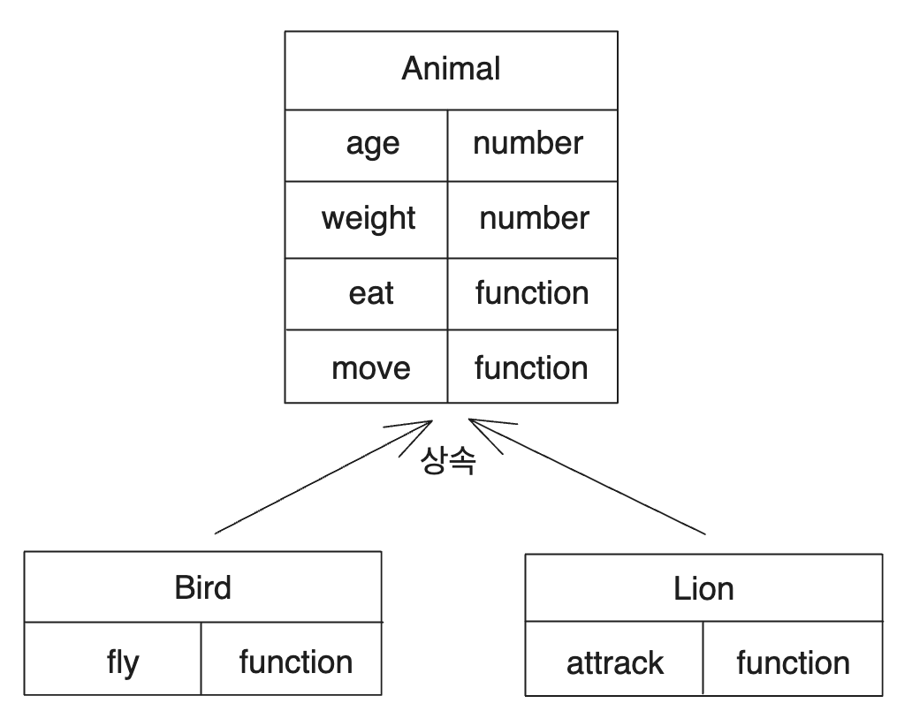
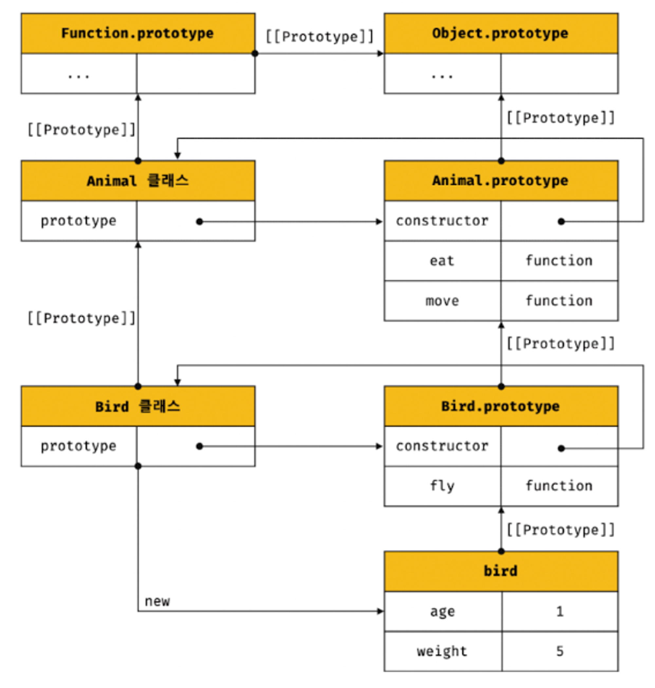
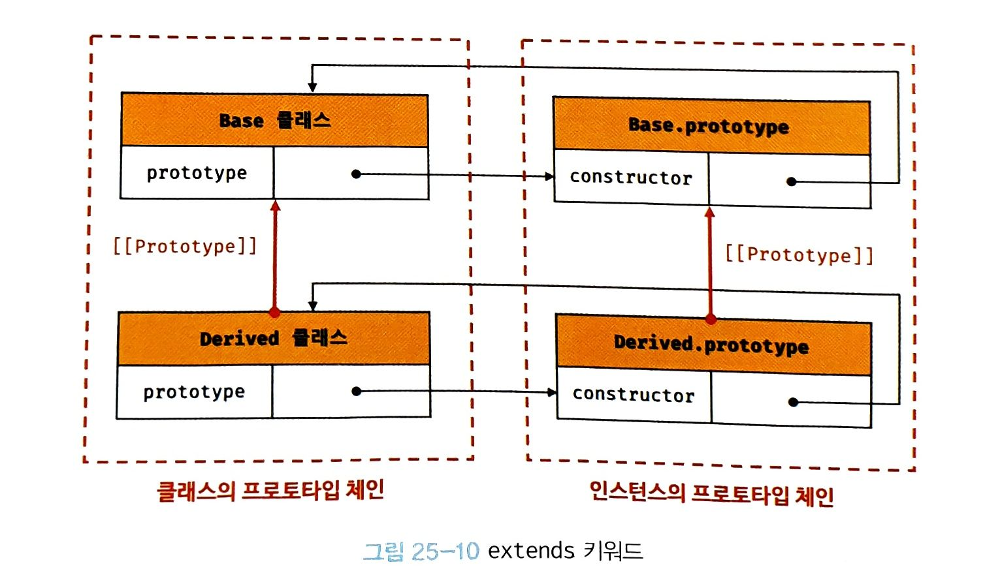
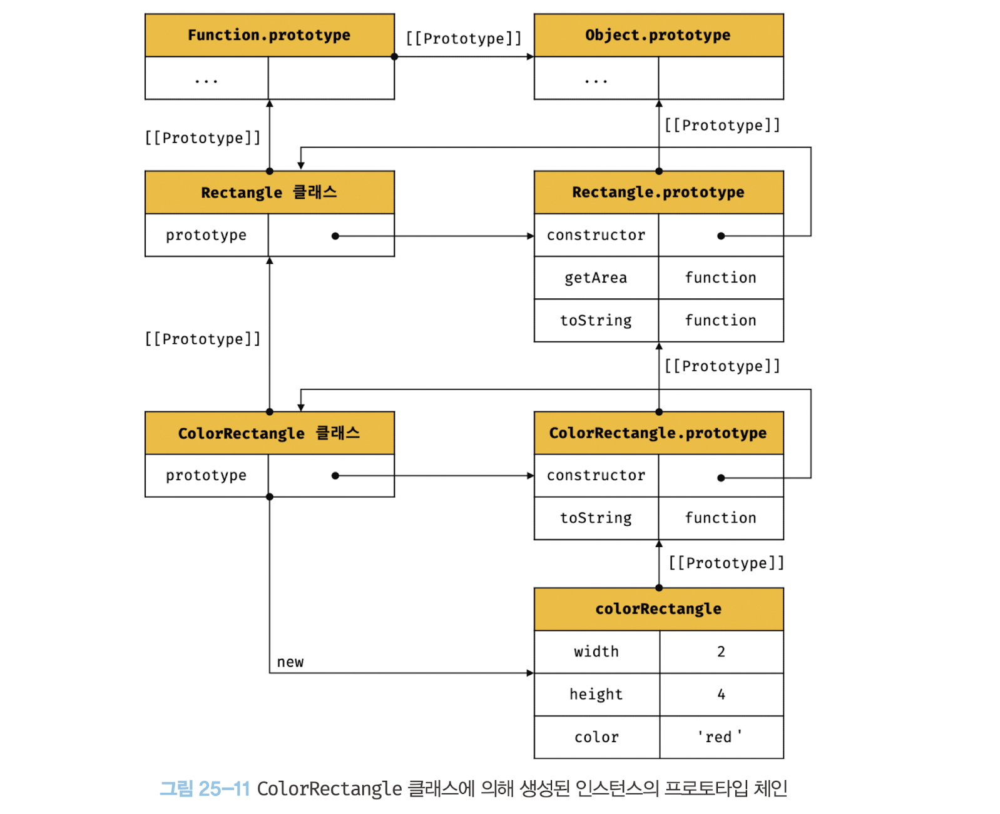

> # 📖25.1 클래스는 프로토타입의 문법적 설탕인가

- 자바스크립트는 `프로토타입 기반 객체지향 언어`다.<br>
  (프로토타입 기반 객체지향언어는 클래스가 필요하지 않고, ES5에서는 클래스 없이도 생성자 함수와 프로토타입을 통해 상속을 구현할 수 있다.)

#### 클래스와 생성자 함수의 차이점

| 클래스                                                  | 생성자 함수                                                                                                             |
| ------------------------------------------------------- | ----------------------------------------------------------------------------------------------------------------------- |
| new 연산자없이 호출하면 에러 발생                       | new 연산자 없이 호출하면 일반함수로서 호출됨                                                                            |
| 상속을 지원하는 extends와 super 키워드를 제공           | 지원X                                                                                                                   |
| 호이스팅이 발생하지 않는 것처럼 동작함                  | 함수 선언문으로 정의된 생성자 함수는 함수 호이스팅이, <br />함수 표현식으로 정의한 생성자 함수는 변수 호이스팅이 발생함 |
| 클래스 내의 모든 코드에는 암묵적으로 strict mode가 지정 | 지정X                                                                                                                   |

---

+클래스의 constructor, 프로토타입 메서드, 정적 메서드는 모두 프로퍼티 어트리뷰터 [[Enumerable]]의 값이 false다. 열거되지 않음.

<details>
<summary>💡 문법적 설탕(syntatic sugar)</summary>

- 사람이 이해 하고 표현하기 쉽게 디자인된 프로그래밍 언어 문법
- 사람이 프로그래밍 언어를 sweeter하게 사용 할 수 있도록 도와주는 문법
- 더욱 더 간결하고 명확하게 표현이 가능한 문법을 뜻 한다.
- 대표적인 예 TypeScript를 Syntactic sugar의 특징을 가졌다고도 한다. ES6의 Class 또한 Syntactic sugar인 구문임
</details>

<br>
<br>
<br>
<br>
<br>

> # 📖25.2 클래스 정의

- 클래스는 class 키워드를 사용하여 정의한다.
- 일반적으로 파스칼 케이스를 사용하지만, 사용하지 않아도 에러가 발생하지는 않는다.
- `클래스는 함수이다.` 즉 값으로 사용할 수 있는 `일급 객체`이다.

  - 무명의 리터럴로 생성할 수 있다. 런타임에 생성 가능
  - 변수나 자료구조(객체 배열)에 저장할 수 있다.
  - 함수의 매개변수에게 전달할 수 있다.
  - 함수의 반환값으로 사용할 수 있다.

- 클래스 몸체에서 정의할 수 있는 메서드
  - constructor(생성자)
  - 프로토타입 메서드
  - 정적 메서드

```js
// 익명 클래스 표현식
const Person = class {};

// 기명 클래스 표현식
const Person = class MyClass {};

// 클래스 선언문
class Person {
  // 생성자
  constructor(name) {
    // 인스턴스 생성 및 초기화
    this.name = name; // name 프로퍼티는 public하다.
  }

  // 프로토타입 메서드
  sayHi() {
    console.log(`Hi! My name is ${this.name}`);
  }

  // 정적 메서드
  static sayHello() {
    console.log("Hello!");
  }
}

// 인스턴스 생성
const me = new Person("Lee");

// 인스턴스의 프로퍼티 참조
console.log(me.name); // Lee
// 프로토타입 메서드 호출
me.sayHi(); // Hi! My name is Lee
// 정적 메서드 호출
Person.sayHello(); // Hello!
```

<br>
<br>
<br>
<br>
<br>

> # 📖25.3 클래스 호이스팅

- 클래스는 함수로 평가된다.
- 클래스 선언문으로 정의한 클래스는 함수 선언문과 같이 소스코드 평가 과정(런타임 이전)에 먼저 평가 되어 함수 객체 생성
- 이때 클래스가 평가되어 생성된 함수 객체는 `constructor`다.
- 생성자 함수로서 호출할 수 있는 함수는 함수 정의가 평가되어 함수 객체를 생성하는 시점에 프로토타입도 더불어 생성된다. 프로토타입과 생성자 함수는 언제나 쌍으로 존재하기 때문이다.

- 클래스는 클래스 정의 이전에 참조할 수 없다.

```js
console.log(Person);
// ReferenceError: Cannot access 'Person' before initialization

// 클래스 선언문
class Person {}
```

- 클래스 선언문은 마치 호이스팅이 발생하지 않는 것처럼 보이지만, let, const키워드로 선언한 변수처럼 호이스팅이 된다. <br>
  클래스 선언문 이전에 일시적 사각지대(TDZ)에 빠지기 때문에 호이스팅이 발생하지 않는 것처럼 동작한다.

```js
const Person = "";

{
  // 호이스팅이 발생하지 않는다면 ''이 출력되어야 한다.
  console.log(Person);
  // ReferenceError: Cannot access 'Person' before initialization

  // 클래스 선언문
  class Person {}
}
```

<br>
<br>
<br>
<br>
<br>

> # 📖25.4 인스턴스 생성

- 클래스는 생성자 함수이며 new 연산자와 함께 호출되어 인스턴스를 생성한다.
- 함수는 new 연산자의 사용여부에 따라 일반함수로 호출되거나, 인스턴스 생성을 위한 생성자 함수로 호출되지만, 클래스는 인스턴스를 생성하는 것이 유일한 존재이뮤이므로 반드시 new 연산자와 함께 호출해야한다.

```js
//1. new연산자를 사용하여 호출
class Person {}

// 인스턴스 생성
const me = new Person();
console.log(me); // Person {}

//2. 클래스를 new 연산자 없이 호출하면 타입 에러가 발생한다.
const me = Person();
// TypeError: Class constructor Foo cannot be invoked without 'new'
```

<br>
<br>
<br>
<br>
<br>

> # 📖25.5 메서드

- 클래스 몸체에는 0개 이상의 메서드만 선언가능
- 클래스 몸체에서 정의할 수 있는 메서드는 constructor(생성자), 프로토타입 메서드, 정적 메서드의 세 가지가 있다.

## 📌25.5.1 constructor

- constructor는 인스턴스를 생성하고 초기화하기 위한 특수한 메서드다.
- 이름을 변경할 수 없다.
- 클래스는 함수 객체로 평가된다. 따라서 객체 고유의 프로퍼티를 모두 갖고 있다.
- prototype 프로퍼티가 가리키는 프로토타입 객체의 constructor 프로퍼티는 클래스 자신을 가리키고 있다.

    

- constructor 내부에서 this에 추가한 프로퍼티는 인스턴스 프로퍼티가 된다.<br>
  => constructor 내부의 this는 클래스가 생성한 인스턴스를 가리킨다.

    

### constructor와 생성자 함수의 차이점

- constructor는 클래스 내에 최대 한 개만 존재할 수 있다.(2개 이상일 경우 SyntaxError 발생)

```js
class Person {
  constructor() {}
  constructor() {}
}
// SyntaxError: A class may only have one constructor
```

- constructor는 생략가능
  - 생략할 경우 암묵적으로 빈 constructor가 정의됨
  - constructor를 생략한 클래스는 constructor에 의해 빈 객체가 생성됨

```js
class Person {
  // constructor를 생략하면 다음과 같이 빈 constructor가 암묵적으로 정의된다.
  constructor() {}
}

// 빈 객체가 생성된다.
const me = new Person();
console.log(me); // Person {}
```

- 인스턴스를 생성할 때 클래스 외부에서 인스턴스 프로퍼티의 초기값을 전달하려면 constructor에 매개변수를 선언하고 인스턴스를 생성할 때 초기값을 전달한다. 초기값은 constructor의 매개변수에게 전달된다.

```js
class Person {
  constructor(name, address) {
    // 인수로 인스턴스 초기화
    this.name = name;
    this.address = address;
  }
}

// 인수로 초기값을 전달한다. 초기값은 constructor에 전달된다.
const me = new Person("Lee", "Seoul");
console.log(me); // Person {name: "Lee", address: "Seoul"}
```

- constructor는 this가 아닌 다른 객체를 명시적으로 반환하면 return문에 명시된 객체가 반환된다.

```js
class Person {
  constructor(name) {
    this.name = name;

    // 명시적으로 객체를 반환하면 암묵적인 this 반환이 무시된다.
    return {};
  }
}

// constructor에서 명시적으로 반환한 빈 객체가 반환된다.
const me = new Person("Lee");
console.log(me); // {}
```

- 하지만 원시값을 반환할 경우 무시되고 암묵적으로 this가 반환된다.

```js
class Person {
  constructor(name) {
    this.name = name;

    // 명시적으로 원시값을 반환하면 원시값 반환은 무시되고 암묵적으로 this가 반환된다.
    return 100;
  }
}

const me = new Person("Lee");
console.log(me); // Person { name: "Lee" }
```

- construct 내부에서 return 문을 반드시 생략해야 한다.

## 📌25.5.2 프로토타입 메서드

- 생성자 함수를 사용하여 인스턴스를 생성하는 경우 프로토타입 메서드를 생성하기 위해서는 명시적으로 프로토타입에 메서드를 추가해야한다.

```js
// 생성자 함수
function Person(name) {
  this.name = name;
}

// 프로토타입 메서드
Person.prototype.sayHi = function () {
  console.log(`Hi! My name is ${this.name}`);
};

const me = new Person("Lee");
me.sayHi(); // Hi! My name is Lee
```

- 클래스 몸체에서 정의한 메서드는 prototype 프로퍼티에 메서드를 추가하지 않아도 기본적으로 프로토타입 메서드가 된다.

```js
class Person {
  // 생성자
  constructor(name) {
    // 인스턴스 생성 및 초기화
    this.name = name;
  }

  // 프로토타입 메서드
  sayHi() {
    console.log(`Hi! My name is ${this.name}`);
  }
}

const me = new Person("Lee");
me.sayHi(); // Hi! My name is Lee
```

- 생성자 함수와 마찬가지로 클래스가 생성한 인스턴스는 프로토타입 체인의 일원이 된다.

```js
// me 객체의 프로토타입은 Person.prototype이다.
Object.getPrototypeOf(me) === Person.prototype; // -> true
me instanceof Person; // -> true

// Person.prototype의 프로토타입은 Object.prototype이다.
Object.getPrototypeOf(Person.prototype) === Object.prototype; // -> true
me instanceof Object; // -> true

// me 객체의 constructor는 Person 클래스다.
me.constructor === Person; // -> true
```


## 📌25.5.3 정적 메서드

- 인스턴스를 생성하지 않아도 호출할 수 있는 메서드
- 생성자 함수의 경우 명시적으로 생성자 함수에 메서드를 추가하여 생성할 수 있다.

```js
// 생성자 함수
function Person(name) {
  this.name = name;
}

// 정적 메서드
Person.sayHi = function () {
  console.log("Hi!");
};

// 정적 메서드 호출
Person.sayHi(); // Hi!
```

- 클래스에서는 메서드에 static 키워드를 붙여서 생성

```js
class Person {
  // 생성자
  constructor(name) {
    // 인스턴스 생성 및 초기화
    this.name = name;
  }

  // 정적 메서드 : 클래스에서는 static 키워드를 붙여서 생성한다.
  static sayHi() {
    console.log("Hi!");
  }
}
```

- 정적 메서드 호출

```js
// 정적 메서드는 프로토타입 메서드처럼 인스턴스로 호출하지 않고 클래스로 호출한다.
Person.sayHi(); // Hi!

// 인스턴스 생성
const me = new Person("Lee");
me.sayHi(); // TypeError: me.sayHi is not a function
// 정적 메서드는 인스턴스로 호출할 수 없다.
```

정적 메서드는 클래스에 바인딩된 메서드이고 인스턴스의 프로토타입 체인상에 존재하지 않기 때문에 정적 메서드는 인스턴스로 호출할 수 없다.

## 📌25.5.4 정적 메서드와 프로토타입 메서드 차이

- 정적 메서드와 프로토타입 메서드는 자신이 속해있는 프로토타입 체인이 다르다.
- 정적 메서드는 클래스로 호출, 프로토타입 메서드는 인스턴스로 호출
- 정적 메서드는 인스턴스 프로퍼티를 참조할 수 없지만, 프로토타입 메서드는 인스턴스 프로퍼티를 참조할 수 있다.

```js
class Square {
  // 정적 메서드
  static area(width, height) {
    return width * height;
  }
}

console.log(Square.area(10, 10)); // 100
```

```js
class Square {
  constructor(width, height) {
    this.width = width;
    this.height = height;
  }

  // 프로토타입 메서드
  area() {
    return this.width * this.height;
  }
}

const square = new Square(10, 10);
console.log(square.area()); // 100
```

## 📌25.5.5 클래스에서 정의한 메서드의 특징

- function 키워드를 생략한 메서드 축약 표현을 사용한다.
- 객체 리터럴과는 다르게 클래스에 메서드를 정의할 땐 콤마가 필요없다.
- 암묵적으로 strict mode로 실행된다.
- for...in문이나 Object.key 메서드 등으로 열거할 수 없다. 즉, 프로퍼티의 열거 가능 여부를 나타내며, 불리언 값을 갖는 프로퍼티 어트리뷰트 [[Enumerable]]의 값이 false다.
- 내부 메서드 [[Construct]]를 갖지 않는 non-constructor다. 따라서 new 연산자와 함께 호출할 수 없다.

<br>
<br>
<br>
<br>
<br>

> # 📖25.6 클래스의 인스턴스 생성 과정

- 인스턴스 생성과 this 바인딩
- 인스턴스 초기화
- 인스턴스 반환

```js
class Person {
  // 생성자
  constructor(name) {
    // 1. 암묵적으로 인스턴스가 생성되고 this에 바인딩된다.
    console.log(this); // Person {}
    console.log(Object.getPrototypeOf(this) === Person.prototype); // true

    // 2. this에 바인딩되어 있는 인스턴스를 초기화한다.
    this.name = name;

    // 3. 완성된 인스턴스가 바인딩된 this가 암묵적으로 반환된다.
  }
}
```

> # 25.7 프로퍼티

### 1. 인스턴스 프로퍼티

`인스턴스 프로퍼티`는 `constructor 내부`에서 정의해야한다

```javascript
class Person {
  constructor(name) {
    // 인스턴스 프로퍼티
    this.name = name; // name 프로퍼티는 public하다.
  }
}

const me = new Person("Lee");
console.log(me); // Person {name: "Lee"}
// name은 public하다.
console.log(me.name); // Lee
```

- constructor 내부 코드가 실행되기 이전에 this에는 이미 클래스가 암묵적으로 생성한 인스턴스인 빈객체가 바인딩되어있다.
- 위 코드에서는 프로퍼티가 추가되어 인스턴스가 초기화 된다(없을 경우 빈 객체 바인딩)
- 자바스크립트는 다른 객체 지향 언어처럼 `private, public, protected` 키워드와 같은 접근 제한자를 지원하지 않는다. 따라서 인스턴스 프로퍼티는 언제나 `public`하다.

### 2. 접근자 프로퍼티

접근자 프로퍼티는 자체적으로는 값을 갖지 않고 다른 데이터 프로퍼티의 값을 읽거나 저장할 때 사용하는 접근자 함수로 구성된 프로퍼티이다.

```javascript
const person = {
  // 데이터 프로퍼티
  firstName: "Ungmo",
  lastName: "Lee",

  // fullName은 접근자 함수로 구성된 접근자 프로퍼티다.
  // getter 함수
  get fullName() {
    return `${this.firstName} ${this.lastName}`;
  },
  // setter 함수
  set fullName(name) {
    // 배열 디스트럭처링 할당: "36.1. 배열 디스트럭처링 할당" 참고
    [this.firstName, this.lastName] = name.split(" ");
  },
};

// 데이터 프로퍼티를 통한 프로퍼티 값의 참조.
console.log(`${person.firstName} ${person.lastName}`); // Ungmo Lee

// 접근자 프로퍼티를 통한 프로퍼티 값의 저장
// 접근자 프로퍼티 fullName에 값을 저장하면 setter 함수가 호출된다.
person.fullName = "Heegun Lee";
console.log(person); // {firstName: "Heegun", lastName: "Lee"}

// 접근자 프로퍼티를 통한 프로퍼티 값의 참조
// 접근자 프로퍼티 fullName에 접근하면 getter 함수가 호출된다.
console.log(person.fullName); // Heegun Lee

// fullName은 접근자 프로퍼티다.
// 접근자 프로퍼티는 get, set, enumerable, configurable 프로퍼티 어트리뷰트를 갖는다.
console.log(Object.getOwnPropertyDescriptor(person, "fullName"));
// {get: ƒ, set: ƒ, enumerable: true, configurable: true}
```

- 접근자 프로퍼티는 클래서에서도 사용 가능하다.
- getter: `인스턴스 프로퍼티에 접근할 때마다` 프로퍼티 값을 조작하거나 별도의 행위가 필요할 때 사용한다.(get 키워드를 사용한다)
- setter: `인스턴스 프로퍼티에 값을 할당할 때마다`프로퍼티 값을 조작하거나 별도의 행위가 필요할 때 사용한다.(set키워드를 사용한다, 할당할때마다 호출되기때문에 `하나의 매개변수` 필요함)
- 클래스의 메서드는 `프로토타입 메서드`되고, 접근자 메서드도 인스턴스 프로퍼티가 아닌 `프로토타입의 프로퍼티`가 된다.

<p align="left">
    
</p>

### 1. 클래스 필드 정의 제안

`클래스 필드`란 클래스 기반 객체지향 언어에서 클래스가 생성할 인스턴스의 프로퍼티를 가리키는 용어다

Java의 클래스 정의

```javascript
// 자바의 클래스 정의
public class Person {
  // ① 클래스 필드 정의
  // 클래스 필드는 클래스 몸체에 this 없이 선언해야 한다.
  private String firstName = "";
  private String lastName = "";

  // 생성자
  Person(String firstName, String lastName) {
    // ③ this는 언제나 클래스가 생성할 인스턴스를 가리킨다.
    this.firstName = firstName;
    this.lastName = lastName;
  }

  public String getFullName() {
    // ② 클래스 필드 참조
    // this 없이도 클래스 필드를 참조할 수 있다.
    return firstName + " " + lastName;
  }
}
```

- 자바는 this를 생략해도 클래스 필드를 참조할 수 있다.
- this를 사용하는 곳은 클래스 필드가 생성자 또는 메서드의 매개변수 이름과 동일할 때 명확하게 하기위해 사용된다
- 클래스 몸체에서 클래스 필드 정의 제안은 아직 ECMAscript의 정식 표준 사양으로 승급되지 않았지만 최신 브라우저, Node.js에서는 미리 구현해놓았다. 사용가능하다.

클래스 몸체는 어디일까요?

```javascript
class Foo {
  name = ""; // SyntaxError / 메서드를 선언하지 않으면 에러뜸(메서드만 가능)

  constructor() {}
}
```

### 2. private 필드 정의 제안

자바스크립트는 캡슐화를 완전하게 지원하지 않는다.

접근제한자도 지원하지 않는다.

따라서 인스턴스 프로퍼티는 인스턴스를 통해 클래스 외부에서 언제나 참조 가능하다(언제나 public하다)

```javascript
class Person {
  name = "Lee"; // 클래스 필드도 기본적으로 public하다.
}

// 인스턴스 생성
const me = new Person();
console.log(me.name); // Lee
```

- private 필드를 정의하는것도 제안되어있고 최신버전에만 이미 구현 되어 있다.

private 필드의 선두에는 `#`을 붙여준다

```javascript
class Person {
  // private 필드 정의
  #name = "";

  constructor(name) {
    // private 필드 참조
    this.#name = name;
  }
}

const me = new Person("Lee");

// private 필드 #name은 클래스 외부에서 참조할 수 없다.
console.log(me.#name);
// SyntaxError: Private field '#name' must be declared in an enclosing class
```

- private 필드는 반드시 클래스 몸체에 정의해야한다(constructor에 정의하면 에러 발생)

### 접근제한자

사용 이유: 외부로 부터 데이터보호

- private: 같은 클래스 내에서만 접근가능(자신만 접근가능)
- default: 같은 패키지 내에서만 접근가능 (같은 패키지(파일) 클래스)<br>
  ex) int a => int 앞에 default 가 생략됨
- protected: 같은 패키지 내, 그리고 다른 클래스의 자손 클래스에서 접근 가능
- public: 접근 제한 없음(누구나 사용 가능)

`접근 범위가 넓은 순: public > protected > default > private`

### 3. static 필드 정의 제안

static 이라는 키워드를 사용하면 정적 메서드를 정의할 수 있다.

```javascript
class MyMath {
  // static public 필드 정의
  static PI = 22 / 7;

  // static private 필드 정의
  static #num = 10;

  // static 메서드
  static increment() {
    return ++MyMath.#num;
  }
}

console.log(MyMath.PI); // 3.142857142857143
console.log(MyMath.increment()); // 11
```

> # 25.8 상속에 의한 클래스 확장

### 1. 클래스 상속과 생성자 함수 상속

프로토타입 기반 상속과는 다른 개념

`상속에 의한 클래스 확장은 기존 클래스를 상속받아 새로운 클래스를 확장하여 정의`

<p align="left">
    
</p>

<p align="left">
    
</p>

Animal 클래스를 확장한 Bird 클래스

```javascript
class Animal {
  constructor(age, weight) {
    this.age = age;
    this.weight = weight;
  }

  eat() {
    return "eat";
  }

  move() {
    return "move";
  }
}

// 상속을 통해 Animal 클래스를 확장한 Bird 클래스
class Bird extends Animal {
  fly() {
    return "fly";
  }
}

const bird = new Bird(1, 5);

console.log(bird); // Bird {age: 1, weight: 5}
console.log(bird instanceof Bird); // true
console.log(bird instanceof Animal); // true

console.log(bird.eat()); // eat
console.log(bird.move()); // move
console.log(bird.fly()); // fly
```

<p align="left">
    
</p>

### 2. extends 키워드

상속을 통해 클래스를 확장하려면 extends키워드를 사용해야한다

```javascript
// 수퍼(베이스/부모)클래스
class Base {}

// 서브(파생/자식)클래스
class Derived extends Base {}
```

상위 클래스를 부모 클래스, 수퍼 클래스, 베이스 클래스 라고 부른다
하위 클래스를 자식 클래스, 서브 클래스, 파생 클래스 라고 부른다

부모클래스와 자식 클래스의 상속 관계

<p align="left">
    
</p>

- 인스턴스 객체만 프로토타입 체인을 생성하는게 아니라 클래스 간의 프로토타입 체인도 생성한다
- 프로토 타입 메서드, 정적 메서드 모드 상속 가능

### 3. 동적 상속

```javascript
function Base1() {}

class Base2 {}

let condition = true;

// 조건에 따라 동적으로 상속 대상을 결정하는 서브클래스
class Derived extends (condition ? Base1 : Base2) {}

const derived = new Derived();
console.log(derived); // Derived {}

console.log(derived instanceof Base1); // true
console.log(derived instanceof Base2); // false
```

- 내부 메서드를 갖는 함수 객체로 평가될 수 있는 모든 표현식을 사용할 수 있다

### 4. 서브클래스의 constructor

```javascript
constructor() {}
```

- 부모 클래스와 자식 클래스 모두 constructor를 생략하고 암묵적으로 빈객체가 생성된다

### 5. super 키워드

- super를 호출하면 부모 클래스의 constructor를 호출한다.
- super를 참조하면 부모클래스의 메서드를 호출할 수 있다.

```javascript
class Person {
  constructor(name, age, hasJob) {
    //생성자 함수,초기화
    this.name = name;
    this.age = age;
    this.hasJob = hasJob;
  }
  speak() {
    console.log("hello");
  }
  eat() {
    console.log("먹는다");
  }
}

class childClass extends Person {
  constructor(name, age, hasJob, height) {
    //생성자 함수,초기화
    super(name, age, hasJob); //부모class에서 기능 가져옴
    this.height = height; //추가 변수값
  }
  speak() {
    //오버라이딩
    super.speak(); //부모클래스(Person) 기능을 가져옴
    console.log("안녕");
  }
}

let person3 = new Person("aaa", 30, false, 180); // 180 추가로 넣음
```

1. 서브 클래스에서 constructor를 생략하지 않는 경우 서브 클래스의 constructor에서 반드시 super를 호출해야한다
2. 서브 클래스의 constructor에서 super를 호출하기 전에는 this를 참조할 수 없다.
3. super는 반드시 서브클래스의 constructor에서만 호출한다. 부모 클래스에 super호출하면 에러 발생

### 6. super 참조

```javascript
// 수퍼클래스
class Base {
  constructor(name) {
    this.name = name;
  }

  sayHi() {
    return `Hi! ${this.name}`;
  }
}

// 서브클래스
class Derived extends Base {
  sayHi() {
    // super.sayHi는 수퍼클래스의 프로토타입 메서드를 가리킨다.
    return `${super.sayHi()}. how are you doing?`;
  }
}

const derived = new Derived("Lee");
console.log(derived.sayHi()); // Hi! Lee. how are you doing?
```

- 서브 클래스의 프로토타입 메서드 내에서 super.sayHi는 수퍼클래스의 프로토타입 메서드 sayHi를 가리킨다.

```javascript
// 수퍼클래스
class Base {
  static sayHi() {
    return "Hi!";
  }
}

// 서브클래스
class Derived extends Base {
  static sayHi() {
    // super.sayHi는 수퍼클래스의 정적 메서드를 가리킨다.
    return `${super.sayHi()} how are you doing?`;
  }
}

console.log(Derived.sayHi()); // Hi! how are you doing?
```

- 서브 클래스의 정적 메서드 내에서 super.sayHi는 수퍼클래스의 정적 메서드 sayHi를 가리킨다.

### 7. 상속 클래스의 인스턴스 생성 과정

```javascript
// 수퍼클래스
class Rectangle {
  constructor(width, height) {
    //#1-1
    this.width = width;
    this.height = height;
  }

  getArea() {
    return this.width * this.height;
  }

  toString() {
    return `width = ${this.width}, height = ${this.height}`;
  }
}

// 서브클래스
class ColorRectangle extends Rectangle {
  constructor(width, height, color) {
    //#2-1
    super(width, height);
    this.color = color;
  }

  // 메서드 오버라이딩
  toString() {
    return super.toString() + `, color = ${this.color}`;
  }
}

const colorRectangle = new ColorRectangle(2, 4, "red"); //#1
console.log(colorRectangle); // ColorRectangle {width: 2, height: 4, color: "red"}  #2

// 상속을 통해 getArea 메서드를 호출
console.log(colorRectangle.getArea()); // 8  #3
// 오버라이딩된 toString 메서드를 호출
console.log(colorRectangle.toString()); // width = 2, height = 4, color = red
//#4
```

### 인스턴스의 프로토타입 체인 이미지

<p align="left">
    
</p>

1. #1 new라는 키워드를 사용하여 클래스 생성자 호출
2. #1-1 constructor 생성자 함수 찾고 생성 및 초기화(this바인딩)
3. #2 colorRectangle 호출
4. #2-1 colorRectangle 생성자 함수 찾고 (super 키워드로 인해 부모 class에서 기능 가져옴) 생성 및 초기화(this바인딩)
5. #3 getArea() 메서드 호출
6. #3 메소드가 호출 됬을 경우 부모 클래스보다 자식클래스에 호출한 메소드가 있는지 먼저 파악한다(자식클래스에 메소드가 있으면 자식클래스 메소드 실행하고 없으면 부모 class 확인하고 실행)
7. #4 toString() 메서드 호출
8. 6번과 같이 자식클래스에서 먼저 파악하고 부모클래스 확인<br>
   부모클래스에 이미 정의된 메서드면 오버라이딩한다

\*오버라이딩: 상속 관계에 있는 부모 클래스에서 이미 정의된 메소드를 자식 클래스에서 메소드로 다시 재정의하는것 (부모에 있는 메소드 내용을 수정하거나 추가)

### 8. 표준 필트인 생성자 함수 확장

```javascript
// Array 생성자 함수를 상속받아 확장한 MyArray
class MyArray extends Array {
  // 중복된 배열 요소를 제거하고 반환한다: [1, 1, 2, 3] => [1, 2, 3]
  uniq() {
    return this.filter((v, i, self) => self.indexOf(v) === i);
  }

  // 모든 배열 요소의 평균을 구한다: [1, 2, 3] => 2
  average() {
    return this.reduce((pre, cur) => pre + cur, 0) / this.length;
  }
}

const myArray = new MyArray(1, 1, 2, 3);
console.log(myArray); // MyArray(4) [1, 1, 2, 3]

// MyArray.prototype.uniq 호출
console.log(myArray.uniq()); // MyArray(3) [1, 2, 3]
// MyArray.prototype.average 호출
console.log(myArray.average()); // 1.75
```

⭐클래스 정리

- class는 객체를 만들기 위한 도구, 템플릿
- 변수와 메소드를 정의하는 일종의 틀이다
- 붕어빵 틀에 여러 맛을 넣는다고 생각해보면 어떨까요?

ex)<br>
let stu1 = new ExtentionStudent("green", 50, 60, 70);<br>
let stu2 = new ExtentionStudent("green", 30, 90, 20);<br>
let stu3 = new ExtentionStudent("green", 10, 50, 10);<br>
let stu4 = new ExtentionStudent("green", 80, 60, 10);<br>

⭐호출 과정 간단하게 다시 정리하면

1. new라는 키워드를 사용하여 class 호출했으면 부모/자식클래스의 constructor 생성자 함수를 먼저 찾아서 초기화 한다
2. 메소드가 호출 됬을 경우에는 부모 클래스보다 자식클래스에 호출한 메소드가 있는지 먼저 파악한다(자식클래스에 메소드가 있으면 자식클래스 메소드 실행하고 없으면 부모 class 확인하고 실행)
