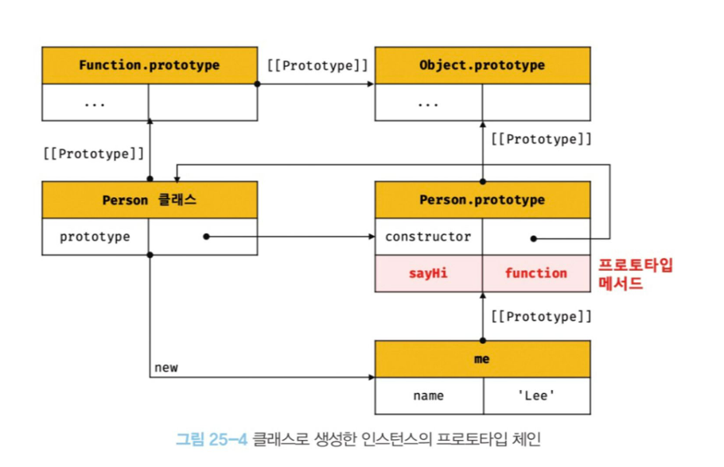

> # 📖25.1 클래스는 프로토타입의 문법적 설탕인가

- 자바스크립트는 `프로토타입 기반 객체지향 언어`다.<br>
  (프로토타입 기반 객체지향언어는 클래스가 필요하지 않고, ES5에서는 클래스 없이도 생성자 함수와 프로토타입을 통해 상속을 구현할 수 있다.)

#### 클래스와 생성자 함수의 차이점

| 클래스                                                  | 생성자 함수                                                                                                             |
| ------------------------------------------------------- | ----------------------------------------------------------------------------------------------------------------------- |
| new 연산자없이 호출하면 에러 발생                       | new 연산자 없이 호출하면 일반함수로서 호출됨                                                                            |
| 상속을 지원하는 extends와 super 키워드를 제공           | 지원X                                                                                                                   |
| 호이스팅이 발생하지 않는 것처럼 동작함                  | 함수 선언문으로 정의된 생성자 함수는 함수 호이스팅이, <br />함수 표현식으로 정의한 생성자 함수는 변수 호이스팅이 발생함 |
| 클래스 내의 모든 코드에는 암묵적으로 strict mode가 지정 | 지정X                                                                                                                   |

---

+클래스의 constructor, 프로토타입 메서드, 정적 메서드는 모두 프로퍼티 어트리뷰터 [[Enumerable]]의 값이 false다. 열거되지 않음.

<details>
<summary>💡 문법적 설탕(syntatic sugar)</summary>

- 사람이 이해 하고 표현하기 쉽게 디자인된 프로그래밍 언어 문법
- 사람이 프로그래밍 언어를 sweeter하게 사용 할 수 있도록 도와주는 문법
- 더욱 더 간결하고 명확하게 표현이 가능한 문법을 뜻 한다.
- 대표적인 예 TypeScript를 Syntactic sugar의 특징을 가졌다고도 한다. ES6의 Class 또한 Syntactic sugar인 구문임
</details>

<br>
<br>
<br>
<br>
<br>

> # 📖25.2 클래스 정의

- 클래스는 class 키워드를 사용하여 정의한다.
- 일반적으로 파스칼 케이스를 사용하지만, 사용하지 않아도 에러가 발생하지는 않는다.
- `클래스는 함수이다.` 즉 값으로 사용할 수 있는 `일급 객체`이다.

  - 무명의 리터럴로 생성할 수 있다. 런타임에 생성 가능
  - 변수나 자료구조(객체 배열)에 저장할 수 있다.
  - 함수의 매개변수에게 전달할 수 있다.
  - 함수의 반환값으로 사용할 수 있다.

- 클래스 몸체에서 정의할 수 있는 메서드
  - constructor(생성자)
  - 프로토타입 메서드
  - 정적 메서드

```js
// 익명 클래스 표현식
const Person = class {};

// 기명 클래스 표현식
const Person = class MyClass {};

// 클래스 선언문
class Person {
  // 생성자
  constructor(name) {
    // 인스턴스 생성 및 초기화
    this.name = name; // name 프로퍼티는 public하다.
  }

  // 프로토타입 메서드
  sayHi() {
    console.log(`Hi! My name is ${this.name}`);
  }

  // 정적 메서드
  static sayHello() {
    console.log('Hello!');
  }
}

// 인스턴스 생성
const me = new Person('Lee');

// 인스턴스의 프로퍼티 참조
console.log(me.name); // Lee
// 프로토타입 메서드 호출
me.sayHi(); // Hi! My name is Lee
// 정적 메서드 호출
Person.sayHello(); // Hello!
```

<br>
<br>
<br>
<br>
<br>

> # 📖25.3 클래스 호이스팅

- 클래스는 함수로 평가된다.
- 클래스 선언문으로 정의한 클래스는 함수 선언문과 같이 소스코드 평가 과정(런타임 이전)에 먼저 평가 되어 함수 객체 생성
- 이때 클래스가 평가되어 생성된 함수 객체는 `constructor`다.
- 생성자 함수로서 호출할 수 있는 함수는 함수 정의가 평가되어 함수 객체를 생성하는 시점에 프로토타입도 더불어 생성된다. 프로토타입과 생성자 함수는 언제나 쌍으로 존재하기 때문이다.

- 클래스는 클래스 정의 이전에 참조할 수 없다.

```js
console.log(Person);
// ReferenceError: Cannot access 'Person' before initialization

// 클래스 선언문
class Person {}
```

- 클래스 선언문은 마치 호이스팅이 발생하지 않는 것처럼 보이지만, let, const키워드로 선언한 변수처럼 호이스팅이 된다. <br>
  클래스 선언문 이전에 일시적 사각지대(TDZ)에 빠지기 때문에 호이스팅이 발생하지 않는 것처럼 동작한다.

```js
const Person = '';

{
  // 호이스팅이 발생하지 않는다면 ''이 출력되어야 한다.
  console.log(Person);
  // ReferenceError: Cannot access 'Person' before initialization

  // 클래스 선언문
  class Person {}
}
```

<br>
<br>
<br>
<br>
<br>

> # 📖25.4 인스턴스 생성

- 클래스는 생성자 함수이며 new 연산자와 함께 호출되어 인스턴스를 생성한다.
- 함수는 new 연산자의 사용여부에 따라 일반함수로 호출되거나, 인스턴스 생성을 위한 생성자 함수로 호출되지만, 클래스는 인스턴스를 생성하는 것이 유일한 존재이뮤이므로 반드시 new 연산자와 함께 호출해야한다.

```js
//1. new연산자를 사용하여 호출
class Person {}

// 인스턴스 생성
const me = new Person();
console.log(me); // Person {}

//2. 클래스를 new 연산자 없이 호출하면 타입 에러가 발생한다.
const me = Person();
// TypeError: Class constructor Foo cannot be invoked without 'new'
```

<br>
<br>
<br>
<br>
<br>

> # 📖25.5 메서드

- 클래스 몸체에는 0개 이상의 메서드만 선언가능
- 클래스 몸체에서 정의할 수 있는 메서드는 constructor(생성자), 프로토타입 메서드, 정적 메서드의 세 가지가 있다.

## 📌25.5.1 constructor

- constructor는 인스턴스를 생성하고 초기화하기 위한 특수한 메서드다.
- 이름을 변경할 수 없다.
- 클래스는 함수 객체로 평가된다. 따라서 객체 고유의 프로퍼티를 모두 갖고 있다.
- prototype 프로퍼티가 가리키는 프로토타입 객체의 constructor 프로퍼티는 클래스 자신을 가리키고 있다.

    

- constructor 내부에서 this에 추가한 프로퍼티는 인스턴스 프로퍼티가 된다.<br>
  => constructor 내부의 this는 클래스가 생성한 인스턴스를 가리킨다.

    

### constructor와 생성자 함수의 차이점

- constructor는 클래스 내에 최대 한 개만 존재할 수 있다.(2개 이상일 경우 SyntaxError 발생)

```js
class Person {
  constructor() {}
  constructor() {}
}
// SyntaxError: A class may only have one constructor
```

- constructor는 생략가능
  - 생략할 경우 암묵적으로 빈 constructor가 정의됨
  - constructor를 생략한 클래스는 constructor에 의해 빈 객체가 생성됨

```js
class Person {
  // constructor를 생략하면 다음과 같이 빈 constructor가 암묵적으로 정의된다.
  constructor() {}
}

// 빈 객체가 생성된다.
const me = new Person();
console.log(me); // Person {}
```

- 인스턴스를 생성할 때 클래스 외부에서 인스턴스 프로퍼티의 초기값을 전달하려면 constructor에 매개변수를 선언하고 인스턴스를 생성할 때 초기값을 전달한다. 초기값은 constructor의 매개변수에게 전달된다.

```js
class Person {
  constructor(name, address) {
    // 인수로 인스턴스 초기화
    this.name = name;
    this.address = address;
  }
}

// 인수로 초기값을 전달한다. 초기값은 constructor에 전달된다.
const me = new Person('Lee', 'Seoul');
console.log(me); // Person {name: "Lee", address: "Seoul"}
```

- constructor는 this가 아닌 다른 객체를 명시적으로 반환하면 return문에 명시된 객체가 반환된다.

```js
class Person {
  constructor(name) {
    this.name = name;

    // 명시적으로 객체를 반환하면 암묵적인 this 반환이 무시된다.
    return {};
  }
}

// constructor에서 명시적으로 반환한 빈 객체가 반환된다.
const me = new Person('Lee');
console.log(me); // {}
```

- 하지만 원시값을 반환할 경우 무시되고 암묵적으로 this가 반환된다.
- construct 내부에서 return 문을 반드시 생략해야 한다.

```js
class Person {
  constructor(name) {
    this.name = name;

    // 명시적으로 원시값을 반환하면 원시값 반환은 무시되고 암묵적으로 this가 반환된다.
    return 100;
  }
}

const me = new Person('Lee');
console.log(me); // Person { name: "Lee" }
```

## 📌25.5.2 프로토타입 메서드

- 생성자 함수를 사용하여 인스턴스를 생성하는 경우 프로토타입 메서드를 생성하기 위해서는 명시적으로 프로토타입에 메서드를 추가해야한다.

```js
// 생성자 함수
function Person(name) {
  this.name = name;
}

// 프로토타입 메서드
Person.prototype.sayHi = function () {
  console.log(`Hi! My name is ${this.name}`);
};

const me = new Person('Lee');
me.sayHi(); // Hi! My name is Lee
```

- 클래스 몸체에서 정의한 메서드는 prototype 프로퍼티에 메서드를 추가하지 않다로 기본적으로 프로토타입 메서드가 된다.

```js
class Person {
  // 생성자
  constructor(name) {
    // 인스턴스 생성 및 초기화
    this.name = name;
  }

  // 프로토타입 메서드
  sayHi() {
    console.log(`Hi! My name is ${this.name}`);
  }
}

const me = new Person('Lee');
me.sayHi(); // Hi! My name is Lee
```

- 생성자 함수와 마찬가지로 클래스가 생성한 인스턴스는 프로토타입 체인의 일원이 된다.

```js
// me 객체의 프로토타입은 Person.prototype이다.
Object.getPrototypeOf(me) === Person.prototype; // -> true
me instanceof Person; // -> true

// Person.prototype의 프로토타입은 Object.prototype이다.
Object.getPrototypeOf(Person.prototype) === Object.prototype; // -> true
me instanceof Object; // -> true

// me 객체의 constructor는 Person 클래스다.
me.constructor === Person; // -> true
```



## 📌25.5.3 정적 메서드

- 인스턴스를 생성하지 않아도 호출할 수 있는 메서드
- 생성자 함수의 경우 명시적으로 생성자 함수에 메서드를 추가하여 생성

```js
// 생성자 함수
function Person(name) {
  this.name = name;
}

// 정적 메서드
Person.sayHi = function () {
  console.log('Hi!');
};

// 정적 메서드 호출
Person.sayHi(); // Hi!
```

- 클래스에서는 메서드에 static 키워드를 붙여서 생성

```js
class Person {
  // 생성자
  constructor(name) {
    // 인스턴스 생성 및 초기화
    this.name = name;
  }

  // 정적 메서드 : 클래스에서는 static 키워드를 붙여서 생성한다.
  static sayHi() {
    console.log('Hi!');
  }
}
```

- 정적 메서드 호출

```js
// 정적 메서드는 프로로타입 메서드처럼 인스턴스로 호출하지 않고 클래스를 호출한다.
Person.sayHi(); // Hi!

// 인스턴스 생성
const me = new Person('Lee');
me.sayHi(); // TypeError: me.sayHi is not a function
// 정적 메서드는 인스턴스로 호출할 수 없다.
```

정적 메서드는 클래스에 바인딩된 메서드이고 인스턴스의 프로토타입 체인상에 존재하지 않기 때문에 정적 메서드는 인스턴스로 호출할 수 없다.

## 📌25.5.4 정적 메서드와 프로토타입 메서드 차이

- 정적 메서드와 프로토타입 메서드는 자신이 속해있는 프로토타입 체인이 다르다.
- 정적 메서드는 클래스로 호출, 프로토타입 메서드는 인스턴스로 호출
- 정적 메서드는 인스턴스 프로퍼티를 참조할 수 없지만, 프로토타입 메서드는 인스턴스 프로퍼티를 참조할 수 있다.

```js
class Square {
  // 정적 메서드
  static area(width, height) {
    return width * height;
  }
}

console.log(Square.area(10, 10)); // 100
```

```js
class Square {
  constructor(width, height) {
    this.width = width;
    this.height = height;
  }

  // 프로토타입 메서드
  area() {
    return this.width * this.height;
  }
}

const square = new Square(10, 10);
console.log(square.area()); // 100
```

## 📌25.5.5 클래스에서 정의한 메서드의 특징

- function 키워드를 생략한 메서드 축약 표현을 사용한다.
- 객체 리터럴과는 다르게 클래스에 메서드를 정의할 땐 콤마가 필요없다.
- 암묵적으로 strict mode로 실행된다.
- for...in문이나 Object.key 메서드 등으로 열거할 수 없다. 즉, 프로퍼티의 열거 가능 여부를 나타내며, 불리언 값을 갖는 프로퍼티 어트리뷰트 [[Enumerable]]의 값이 false다.
- 내부 메서드 [[Construct]]를 갖지 않는 non-constructor다. 따라서 new 연산자와 함께 호출할 수 없다.

<br>
<br>
<br>
<br>
<br>

> # 📖25.6 클래스의 인스턴스 생성 과정

- 인스턴스 생성과 this 바인딩
- 인스턴스 초기화
- 인스턴스 반환

```js
class Person {
  // 생성자
  constructor(name) {
    // 1. 암묵적으로 인스턴스가 생성되고 this에 바인딩된다.
    console.log(this); // Person {}
    console.log(Object.getPrototypeOf(this) === Person.prototype); // true

    // 2. this에 바인딩되어 있는 인스턴스를 초기화한다.
    this.name = name;

    // 3. 완성된 인스턴스가 바인딩된 this가 암묵적으로 반환된다.
  }
}
```
