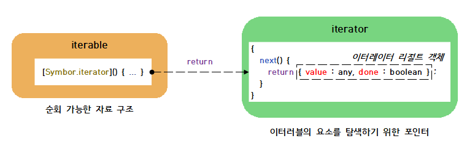
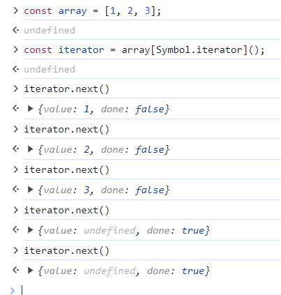
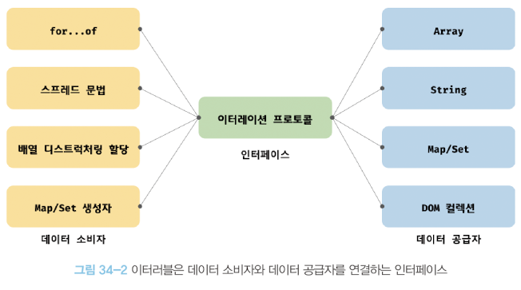

> # 📖 이터러블

## 이터레이션 프로토콜

순회 가능한(iterable) 데이터 컬렉션(자료구조)을 만들기 위한 규칙

`ES6이전` 순회 가능한 데이터 컬렉션 즉 배열, 문자열, 유사배열, DOM 등 통일된 규약 없이 각자 나음의 구조를 가지고 for문, for-in, forEac 메서드 등 순회할 수 있었다

`ES6이후` 순회 가능한 데이터 컬렉션을 프로토콜을 준수하는 이터러블을 통일하여 for-of문, 스프레드 문법, 배열 디스트럭처링 할당의 대상으로 사용할 수 있다

### ⭐이터레이션 프로토콜 2가지

### 1. 이터러블 프로토콜

이터러블 프로토콜을 준수한 객체를 이터러블이라한다. 이터러블은 for-of문으로 순회할 수 있으면 스프레드 문법과 배역 디스트럭처링 할당의 대상으로 사용 가능

### 2. 이터레이터 프로토콜

이터레이터는 next 메서드를 가지고있고 호출하면 value, done 프로퍼티를 갖는 이터레이터 리절트 객체를 반환. 이터레이터 프로토콜을 준수한 객체를 이터레이터라 한다. 이터레이터는 이터러블의 요소를 탐색하기 위한 포인터 역할이다.

<p align="left">
    
</p>

### ✔️이터러블

이터러블은 Symbol.iterator를 프로퍼티 키로 사용한 메서드를 직접 구현하거나 프로토타입 체인을 통해 상속 받은 객체

```javascript
const isIterable = (v) =>
  v !== null && typeof v[Symbol.iterator] === "function";

// 배열, 문자열, Map, Set 등은 이터러블이다.
isIterable([]); // -> true
isIterable(""); // -> true
isIterable(new Map()); // -> true
isIterable(new Set()); // -> true
isIterable({}); // -> false
```

배열은 Array.prototype의 Symbol.iterator 메서드를 상속받은 이터러블이다.<br>
for-of 문으로 순회할 수 있으며 스프레드, 배역 디스트럭처링할당 사용 가능

```javascript
const array = [1, 2, 3];

// 배열은 Array.prototype의 Symbol.iterator 메서드를 상속받는 이터러블이다.
console.log(Symbol.iterator in array); // true

// 이터러블인 배열은 for...of 문으로 순회 가능하다.
for (const item of array) {
  console.log(item); // 1 2 3
}

// 이터러블인 배열은 스프레드 문법의 대상으로 사용할 수 있다.
console.log([...array]); // [1, 2, 3]

// 이터러블인 배열은 배열 디스트럭처링 할당의 대상으로 사용할 수 있다.
const [a, ...rest] = array;
console.log(a, rest); // 1, [2, 3]
```

객체는 이터러블 프로토콜을 준수한 이터러블이 아니다.(21년 1월 전까지)

```javascript
const obj = { a: 1, b: 2 };

// 일반 객체는 Symbol.iterator 메서드를 구현하거나 상속받지 않는다.
// 따라서 일반 객체는 이터러블 프로토콜을 준수한 이터러블이 아니다.
console.log(Symbol.iterator in obj); // false

// 이터러블이 아닌 일반 객체는 for...of 문으로 순회할 수 없다.
for (const item of obj) {
  // -> TypeError: obj is not iterable
  console.log(item);
}

// 이터러블이 아닌 일반 객체는 배열 디스트럭처링 할당의 대상으로 사용할 수 없다.
const [a, b] = obj; // -> TypeError: obj is not iterable
```

21년 후부터는 사용 허용

객체도 이터러블 프로토콜을 준수하도록 구현하면 이터러블이 된다.

```javascript
const obj = { a: 1, b: 2 };

const { a, b } = obj;
// 스프레드 프로퍼티 제안(Stage 4)은 객체 리터럴 내부에서 스프레드 문법의 사용을 허용한다.

console.log({ ...obj }); // { a: 1, b: 2 }
console.log(a); // 1
```

### ✔️이터레이터

```javascript
// 배열은 이터러블 프로토콜을 준수한 이터러블이다.
const array = [1, 2, 3];

// Symbol.iterator 메서드는 이터레이터를 반환한다. 이터레이터는 next 메서드를 갖는다.
const iterator = array[Symbol.iterator]();

// next 메서드를 호출하면 이터러블을 순회하며 순회 결과를 나타내는 이터레이터 리절트 객체를
// 반환한다. 이터레이터 리절트 객체는 value와 done 프로퍼티를 갖는 객체다.
console.log(iterator.next()); // { value: 1, done: false }
console.log(iterator.next()); // { value: 2, done: false }
console.log(iterator.next()); // { value: 3, done: false }
console.log(iterator.next()); // { value: undefined, done: true }
```

<p align="left">
    
</p>

## 빌트인 이터러블

자바스크립트는 이터레이션 프로토콜을 준수한 객체인 빌트인 이터러블을 제공한다.

<p align="left">
    
</p>

## for...of문

내부 동작 확인을 해보자

```javascript
// 이터러블
const iterable = [1, 2, 3];

// 이터러블의 Symbol.iterator 메서드를 호출하여 이터레이터를 생성한다.
const iterator = iterable[Symbol.iterator]();

for (;;) {
  // 이터레이터의 next 메서드를 호출하여 이터러블을 순회한다. 이때 next 메서드는 이터레이터 리절트 객체를 반환한다.
  const res = iterator.next();

  // next 메서드가 반환한 이터레이터 리절트 객체의 done 프로퍼티 값이 true이면 이터러블의 순회를 중단한다.
  if (res.done) break;

  // 이터레이터 리절트 객체의 value 프로퍼티 값을 item 변수에 할당한다.
  const item = res.value;
  console.log(item); // 1 2 3
}
```

내부 코드를 숨기면 우리가 자주봤던 for문이다

```javascript
for (const item of [1, 2, 3]) {
  // item 변수에 순차적으로 1, 2, 3이 할당된다.
  console.log(item); // 1 2 3
}
```

## 이터러블과 유사 배열 객체

- 유사배열은 배열처럼 인덱스로 프로퍼티 값에 접근 가능.
- length프로퍼티를 갖기 때문에 for문을 순회할 수 있다.

```javascript
// 유사 배열 객체
const arrayLike = {
  0: 1,
  1: 2,
  2: 3,
  length: 3,
};

// 유사 배열 객체는 length 프로퍼티를 갖기 때문에 for 문으로 순회할 수 있다.
for (let i = 0; i < arrayLike.length; i++) {
  // 유사 배열 객체는 마치 배열처럼 인덱스로 프로퍼티 값에 접근할 수 있다.
  console.log(arrayLike[i]); // 1 2 3
}
```

근데 유사배열은 이터러블이 아닌 일반 객체이기 때문에 for-of 문으로는 순회할 수 없다.

```javascript
// 유사 배열 객체는 이터러블이 아니기 때문에 for...of 문으로 순회할 수 없다.
for (const item of arrayLike) {
  console.log(item); // 1 2 3
}
// -> TypeError: arrayLike is not iterable
```

`단 유사배열인 arguments, NodeList, HTMLCollection은 이터러블이다 ES6부터 배열과 같이 Symbol.iterator 메서드를 구현하여 이터러블이 되었다.`

🤔 그리고 ES6에서 도입된 Array.from 메서드를 사용해서 배열로 간단하게 변환가능

```javascript
// 유사 배열 객체
const arrayLike = {
  0: 1,
  1: 2,
  2: 3,
  length: 3,
};

// Array.from은 유사 배열 객체 또는 이터러블을 배열로 변환한다
const arr = Array.from(arrayLike);
console.log(arr); // [1, 2, 3]
```

## 이터레이션 프로토콜의 필요성

다시 정리하면 과정이

이터러블을 지원하는 데이터 소비자는 내부에서 Symbol.iterator 메서드를 호출해 이터레이터를 생성하고 이터레이터의 next 메서드를 호출하여 이터러블을 순회하며 이터레이터 리절트 객체를 반환한다. 그리고 이터레이터 리절트 객체의 value, done 프로퍼티 값을 취득한다.

즉 이터레이션 프로토콜은 데이터 소비자와 데이터 공급자를 연결하는 인터페이스의 역할을 한다.

`데이터 소비자`: for...of문, 스프레드 문법, 배열 디스트럭처링 할당과 같은<br>
`데이터 공급자`: 이터러블

<p align="left">
    
</p>

### 사용자 정의 이터러블

이터레이션 프로토콜을 준수하지 않는 일반 객체도 이터레이션 프로토콜을 준수하도록 구현 가능
(직접 커스텀 가능하다)

예시)피보나치 수열 코드

```javascript
// 피보나치 수열을 구현한 사용자 정의 이터러블
const fibonacci = {
  // Symbol.iterator 메서드를 구현하여 이터러블 프로토콜을 준수한다.
  [Symbol.iterator]() {
    let [pre, cur] = [0, 1]; // "36.1. 배열 디스트럭처링 할당" 참고
    const max = 10; // 수열의 최대값

    // Symbol.iterator 메서드는 next 메서드를 소유한 이터레이터를 반환해야 하고
    // next 메서드는 이터레이터 리절트 객체를 반환해야 한다.
    return {
      next() {
        [pre, cur] = [cur, pre + cur]; // "36.1. 배열 디스트럭처링 할당" 참고
        // 이터레이터 리절트 객체를 반환한다.
        return { value: cur, done: cur >= max };
      },
    };
  },
};

// 이터러블인 fibonacci 객체를 순회할 때마다 next 메서드가 호출된다.
for (const num of fibonacci) {
  console.log(num); // 1 2 3 5 8
}
```

done 프로퍼티가 true가 되면 반복문이 멈춘다.

### 이터러블 생성하는 함수

```javascript
// 피보나치 수열을 구현한 사용자 정의 이터러블을 반환하는 함수. 수열의 최대값을 인수로 전달받는다.
const fibonacciFunc = function (max) {
  let [pre, cur] = [0, 1];

  // Symbol.iterator 메서드를 구현한 이터러블을 반환한다.
  return {
    [Symbol.iterator]() {
      return {
        next() {
          [pre, cur] = [cur, pre + cur];
          return { value: cur, done: cur >= max };
        },
      };
    },
  };
};

// 이터러블을 반환하는 함수에 수열의 최대값을 인수로 전달하면서 호출한다.
for (const num of fibonacciFunc(10)) {
  console.log(num); // 1 2 3 5 8
}
```

### 이터러블이면서 이터레이터인 객체를 생성하는 함수

```javascript
// 이터러블이면서 이터레이터인 객체. 이터레이터를 반환하는 Symbol.iterator 메서드와
// 이터레이션 리절트 객체를 반환하는 next 메서드를 소유한다.
{
  [Symbol.iterator]() { return this; },
  next() {
    return { value: any, done: boolean };
  }
}
```

피보나치수열 코드에 적용시켜보자

```javascript
// 이터러블이면서 이터레이터인 객체를 반환하는 함수
const fibonacciFunc = function (max) {
  let [pre, cur] = [0, 1];

  // Symbol.iterator 메서드와 next 메서드를 소유한 이터러블이면서 이터레이터인 객체를 반환
  return {
    [Symbol.iterator]() {
      return this;
    },
    // next 메서드는 이터레이터 리절트 객체를 반환
    next() {
      [pre, cur] = [cur, pre + cur];
      return { value: cur, done: cur >= max };
    },
  };
};

// iter는 이터러블이면서 이터레이터다.
let iter = fibonacciFunc(10);

// iter는 이터러블이므로 for...of 문으로 순회할 수 있다.
for (const num of iter) {
  console.log(num); // 1 2 3 5 8
}

// iter는 이터러블이면서 이터레이터다
iter = fibonacciFunc(10);

// iter는 이터레이터이므로 이터레이션 리절트 객체를 반환하는 next 메서드를 소유한다.
console.log(iter.next()); // { value: 1, done: false }
console.log(iter.next()); // { value: 2, done: false }
console.log(iter.next()); // { value: 3, done: false }
console.log(iter.next()); // { value: 5, done: false }
console.log(iter.next()); // { value: 8, done: false }
console.log(iter.next()); // { value: 13, done: true }
```

### 무한 이터러블과 지연 평가

max값 없이 구현하면

```javascript
// 무한 이터러블을 생성하는 함수
const fibonacciFunc = function () {
  let [pre, cur] = [0, 1];

  return {
    [Symbol.iterator]() {
      return this;
    },
    next() {
      [pre, cur] = [cur, pre + cur];
      // 무한을 구현해야 하므로 done 프로퍼티를 생략한다.
      return { value: cur };
    },
  };
};

// fibonacciFunc 함수는 무한 이터러블을 생성한다.
for (const num of fibonacciFunc()) {
  if (num > 10000) break;
  console.log(num); // 1 2 3 5 8...4181 6765
}

// 배열 디스트럭처링 할당을 통해 무한 이터러블에서 3개의 요소만 취득한다.
const [f1, f2, f3] = fibonacciFunc();
console.log(f1, f2, f3); // 1 2 3
```

지연평가는 데이터가 필요한 시점 이전까지는 미리 데이터를 생성하지 않다가 데이터가 필요한 시점이 되면 그때야 비로소 데이터를 생성하는 기법이다.

장점

1. 빠른 실행 속도
2. 불필요한 메모리 소비하지 않아도 된다.
3. 무한도 표현할 수 있다.
