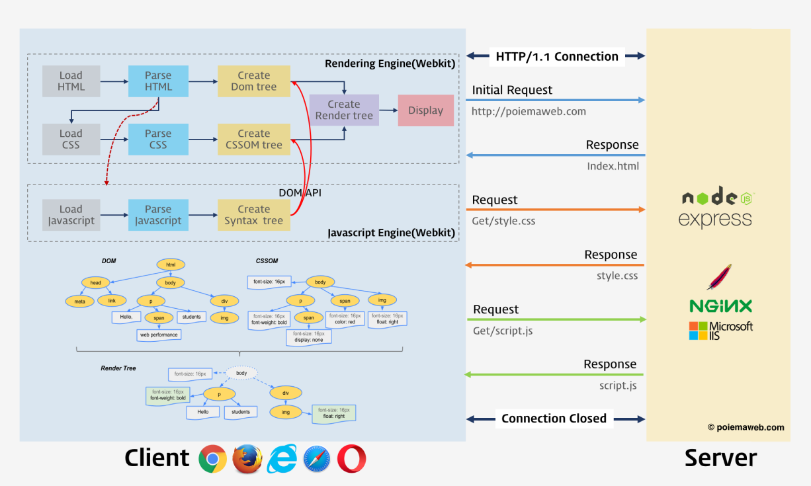
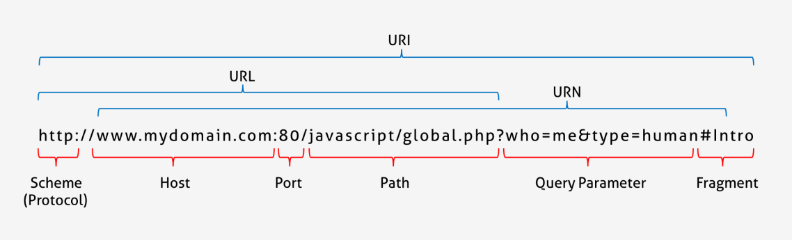
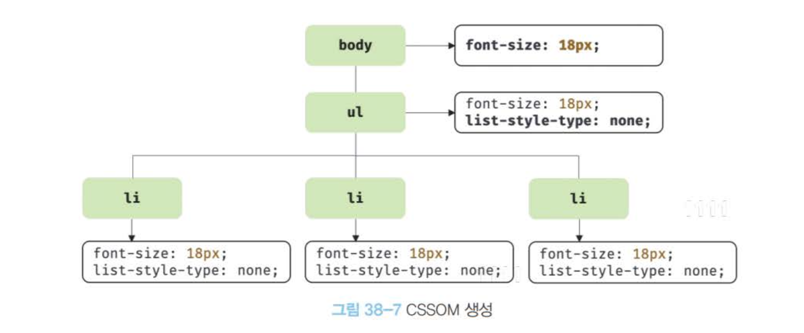
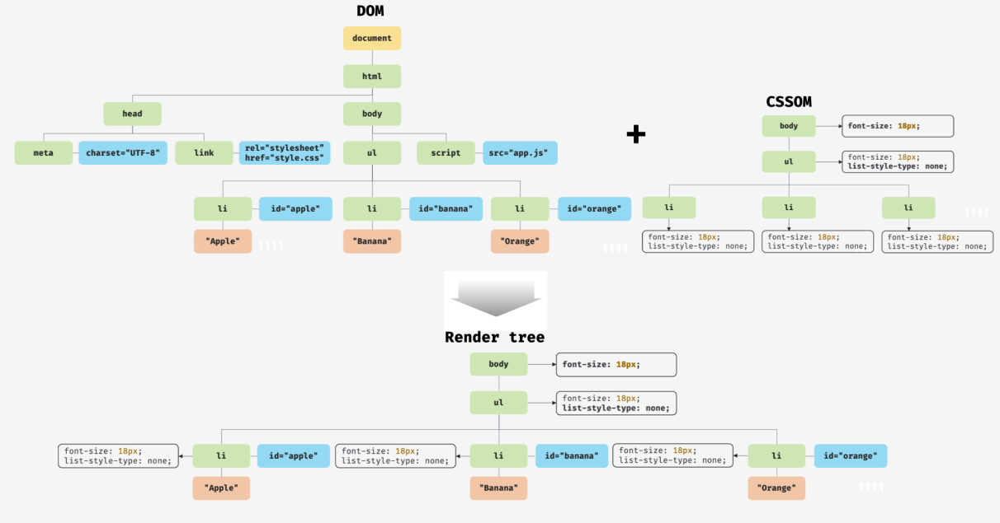

> # 📖 브라우저의 렌더링 과정

- 파싱(parsing): 프로그래밍 언어의 문법에 맞게 작성된 텍스트 문서를 읽어 들여 실행하기 위해 텍스트 문서의 문자열을 토큰으로 분해하고 토큰에 문법적 의미와 구조를 반영하여 트리 구조의 자료구조인 파스트리를 생성하는 일련의 과정을 말한다(간단하게 말하면 프로그래밍 언어의 문법에 맞게 해석한다)
- 렌더링(rendering): HTML, CSS, 자바스크립트로 작성된 문서를 파싱하여 브라우저에 시각적으로 출력

### 랜더링 과정

<p align="left">
    
</p>

1. 브라우저는 HTML, CSS, 자바스크립트, 이미지, 포트파일 등 랜더링에 필요한 리소스를 요청하고 서버로부터 응답 받는다
2. 브라우저의 렌더링 엔진은 서버로부터 응답된 HTML과 CSS를 파싱하여 DOM과 CSSOM을 생성하고 이들을 결합하여 렌더트리를 생성한다.
3. 브라우저의 자바스크립트 엔진은 서버로부터 응답된 자바스크립트를 파싱하여 AST를 생성하고 바이트 코드로 변환하여 실행한다. 이때 자바스크립트 DOM API를 통해 DOM이나 CSSOM을 변경할 수 있다. 변경된 DOM과 CSSOM은 다시 렌더트리로 결합된다.
4. 렌더트리를 기반으로 HTML 요소의 레이아웃(위치와 크기)을 계산하고 브라우저 화면에 HTML 요소를 페인팅한다

## 요청과 응답

렌더링에 필요한 리소스를 모두 서버에 존재하므로 필요한 리소스를 서버에 요청하고 서버가 응답한 리소스를 파싱하여 렌더링하는 것

### URL 구조

<p align="left">
    
</p>

브라우저의 주소창에 URL을 입력 -> URL의 호스트 이름이 DNS를 통해 IP 주소로 변환 -> IP주소를 갖는 서버에 요청

\*주소창에 https://example.com 입력하면 암묵적으로 index.html을 응답하도록 기본 설정되어있다. (https://example.com/index.html)

URL을 입력하고 들어가면 요청하지도 않은 리소스들은 왜 응답할까요?

이유는 브라우저 첫 단계인 브라우저 렌더링 엔진이 HTML(index.html)을 위에서 한줄씩 파싱하는 도중에 리소스를 로드하는 태그(meta, css, link, img 등등) 를 만나면 HTML 파싱을 잠시 중단하고 리소스파일부터 서버에 요청함

## HTTP1.1과 HTTP2.0

HTTP1.1: 기본적으로 커넥션 당 하나의 요청과 응답만 처리(여러개의 요청을 한번에 처리 못함 그래서 응답시간이 오래걸림)

HTTP2.0: 커넥션당 여러개의 요청과 응답 가능(1.1보다 페이지 로드 속도가 약 50% 빠름)

## HTML 파싱과 DOM 생성

### 예시 코드)

```HTML
<!DOCTYPE html>
<html>
  <head>
    <meta charset="UTF-8">
    <link rel="stylesheet" href="style.css">
  </head>
  <body>
    <ul>
      <li id="apple">Apple</li>
      <li id="banana">Banana</li>
      <li id="orange">Orange</li>
    </ul>
    <script src="app.js"></script>
  </body>
</html>
```

### DOM 구조

<p align="left">
    
</p>

1. 서버는 브라우저가 요청한 HTML 파일을 읽어들여 메모리에 저장한 다음 메모리에 저장된 바이트(2진수)를 인터넷을 경유하여 응답
2. 바이트 형태의 HTML문서는 meta태그(charset 어트리뷰트)에 의해 인코딩되어 문자열로 변환
3. 문자열로 변환된 HTML문서를 읽어 최소단위인 토큰들로 분해
4. 각 토큰들을 객체로 변환하여 노드를 생성(이후 DOM을 구성하는 기본요소가 됨)
5. HTML요소 간의 부자관계를 반영하여 모든 노드들을 트리 자료구조로 구성. 이노드들로 구성된 트리 자료구조를 DOM이라 부른다.

\*DOM은 HTML문서를 파싱한 결과물

## CSS 파싱과 CSSOM 생성

```HTML
html파일
<!DOCTYPE html>
<html>
  <head>
    <meta charset="UTF-8">
    <link rel="stylesheet" href="style.css">
...
```

```css
css파일 body {
  font-size: 18px;
}

ul {
  list-style-type: none;
}
```

서버로부터 CSS파일이 응답되면 렌더링 엔진은 HTML과 동일한 해석과정을 거쳐 CSS파일을 파싱하여 CSSOM을 생성한다

해석과정: 바이트 -> 문자 -> 토큰-> 노드 -> CSSOM

<p align="left">
    
</p>

## 렌더 트리 생성

렌더링 엔진은 서버로부터 응답된 HTML과 CSS를 파싱하여 각각 DOM과 CSSOM를 생성한다. 그리고 DOM과 CSSOM은 렌더링을 위해 렌더 트리로 결합된다.

화면에 렌더링되지 않는 노드: meta, script, css에 의해 비표시되는 노드(ex. display: none)

<p align="left">
    
</p>

이후 완성된 렌더 트리는 각 HTML 요소의 레이아웃(위치와 크기)을 계산하는데 사용되며 브라우저 화면에 픽셀을 렌더링 하는 페인팅 처리

<p align="left">
    
</p>

이러한 과정은 반복해서 실행될 수 있다.

반복실행 되는 경우

- 자바스크립트에 의한 노드 추가 또는 삭제
- 브라우조 창의 리사이징에 의한 뷰포트 크기 변경
- HTML 요소의 레이아웃(위치, 크기)에 변경을 발생시키는 width/height, margin, padding, border, display, position 등등의 스타일 변경

반복실행(리렌더링) 단점

- 비용이 많이든다(성능에 악영향을 주는 작업)

## 자바스크립트 파싱과 실행

DOM은 HTML 문서의 구조와 정보뿐만 아니라 HTML 요소와 스타일 등을 변경할 수 있는 프로그래밍 인터페이스로서 DOM API를 제공한다(DOM API를 사용하여 DOM을 동적으로 조작가능)

- 자바스크립트 파싱과 실행은 브라우저의 렌더링 엔진이 아닌 자바스크립트 엔진이 처리
- 렌더링 엔진이 HTML과 CSS를 파싱하여 DOM과 CSSOM을 생성하듯이 자바스크립트 엔진은 자바스크립트를 해석하여 AST를 생성
- AST를 기반으로 인터프리터가 실행할 수 있는 중간 코드인 바이트코드를 생성/실행

<p align="left">
    
</p>

### 토큰나이징(tokenizing)

자바스크립트 코드를 어휘분석하여 문법적 의미를 갖는 코드의 최소단위인 토큰들로 분해. 이과정을 렉싱이라고 브르지만 토크나이징과 미묘한 차이가 있다.

### 파싱(parsing)

- 토큰들의 집합을 분석하여 AST를 생성한다
- AST는 인터프리터나 컴파일러만 사용하는것이 아니다
- AST를 사용하면 TypeScript, Babel, Prettier 같은 트랜스파일러를 구현할 수 있다
- https://astexplorer.net 에 방분하면 오픈소스 자바스크립트 파서를 사용하여 AST를 생성해 볼 수 있다.

### 바이트코드 생성과 실행

파싱의 결과물로서 생성된 AST는 인터프리터가 실행할 수 있는 중간 코드인 바이트코드로 변환되고 인터프리터에 의해 실행된다.

만약 코드의 사용 빈도가 적어지면 다시 디옵티마이징하기도 한다.

디옵티마이징(Deoptimizing): 다시 바이트 코드로 변환

## 리플로우와 리페인트

DOM API가 사용된 경우 DOM이나 CSSOM이 변경되는데 변경된 DOM과 CSSOM은 다시 렌더트리로 결합되고 레이아웃과 페인트 과정을 거쳐 브라우저 화면에 다시 렌더링하는데 이 과정들을 `리플로우`, `리페인트`라고 한다

### 리플로우

레이아웃 계산을 다시 하는 것을 말함(노드추가/삭제, 요소 크기/위치 변경 등)
레이아웃에 영향을 주는 것

### 리페인트

재결합된 렌더 트리를 기반으로 다시 페인트하는 것을 말함

- 리플로우와 리페인트가 반드시 순차적으로 동시에 실행되는게 아니다.
- 레이아웃에 영향이 없는 변경은 리플로우 없이 리페인트만 실행

## 자바스크립트 파싱에 의한 HTML 파싱 중단

렌더링 엔진과 자바스크립트 엔진은 직렬적(동기적)으로 파싱을 수행한다.

<p align="left">
    
</p>

위 코드에서는 script태그가 body위에 HTML 파싱 중간에 script가 실행되는데
이렇게 되면 DOM 생성이 지연될수 있다. 이러한 현상을 블로킹이라고한다. 따라서 script태그 위치는 중요한 의미를 갖는다.

```HTML
<!DOCTYPE html>
<html>
  <head>
    <meta charset="UTF-8">
    <link rel="stylesheet" href="style.css">
    <script>
      /*
      DOM API인 document.getElementById는 DOM에서 id가 'apple'인 HTML 요소를
      취득한다. 아래 DOM API가 실행되는 시점에는 아직 id가 'apple'인 HTML 요소를 파싱하지
      않았기 때문에 DOM에는 id가 'apple'인 HTML 요소가 포함되어 있지 않다.
      따라서 아래 코드는 정상적으로 id가 'apple'인 HTML 요소를 취득하지 못한다.
      */
      const $apple = document.getElementById('apple');

      // id가 'apple'인 HTML 요소의 css color 프로퍼티 값을 변경한다.
      // 이때 DOM에는 id가 'apple'인 HTML 요소가 포함되어 있지 않기 때문에 에러가 발생한다.
      $apple.style.color = 'red'; // TypeError: Cannot read property 'style' of null
    </script>
  </head>
  <body>
    <ul>
      <li id="apple">Apple</li>
      <li id="banana">Banana</li>
      <li id="orange">Orange</li>
    </ul>
  </body>
</html>
```

이 문제를 해결하기 위해서 script태그를 body요소 가장 아래에 위치하는게 좋다

- DOM이 완성되지 않은 상태에서 자바스크립트가 DOM을 조작하면 에러가 발생
- 자바스크립트 로딩/ 파싱/ 실행으로 인해 HTML요소들의 렌더링에 지정받는 일이 발생하지 않아 페이지 로딩 시간이 단축

```HTML
<!DOCTYPE html>
<html>
  <head>
    <meta charset="UTF-8">
    <link rel="stylesheet" href="style.css">
  </head>
  <body>
    <ul>
      <li id="apple">Apple</li>
      <li id="banana">Banana</li>
      <li id="orange">Orange</li>
    </ul>
    <script>
      /*
      DOM API인 document.getElementById는 DOM에서 id가 'apple'인 HTML 요소를
      취득한다. 아래 코드가 실행되는 시점에는 id가 'apple'인 HTML 요소의 파싱이 완료되어
      DOM에 포함되어 있기 때문에 정상적으로 동작한다.
      */
      const $apple = document.getElementById('apple');

      // apple 요소의 css color 프로퍼티 값을 변경한다.
      $apple.style.color = 'red';
    </script>
  </body>
</html>
```

## script 태그의 async/defer 어트리뷰트

```HTML
<script async src="extern.js"></script>
<script defer src="extern.js"></script>
```

async와 defer 어트리뷰트를 사용하면 HTML 파싱과 외부 자바스크립트 파일의 로드가 비동기적으로 동시에 진행된다.

### async

- 비동기적으로 동시에 진행되지만 자바스크립트의 파싱과 실행은 자바스크립트 파일의 로드가 완료된 직후 진행되며 HTML 파싱이 중단된다.
- async 를 여러개 지정하면 script 태그 순서와 상관 없이 로드가 완료된 자바스크립트부터 먼저 실행되므로 순서가 보장되지 않는다.

### defer

async 마찬가지로 비동기적으로 동시에 진행되지만 자바스크립트의 파싱과 실행은 HTML 파싱이 완료된 직후, 즉 DOM 생성이 완료된 직후 진행 된다.

- IE6 ~ 9 에서도 지원되지만 정상적으로 동작하지않는다. IE10이상 정상 작동

<p align="left">
    
</p>

## 다시 정리

<p align="left">
    
</p>

1. 주소창에 URL를 입력하면 https://www.example.com 입력하면 브라우저에서 암묵적으로 https://www.example.com/index.html 실행되고 index.html을 파싱한다.
2. 서버에 HTML, css, 자바스크립트, 이미지, 폰트 등등 서버에 리소스를 요청하고 응답받는다.
3. HTML 코드 한줄씩 파싱하면서 link가 실행되면 html 파싱이 잠시 중단하고 css파일을 html과 동일한 방식으로 파싱한다(바이트 -> 문자 -> 토큰 -> 노드 -> CSSOM)
4. css 파싱이 완료되면 다시 HTML 파싱 시작 -> 렌더 트리 생성 -> DOM 생성 완료(script태그가 body맨 아래 있을 경우)
5. body 맨 아래에 있는 script태그가 실행되면 DOM API를 제공하고 제어권이 자바스크립트 엔진으로 바뀐다.
6. 이 때 자바스크립트 파싱과 실행은 브라우저가 아닌 자바스크립트 엔진에서 처리한다
7. 토큰 변환 -> AST 생성 -> 바이트 코드 생성 -> 인터프리터 실행 끝
