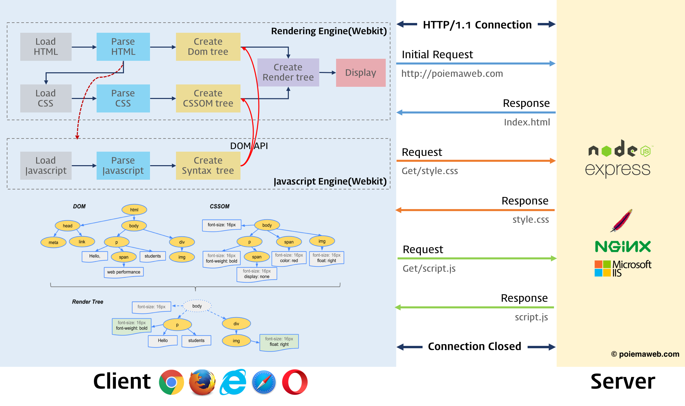
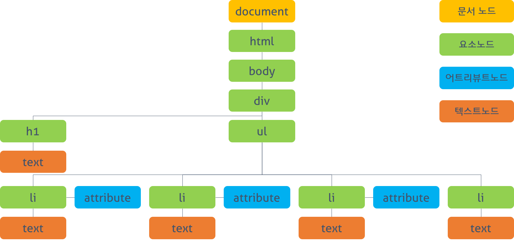
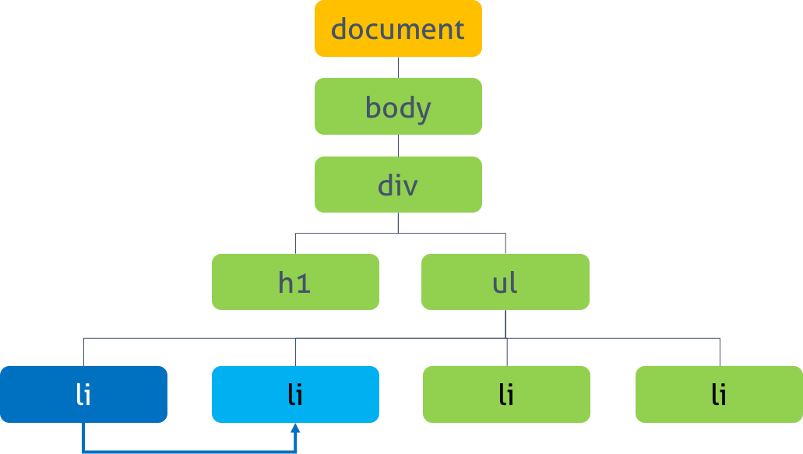
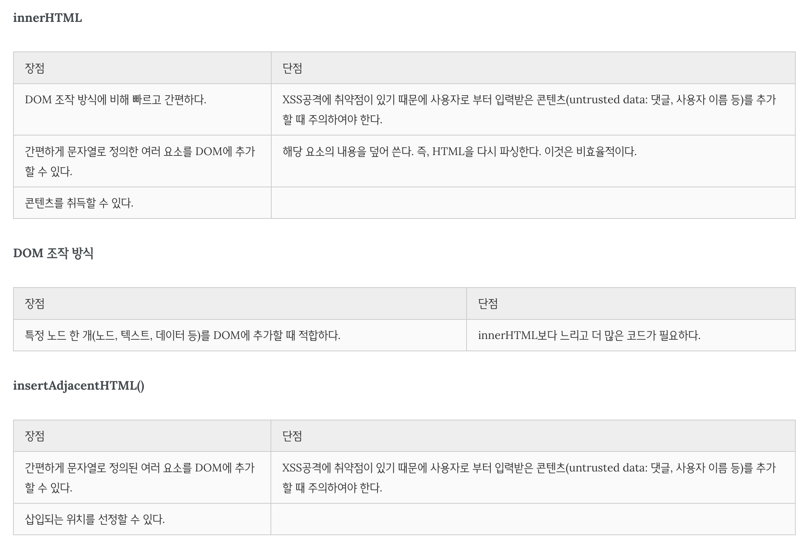

> # 📖 DOM

텍스트 파일로 만들어져 있는 웹 문서를 브라우저에 렌더링하려면 웹 문서를 브라우저가 이해할 수 있는 구조로 메모리에 올려야 한다. 브라우저의 렌더링 엔진은 웹 문서를 로드한 후, 파싱하여 웹 문서를 브라우저가 이해할 수 있는 구조로 구성하여 메모리에 적재하는데 이를 DOM이라 한다.

즉 모든 요소와 요소의 어트리뷰트, 텍스트를 각각의 객체로 만들고 이들 객체를 부자 관계를 표현할 수 있는 트리 구조로 구성한 것이 DOM이다. 이 DOM은 자바스크립트를 통해 동적으로 변경할 수 있으며 변경된 DOM은 렌더링에 반영된다.



이러한 웹 문서의 동적 변경을 위해 DOM은 프로그래밍 언어가 자신에 접근하고 수정할 수 있는 방법을 제공하는데 일반적으로 프로퍼티와 메소드를 갖는 자바스크립트 객체로 제공된다. 이를 DOM API(Application Programming Interface)라고 부른다.

달리 말하면 정적인 웹페이지에 접근하여 동적으로 웹페이지를 변경하기 위한 유일한 방법은 메모리 상에 존재하는 DOM을 변경하는 것이고, 이때 필요한 것이 DOM에 접근하고 변경하는 프로퍼티와 메소드의 집합인 DOM API이다.

### 🧐 DOM Tree



DOM tree는 브라우저가 HTML 문서를 로드한 후 파싱하여 생성하는 모델을 의미한다.

| 노드 종류                       | 의미                                                                                                                                                                                                                                    |
| ------------------------------- | --------------------------------------------------------------------------------------------------------------------------------------------------------------------------------------------------------------------------------------- |
| 문서 노드(Document Node)        | 트리의 최상위에 존재하며 각각 요소, 어트리뷰트, 텍스트 노드에 접근하려면 문서 노드를 통해야 한다. 즉, DOM tree에 접근하기 위한 시작점(entry point)이다.                                                                                 |
| 요소 노드(Element Node)         | HTML 요소를 표현. 요소 노드는 문서의 구조를 서술한다고 말 할 수 있다. 어트리뷰트, 텍스트 노드에 접근하려면 먼저 요소 노드를 찾아 접근해야 한다. 모든 요소 노드는 요소별 특성을 표현하기 위해 HTMLElement 객체를 상속한 객체로 구성된다. |
| 어트리뷰트 노드(Attribute Node) | HTML 요소의 어트리뷰트를 표현. 어트리뷰트 노드는 해당 어트리뷰트가 지정된 요소의 자식이 아니라 해당 요소의 일부로 표현된다.                                                                                                             |
| 텍스트 노드(Text Node)          | HTML 요소의 텍스트를 표현. 텍스트 노드는 요소 노드의 자식이며 자신의 자식 노드를 가질 수 없다. 즉, 텍스트 노드는 DOM tree의 최종단이다.                                                                                                 |

<br/>

### 🧐 DOM Query

✅ 하나의 요소 노드 선택

- `document.getElementById(id)`

  - id 어트리뷰트 값으로 요소 노드를 한 개 선택한다. 복수개가 선택된 경우, 첫번째 요소만 반환한다.
  - Return: HTMLElement를 상속받은 객체

- `document.querySelector(cssSelector)`

  - CSS 셀렉터를 사용하여 요소 노드를 한 개 선택한다. 복수개가 선택된 경우, 첫번째 요소만 반환한다.
  - Return: HTMLElement를 상속받은 객체

<br/>

✅ 여러 개의 요소 노드 선택

- `document.getElementsByClassName(class)`

  - class 어트리뷰트 값으로 요소 노드를 모두 선택한다. 공백으로 구분하여 여러 개의 class를 지정할 수 있다.
  - Return: HTMLCollection (live)

HTMLCollection은 반환값이 복수인 경우, HTMLElement의 리스트를 담아 반환하기 위한 객체로 배열과 비슷한 사용법을 가지고 있지만 배열은 아닌 유사배열(array-like object)이다. 또한 HTMLCollection은 실시간으로 Node의 상태 변경을 반영한다.

- `document.getElementsByTagName(tagName)`

  - 태그명으로 요소 노드를 모두 선택한다.
  - Return: HTMLCollection (live)

- `document.querySelectorAll(selector)`

  - 지정된 CSS 선택자를 사용하여 요소 노드를 모두 선택한다.
  - Return: NodeList (non-live)

<br/>

### 🧐 DOM 탐색



- `parentNode` : 부모 노드 탐색, HTMLElement를 상속받은 객체 반환

- `firstChild & lastChild` : 처음/마지막 자식 노드 탐색, HTMLElement를 상속받은 객체 반환

- `hasChildNodes()` : 자식 노드 여부 확인 후 불린 값 반환

- `childNodes()` : 자식 노드의 컬렉션 반환(텍스트 요소 포함한 모든 자식 요소 반환 - NodeList(non-live))

- `children()` : 자식 노드의 컬렉션 반환(자식 요소 중에서 Element type 요소만 반환 - HTMLCollection(live)) -`previousSibling & nextSibling` : 형제 노드 탐색, HTMLElement를 상속받은 객체 반환

- `previousElementSibling & nextElementSibling`: 형제 노드 탐색(Element type 요소만 탐색), HTMLElement를 상속받은 객체 반환

<br/>

### 🧐 DOM 조작

1. 텍스트 노드 접근 및 수정

- `nodeValue`
  - 노드의 값을 반환한다.
  - Return: 텍스트 노드의 경우는 문자열, 요소 노드의 경우 null 반환

```js
// 해당 텍스트 노드의 부모 요소 노드를 선택한다.
const one = document.getElementById("one");
console.dir(one); // HTMLLIElement: li#one.red

// nodeName, nodeType을 통해 노드의 정보를 취득할 수 있다.
console.log(one.nodeName); // LI
console.log(one.nodeType); // 1: Element node

// firstChild 프로퍼티를 사용하여 텍스트 노드를 탐색한다.
const textNode = one.firstChild;

// nodeName, nodeType을 통해 노드의 정보를 취득할 수 있다.
console.log(textNode.nodeName); // #text
console.log(textNode.nodeType); // 3: Text node

// nodeValue 프로퍼티를 사용하여 노드의 값을 취득한다.
console.log(textNode.nodeValue); // Seoul

// nodeValue 프로퍼티를 이용하여 텍스트를 수정한다.
textNode.nodeValue = "Pusan";
```

2. 어트리뷰트 노드 접근 및 수정

- `className`

  - class 어트리뷰트의 값을 취득 또는 변경한다. className 프로퍼티에 값을 할당하는 경우, class 어트리뷰트가 존재하지 않으면 class 어트리뷰트를 생성하고 지정된 값을 설정한다. class 어트리뷰트의 값이 여러 개일 경우, 공백으로 구분된 문자열이 반환되므로 String 메소드 split(' ')를 사용하여 배열로 변경하여 사용한다.

- `classList`

  - add, remove, item, toggle, contains, replace 메소드를 제공한다.

```js
const elems = document.querySelectorAll("li");

// className
[...elems].forEach((elem) => {
  // class 어트리뷰트 값을 취득하여 확인
  if (elem.className === "red") {
    // class 어트리뷰트 값을 변경한다.
    elem.className = "blue";
  }
});

// classList
[...elems].forEach((elem) => {
  // class 어트리뷰트 값 확인
  if (elem.classList.contains("blue")) {
    // class 어트리뷰트 값 변경한다.
    elem.classList.replace("blue", "red");
  }
});
```

- `id`

  - id 어트리뷰트의 값을 취득 또는 변경한다. id 프로퍼티에 값을 할당하는 경우, id 어트리뷰트가 존재하지 않으면 id 어트리뷰트를 생성하고 지정된 값을 설정한다.

- `hasAttribute(attribute)`

  - 지정한 어트리뷰트를 가지고 있는지 검사한다.
  - Return : Boolean

- `getAttribute(attribute)`

  - 어트리뷰트의 값을 취득한다.
  - Return : 문자열

- `setAttribute(attribute, value)`

  - 어트리뷰트와 어트리뷰트 값을 설정한다.
  - Return : undefined

- `removeAttribute(attribute)`
  - 지정한 어트리뷰트를 제거한다.
  - Return : undefined

<br/>

3. HTML 컨텐츠 조작

- `textContent`

  - 요소의 텍스트 콘텐츠를 취득 또는 변경한다. 이때 마크업은 무시된다. textContent를 통해 요소에 새로운 텍스트를 할당하면 텍스트를 변경할 수 있다. 이때 순수한 텍스트만 지정해야 하며 마크업을 포함시키면 문자열로 인식되어 그대로 출력된다.

- `innerText`

  - innerText 프로퍼티를 사용하여도 요소의 텍스트 콘텐츠에만 접근할 수 있다. 하지만 아래의 이유로 사용하지 않는 것이 좋다.
    - 비표준이다.
    - CSS에 순종적이다. 예를 들어 CSS에 의해 비표시(visibility: hidden;)로 지정되어 있다면 텍스트가 반환되지 않는다.
    - CSS를 고려해야 하므로 textContent 프로퍼티보다 느리다

- `innerHTML`

  - 해당 요소의 모든 자식 요소를 포함하는 모든 콘텐츠를 하나의 문자열로 취득할 수 있다. 이 문자열은 마크업을 포함한다.

<br/>

4. DOM 조작 방식

```js
// 태그이름을 인자로 전달하여 요소를 생성
const newElem = document.createElement("li");
// const newElem = document.createElement('<li>test</li>');
// Uncaught DOMException: Failed to execute 'createElement' on 'Document': The tag name provided ('<li>test</li>') is not a valid name.

// 텍스트 노드를 생성
const newText = document.createTextNode("Beijing");

// 텍스트 노드를 newElem 자식으로 DOM 트리에 추가
newElem.appendChild(newText);

const container = document.querySelector("ul");

// newElem을 container의 자식으로 DOM 트리에 추가. 마지막 요소로 추가된다.
container.appendChild(newElem);

const removeElem = document.getElementById("one");

// container의 자식인 removeElem 요소를 DOM 트리에 제거한다.
container.removeChild(removeElem);
```

innerHTML 프로퍼티를 사용하지 않고 새로운 콘텐츠를 추가할 수 있는 방법은 DOM을 직접 조작하는 것이다. 한 개의 요소를 추가하는 경우 사용한다. 이 방법은 다음의 수순에 따라 진행한다.

요소 노드 생성 createElement() 메소드를 사용하여 새로운 요소 노드를 생성한다. createElement() 메소드의 인자로 태그 이름을 전달한다.

텍스트 노드 생성 createTextNode() 메소드를 사용하여 새로운 텍스트 노드를 생성한다. 경우에 따라 생략될 수 있지만 생략하는 경우, 콘텐츠가 비어 있는 요소가 된다.

생성된 요소를 DOM에 추가 appendChild() 메소드를 사용하여 생성된 노드를 DOM tree에 추가한다. 또는 removeChild() 메소드를 사용하여 DOM tree에서 노드를 삭제할 수도 있다.

<br/>

5. insertAdjacentHTML

- `insertAdjacentHTML(position, string)`
  - 인자로 전달한 텍스트를 HTML로 파싱하고 그 결과로 생성된 노드를 DOM 트리의 지정된 위치에 삽입한다. 첫번째 인자는 삽입 위치, 두번째 인자는 삽입할 요소를 표현한 문자열이다. 첫번째 인자로 올 수 있는 값은 아래와 같다.
    - ‘beforebegin’
    - ‘afterbegin’
    - ‘beforeend’
    - ‘afterend’

<br/>

🤔 비교



innerHTML과 insertAdjacentHTML()은 크로스 스크립팅 공격(XSS: Cross-Site Scripting Attacks)에 취약하다. 따라서 untrusted data의 경우, 주의하여야 한다. 텍스트를 추가 또는 변경시에는 textContent, 새로운 요소의 추가 또는 삭제시에는 DOM 조작 방식을 사용하도록 한다.

<br/>

`Cross-site Scripting?`

웹 상에서 가장 기초적인 취약점 공격 방법의 일종으로, 악의적인 사용자가 공격하려는 사이트에 스크립트를 넣는 기법을 말한다. 공격에 성공하면 사이트에 접속한 사용자는 삽입된 코드를 실행하게 되며, 보통 의도치 않은 행동을 수행시키거나 쿠키나 세션 토큰 등의 민감한 정보를 탈취한다.
