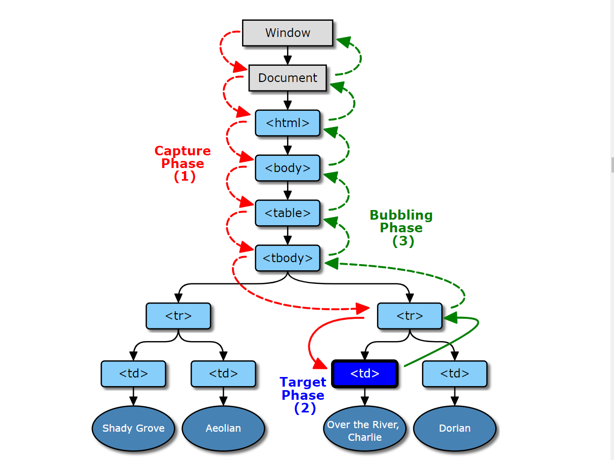

> # 📖40.1 이벤트 드리븐 프로그래밍

- 브라우저는 처리해야 할 특정 사건이 발생하면 이를 감지하여 이벤트를 발생 시킨다.
- 이때 이벤트가 발생했을 때 호출될 함수를 이벤트 핸들러 라 하고, 이벤트가 발생했을 때 핸들러의 호출을 위임하는 것을 이벤트 핸들러 등록 이라 한다.

```js
<!DOCTYPE html>
<html>
<body>
  <button>Click me!</button>
  <script>
    const $button = document.querySelector('button');

    // 사용자가 버튼을 클릭하면 함수를 호출하도록 요청
    $button.onclick = () => { alert('button click'); };
  </script>
</body>
</html>
```

<br>
<br>
<br>
<br>
<br>

> # 📖40.2 이벤트 타입

- 이벤트 타입은 이벤트의 종류를 나타내는 문자열이다.

### 마우스 이벤트

| 이벤트 타입 | 이벤트 발생 시점                                               |
| ----------- | -------------------------------------------------------------- |
| click       | 마우스 버튼을 클릭했을 때                                      |
| dbclick     | 마우스 버튼을 더블 클릭했을 때                                 |
| mousedown   | 마우스 버튼을 눌렀을 때                                        |
| mouseup     | 누르고 있던 마우스 버튼을 놓았을 때                            |
| mousemove   | 마우스 커서를 움직였을 때                                      |
| mouseenter  | 마우스 커서를 HTML 요소 안으로 이동했을 때(버블링 되지 않는다) |
| mouseover   | 마우스 커서를 HTML 요소 안으로 이동했을 때(버블링 된다)        |
| mouseleave  | 마우스 커서를 HTML 요소 밖으로 이동했을 때(버블링 되지 않는다) |
| mouseout    | 마우스 커서를 HTML 요소 밖으로 이동했을 때(버블링 된다)        |

### 키보드 이벤트

| 이벤트 타입 | 이벤트 발생 시점                             |
| ----------- | -------------------------------------------- |
| keydown     | 모든 키를 눌렀을 때 발생한다.                |
| keypress    | 문자 키를 눌렀을 때 연속적으로 발생한다.     |
| keyup       | 누르고 있던 키를 놓았을 때 한 번만 발생한다. |

### 포커스 이벤트

| 이벤트 타입 | 이벤트 발생 시점                                      |
| ----------- | ----------------------------------------------------- |
| focus       | HTML 요소가 포커스를 받았을 때(버블링되지 않는다)     |
| blur        | HTML 요소가 포커스를 잃어버렸을 때(버블링되지 않는다) |
| focusin     | HTML 요소가 포커스를 받았을 때(버블링된다)            |
| focusout    | HTML 요소가 포커스를 잃어버렸을 때(버블링된다)        |

### 폼 이벤트

| 이벤트 타입 | 이벤트 발생 시점                                                                                        |
| ----------- | ------------------------------------------------------------------------------------------------------- |
| submit      | 1. form 요소 내의 input (text, checkbox, radio), select 입력 필드(textarea 제외)에서 엔터키를 눌렀을 때 |
|             | 2. form 요소 내의 submit 버튼(\<button>, \<input type="submit">)을 클릭했을 때                          |
| reset       | form 요소 내의 reset 버튼을 클릭했을 때(최근에는 사용 안 함)                                            |

### 값 변경 이벤트

| 이벤트 타입      | 이벤트 발생 시점                                                                                                         |
| ---------------- | ------------------------------------------------------------------------------------------------------------------------ |
| input            | input (text, checkbox, radio), select, textarea 요소의 값이 입력되었을 때                                                |
| change           | input (text, checkbox, radio), select, textarea 요소의 값이 변경되었을 때                                                |
| readystatechange | HTML 문서의 로드와 파싱 상태를 나타내는 document.readyState 프로퍼티 값('loading', 'interactive', complete')이 변경될 때 |

### DOM 뮤테이션 이벤트

| 이벤트 타입      | 이벤트 발생 시점                                            |
| ---------------- | ----------------------------------------------------------- |
| DOMContentLoaded | HTML 문서의 로드와 파싱이 완료되어 DOM 생성이 완료되었을 때 |

### 뷰 이벤트

| 이벤트 타입 | 이벤트 발생 시점                                                     |
| ----------- | -------------------------------------------------------------------- |
| resize      | 브라우저 윈도우의 크기를 리사이즈할 때 연속적으로 발생한다.          |
| scroll      | 웹페이지(document) 또는 HTML 요소를 스크롤할 때 연속적으로 발생한다. |

### 리소스 이벤트

| 이벤트 타입 | 이벤트 발생 시점                                                          |
| ----------- | ------------------------------------------------------------------------- |
| load        | DOMContentLoaded 이벤트가 발생한 이후, 모든 리소스의 로딩이 완료되었을 때 |
| unload      | 리소스가 언로드될 때(주로 새로운 웹페이지를 요청한 경우)                  |
| abort       | 리소스 로딩이 중단되었을 때                                               |
| error       | 리소스 로딩이 실패했을 때                                                 |

- 이벤트 타입에 대한 상세목록은 아래 링크에서 확인할 수 있다.
- https://developer.mozilla.org/en-US/docs/Web/Events

<br>
<br>
<br>
<br>
<br>

> # 📖40.3 이벤트 핸들러 등록

- 이벤트 핸들러는 이벤트가 발생했을 때 브라우저에 호출을 위임한 함수다. 다시 말해, 이벤트가 발생하면 브라우저에 의해 호출될 함수다.
- 이벤트 핸들러를 등록하는 방법은 3가지다.

## 📌40.3.1 이벤트 핸들러 어트리뷰트 방식

- HTML과 자바스크립트는 관심사가 다르므로 혼재하는 것보다 분리하는 것이 좋다.
- 이 방식은 권장되는 방식이 아니라 더는 사용하지 않는 것이 좋다.

```js
<!DOCTYPE html>
<html>
<body>
  <button onclick="sayHi('Lee')">Click me!</button>
  <script>
    function sayHi(name) {
      console.log(`Hi! ${name}.`);
    }
  </script>
</body>
</html>
```

## 📌40.3.2 이벤트 핸들러 프로퍼티 방식

- window 객체와 Document, HTMLElement 타입의 DOM 노드 객체는 이벤트에 대응하는 이벤트 핸들러 프로퍼티를 가지고 있다.
- 이벤트 핸들러 프로퍼티에 함수를 바인딩하면 이벤트 핸들러가 등록된다.

```js
<!DOCTYPE html>
<html>
<body>
  <button>Click me!</button>
  <script>
    const $button = document.querySelector('button');

    // 이벤트 핸들러 프로퍼티에 이벤트 핸들러를 바인딩
    $button.onclick = function () {
      console.log('button click');
    };
  </script>
</body>
</html>
```

- 이벤트 핸들러 프로퍼티에 하나의 이벤트 핸들러만 바인딩 할 수 있다는 단점이 있다.

```js
<!DOCTYPE html>
<html>
<body>
  <button>Click me!</button>
  <script>
    const $button = document.querySelector('button');

    // 이벤트 핸들러 프로퍼티 방식은 하나의 이벤트에 하나의 이벤트 핸들러만을 바인딩할 수 있다.
    // 첫 번째로 바인딩된 이벤트 핸들러는 두 번째 바인딩된 이벤트 핸들러에 의해 재할당되어
    // 실행되지 않는다.
    $button.onclick = function () {
      console.log('Button clicked 1');
    };

    // 두 번째로 바인딩된 이벤트 핸들러
    $button.onclick = function () {
      console.log('Button clicked 2');
    };
  </script>
</body>
</html>
```

## 📌40.3.3 addEventListener 메서드 방식

- DOM Level 2에서 도입된 EventTarget.prototype.addEventListener 메서드를 사용하여 이벤트 핸들러를 등록할 수 있다.
- 동일한 HTML 요소에 addEventListener를 이용하여 하나 이상의 이벤트 핸들러를 등록할 수 있다. 이때 이벤트 핸들러는 등록된 순서대로 호출된다.

```js
<!DOCTYPE html>
<html>
<body>
  <button>Click me!</button>
  <script>
    const $button = document.querySelector('button');

    // addEventListener 메서드는 동일한 요소에서 발생한 동일한 이벤트에 대해
    // 하나 이상의 이벤트 핸들러를 등록할 수 있다.
    $button.addEventListener('click', function () {
      console.log('[1]button click');
    });

    $button.addEventListener('click', function () {
      console.log('[2]button click');
    });
  </script>
</body>
</html>

```

- 이벤트 핸들러 프로퍼티 방식은 이벤트 핸들러 프로퍼티에 이벤트 핸들러를 바인딩하지만 addEventListener 메서드에는 이벤트 핸들러를 인수로 전달한다.

```js
<!DOCTYPE html>
<html>
<body>
  <button>Click me!</button>
  <script>
    const $button = document.querySelector('button');

    // 이벤트 핸들러 프로퍼티 방식
    $button.onclick = function () {
      console.log('[이벤트 핸들러 프로퍼티 방식]button click');
    };

    // addEventListener 메서드 방식
    $button.addEventListener('click', function () {
      console.log('[addEventListener 메서드 방식]button click');
    });
  </script>
</body>
</html>
```

- 단, addEventListener 메서드를 통해 참조가 동일한 이벤트 핸들러를 중복 등록하면 하나의 이벤트 핸들러만 등록된다.

```js
<!DOCTYPE html>
<html>
<body>
  <button>Click me!</button>
  <script>
    const $button = document.querySelector('button');

    const handleClick = () => console.log('button click');

    // 참조가 동일한 이벤트 핸들러를 중복 등록하면 하나의 핸들러만 등록된다.
    $button.addEventListener('click', handleClick);
    $button.addEventListener('click', handleClick);
  </script>
</body>
</html>
```

<br>
<br>
<br>
<br>
<br>

> # 📖40.4 이벤트 핸들러 제거

- addEventListener로 등록한 이벤트 핸들러를 제거하려면 EventTarget.prototype.removeEventListener 메서드를 사용한다.
- 단, addEvenetListener 메서드에 전달한 인수와 removeEventListener 메서드에 전달한 인수가 일치하지 않으면 이벤트 핸들러가 제거되지 않는다.

```js
<!DOCTYPE html>
<html>
<body>
  <button>Click me!</button>
  <script>
    const $button = document.querySelector('button');

    const handleClick = () => console.log('button click');

    // 이벤트 핸들러 등록
    $button.addEventListener('click', handleClick);

    // 이벤트 핸들러 제거
    // addEventListener 메서드에 전달한 인수와 removeEventListener 메서드에
    // 전달한 인수가 일치하지 않으면 이벤트 핸들러가 제거되지 않는다.
    $button.removeEventListener('click', handleClick, true); // 실패
    $button.removeEventListener('click', handleClick); // 성공
  </script>
</body>
</html>
```

```js
<!DOCTYPE html>
<html>
  <body>
    <button>Click me!</button>
    <script>
      const $button = document.querySelector('button');

      // 기명 함수를 이벤트 핸들러로 등록
      $button.addEventListener('click', function foo() {
        console.log('button click');
        // 이벤트 핸들러를 제거한다. 따라서 이벤트 핸들러는 단 한 번만 호출된다.
        $button.removeEventListener('click', foo);
      });
    </script>
  </body>
</html>

```

- 이벤트 핸들러 프로퍼티 방식으로 등록한 이벤트 핸들러를 제거하려면 이벤트 핸들러 프로퍼티에 null을 할당하면 된다.

```js
<!DOCTYPE html>
<html>
<body>
  <button>Click me!</button>
  <script>
    const $button = document.querySelector('button');

    const handleClick = () => console.log('button click');

    // 이벤트 핸들러 프로퍼티 방식으로 이벤트 핸들러 등록
    $button.onclick = handleClick;

    // removeEventListener 메서드로 이벤트 핸들러를 제거할 수 없다.
    $button.removeEventListener('click', handleClick);

    // 이벤트 핸들러 프로퍼티에 null을 할당하여 이벤트 핸들러를 제거한다.
    $button.onclick = null;
  </script>
</body>
</html>
```

<br>
<br>
<br>
<br>
<br>

> # 📖40.5 이벤트 객체

- 이벤트가 발생하면 이벤트에 관련한 다양한 정보를 담고 있는 이벤트 객체가 동적으로 생성된다.
- 생성된 이벤트 객체는 이벤트 핸들러의 첫 번째 인수로 전달된다.

```js
<!DOCTYPE html>
<html>
<body>
  <p>클릭하세요. 클릭한 곳의 좌표가 표시됩니다.</p>
  <em class="message"></em>
  <script>
    const $msg = document.querySelector('.message');

    // 클릭 이벤트에 의해 생성된 이벤트 객체는 이벤트 핸들러의 첫 번째 인수로 전달된다.
    function showCoords(e) {
      $msg.textContent = `clientX: ${e.clientX}, clientY: ${e.clientY}`;
    }

    document.onclick = showCoords;
  </script>
</body>
</html>
```

## 📌40.5.1 이벤트 객체의 상속 구조

- 이벤트가 발생하면 이벤트 타입에 따라 다양한 타입의 이벤트 객체가 생성된다.
- Event, UIEvent, MouseEvent 등은 모두 생성자 함수다. 따라서 다음과 같이 생성자 함수를 호출하여 이벤트 객체를 생성할 수 있다.

```js
<!DOCTYPE html>
<html>
  <body>
    <script>
      // Event 생성자 함수를 호출하여 foo 이벤트 타입의 Event 객체를 생성한다.
      let e = new Event('foo');
      console.log(e);
      // Event {isTrusted: false, type: "foo", target: null, ...}
      console.log(e.type); // "foo"
      console.log(e instanceof Event); // true
      console.log(e instanceof Object); // true

      // FocusEvent 생성자 함수를 호출하여 focus 이벤트 타입의 FocusEvent 객체를 생성한다.
      e = new FocusEvent('focus');
      console.log(e);
      // FocusEvent {isTrusted: false, relatedTarget: null, view: null, ...}

      // MouseEvent 생성자 함수를 호출하여 click 이벤트 타입의 MouseEvent 객체를 생성한다.
      e = new MouseEvent('click');
      console.log(e);
      // MouseEvent {isTrusted: false, screenX: 0, screenY: 0, clientX: 0, ... }

      // KeyboardEvent 생성자 함수를 호출하여 keyup 이벤트 타입의 KeyboardEvent 객체를
      // 생성한다.
      e = new KeyboardEvent('keyup');
      console.log(e);
      // KeyboardEvent {isTrusted: false, key: "", code: "", ctrlKey: false, ...}

      // InputEvent 생성자 함수를 호출하여 change 이벤트 타입의 InputEvent 객체를 생성한다.
      e = new InputEvent('change');
      console.log(e);
      // InputEvent {isTrusted: false, data: null, inputType: "", ...}
    </script>
  </body>
</html>

```

```js
<!DOCTYPE html>
<html>
  <body>
    <input type="text" />
    <input type="checkbox" />
    <button>Click me!</button>
    <script>
      const $input = document.querySelector('input[type=text]');
      const $checkbox = document.querySelector('input[type=checkbox]');
      const $button = document.querySelector('button');

      // load 이벤트가 발생하면 Event 타입의 이벤트 객체가 생성된다.
      window.onload = console.log;

      // change 이벤트가 발생하면 Event 타입의 이벤트 객체가 생성된다.
      $checkbox.onchange = console.log;

      // focus 이벤트가 발생하면 FocusEvent 타입의 이벤트 객체가 생성된다.
      $input.onfocus = console.log;

      // input 이벤트가 발생하면 InputEvent 타입의 이벤트 객체가 생성된다.
      $input.oninput = console.log;

      // keyup 이벤트가 발생하면 KeyboardEvent 타입의 이벤트 객체가 생성된다.
      $input.onkeyup = console.log;

      // click 이벤트가 발생하면 MouseEvent 타입의 이벤트 객체가 생성된다.
      $button.onclick = console.log;
    </script>
  </body>
</html>

```

## 📌40.5.2 이벤트 객체의 공통 프로퍼티

- Event 인터페이스의 이벤트 관련 프로퍼티는 모든 이벤트 객체가 상속받는 공통 프로퍼티다.

| 공통 프로퍼티    | 설명                                                                        | 타입          |
| ---------------- | --------------------------------------------------------------------------- | ------------- |
| type             | 이벤트 타입                                                                 | string        |
| target           | 이벤트를 발생시킨 DOM 요소                                                  | DOM 요소 Node |
| currentTarget    | 이벤트 핸들러가 바인딩된 DOM 요소                                           | DOM 요소 Node |
| eventPhase       | 이벤트 전파 단계                                                            | number        |
| bubbles          | 이벤트를 버블링으로 전파하는지 여부                                         | boolean       |
| cancelable       | preventDefault 메서드를 호출하여 이벤트의 기본 동작을 취소할 수 있는지 여부 | boolean       |
| defaultPrevented | preventDefault를 호출하여 이벤트를 취소했는지 여부                          | boolean       |
| isTrusted        | 사용자의 행위에 의해 발생한 이벤트인지 여부                                 | boolean       |
| timeStamp        | 이벤트가 발생한 시각(1970/01/01/00:00:0부터 경과한 밀리초(ms))              | number        |

<br>
<br>
<br>
<br>
<br>

> # 📖40.6 이벤트 전파

- DOM 트리 상에서 존재하는 DOM 요소 노드에 발생한 이벤트는 DOM트리를 통해 전파된다. 이를 이벤트 전파라고 한다.
- 이벤트 전파는 이벤트가 전파되는 방향에 따라 3단계로 구분할 수 있다.
  - 캡처링 단계: 이벤트가 상위 요소에서 하위 요소 방향으로 전파
  - 타겟 단계: 이벤트가 이벤트 타겟에 도달
  - 버블링 단계: 이벤트가 하위 요소에서 상위 요소로 전파



- 버블링
  - 이벤트 리스너를 등록한 대상이 currentTarget에 들어가고
  - 이벤트가 실제로 발생한 대상이 target에 들어간다.

```js
<!DOCTYPE html>
<html>
  <body>
    <ul id="fruits">
      <li id="apple">Apple</li>
      <li id="banana">Banana</li>
      <li id="orange">Orange</li>
    </ul>
    <script>
      const $fruits = document.getElementById('fruits');

      // #fruits 요소의 하위 요소인 li 요소를 클릭한 경우
      $fruits.addEventListener('click', (e) => {
        console.log(`이벤트 단계: ${e.eventPhase}`); // 3: 버블링 단계
        console.log(`이벤트 타깃: ${e.target}`); // [object HTMLLIElement]
        console.log(`커런트 타깃: ${e.currentTarget}`); // [object HTMLUListElement]
        console.dir(e.currentTarget);
        console.dir(e.target);
      });
    </script>
  </body>
</html>
```

- 캡쳐링

```js
<!DOCTYPE html>
<html>
  <body>
    <ul id="fruits">
      <li id="apple">Apple</li>
      <li id="banana">Banana</li>
      <li id="orange">Orange</li>
    </ul>
    <script>
      const $fruits = document.getElementById('fruits');

      // #fruits 요소의 하위 요소인 li 요소를 클릭한 경우
      $fruits.addEventListener(
        'click',
        (e) => {
          console.log(`이벤트 단계: ${e.eventPhase}`); // 3: 버블링 단계
          console.log(`이벤트 타깃: ${e.target}`); // [object HTMLLIElement]
          console.log(`커런트 타깃: ${e.currentTarget}`); // [object HTMLUListElement]
          console.dir(e.currentTarget);
          console.dir(e.target);
        },
        true
      );
    </script>
  </body>
</html>

```

```js
<!DOCTYPE html>
<html>
  <body>
    <ul id="fruits">
      <li id="apple">Apple</li>
      <li id="banana">Banana</li>
      <li id="orange">Orange</li>
    </ul>
    <script>
      const $fruits = document.getElementById('fruits');
      const $banana = document.getElementById('banana');

      // #fruits 요소의 하위 요소인 li 요소를 클릭한 경우
      // 캡처링 단계의 이벤트를 캐치한다.
      $fruits.addEventListener(
        'click',
        (e) => {
          console.log(`이벤트 단계: ${e.eventPhase}`); // 1: 캡처링 단계
          console.log(`이벤트 타깃: ${e.target}`); // [object HTMLLIElement]
          console.log(`커런트 타깃: ${e.currentTarget}`); // [object HTMLUListElement]
        },
        true
      );

      // 타깃 단계의 이벤트를 캐치한다.
      $banana.addEventListener('click', (e) => {
        console.log(`이벤트 단계: ${e.eventPhase}`); // 2: 타깃 단계
        console.log(`이벤트 타깃: ${e.target}`); // [object HTMLLIElement]
        console.log(`커런트 타깃: ${e.currentTarget}`); // [object HTMLLIElement]
      });

      // 버블링 단계의 이벤트를 캐치한다.
      $fruits.addEventListener('click', (e) => {
        console.log(`이벤트 단계: ${e.eventPhase}`); // 3: 버블링 단계
        console.log(`이벤트 타깃: ${e.target}`); // [object HTMLLIElement]
        console.log(`커런트 타깃: ${e.currentTarget}`); // [object HTMLUListElement]
      });
    </script>
  </body>
</html>
```

<br>
<br>
<br>
<br>
<br>

> # 📖40.7 이벤트 위임

```js
<!DOCTYPE html>
<html>
<head>
  <style>
    #fruits {
      display: flex;
      list-style-type: none;
      padding: 0;
    }

    #fruits li {
      width: 100px;
      cursor: pointer;
    }

    #fruits .active {
      color: red;
      text-decoration: underline;
    }
  </style>
</head>
<body>
  <nav>
    <ul id="fruits">
      <li id="apple" class="active">Apple</li>
      <li id="banana">Banana</li>
      <li id="orange">Orange</li>
    </ul>
  </nav>
  <div>선택된 내비게이션 아이템: <em class="msg">apple</em></div>
  <script>
    const $fruits = document.getElementById('fruits');
    const $msg = document.querySelector('.msg');

    // 사용자 클릭에 의해 선택된 내비게이션 아이템(li 요소)에 active 클래스를 추가하고
    // 그 외의 모든 내비게이션 아이템의 active 클래스를 제거한다.
    function activate({ target }) {
      [...$fruits.children].forEach($fruit => {
        $fruit.classList.toggle('active', $fruit === target);
        $msg.textContent = target.id;
      });
    }

    // 모든 내비게이션 아이템(li 요소)에 이벤트 핸들러를 등록한다.
    document.getElementById('apple').onclick = activate;
    document.getElementById('banana').onclick = activate;
    document.getElementById('orange').onclick = activate;
  </script>
</body>
</html>
```

- 위 예제를 살펴보면 모든 내비게이션 아이템(li)이 클릭 이벤트에 반응하도록 모든 아이템에 이벤트 핸들러를 등록했다.
- 이 경우 많은 DOM 요소에 이벤트 핸들러를 등록하므로 성능 저하의 원인이 되며, 유지보수에도 부적합하다.
- 이벤트 위임을 사용해 다음과 같이 코드를 수정할 수 있다.

```js
<!DOCTYPE html>
<html>
<head>
  <style>
    #fruits {
      display: flex;
      list-style-type: none;
      padding: 0;
    }

    #fruits li {
      width: 100px;
      cursor: pointer;
    }

    #fruits .active {
      color: red;
      text-decoration: underline;
    }
  </style>
</head>
<body>
  <nav>
    <ul id="fruits">
      <li id="apple" class="active">Apple</li>
      <li id="banana">Banana</li>
      <li id="orange">Orange</li>
    </ul>
  </nav>
  <div>선택된 내비게이션 아이템: <em class="msg">apple</em></div>
  <script>
    const $fruits = document.getElementById('fruits');
    const $msg = document.querySelector('.msg');

    // 사용자 클릭에 의해 선택된 내비게이션 아이템(li 요소)에 active 클래스를 추가하고
    // 그 외의 모든 내비게이션 아이템의 active 클래스를 제거한다.
    function activate({ target }) {
      // 이벤트를 발생시킨 요소(target)가 ul#fruits의 자식 요소가 아니라면 무시한다.
      if (!target.matches('#fruits > li')) return;

      [...$fruits.children].forEach($fruit => {
        $fruit.classList.toggle('active', $fruit === target);
        $msg.textContent = target.id;
      });
    }

    // 이벤트 위임: 상위 요소(ul#fruits)는 하위 요소의 이벤트를 캐치할 수 있다.
    document.getElementById('fruits').onclick = activate;
  </script>
</body>
</html>
```

- 이벤트 위임을 통해 하위 DOM 요소에서 발생한 이벤트를 처리할 때 주의할 점은 상위 요소에 이벤트 핸들러를 등록하기 때문에 이벤트 타깃, 즉 이벤트를 실제로 발생시킨 DOM 요소가 개발자가 기대한 DOM 요소가 아닐 수도 있다는 것이다.
- 따라서 이벤트에 반응이 필요한 DOM 요소에 한정하여 이벤트 핸들러가 실행되도록 이벤트 타깃을 검사할 필요가 있다.

<br>
<br>
<br>
<br>
<br>

> # 📖40.8 DOM 요소의 기본 동작 조작

## 📌40.8.1 DOM 요소의 기본 동작 조작

- DOM 요소는 저마다 기본 동작이 있다. 이벤트 객체의 preventDefault 메서드는 이러한 DOM 요소의 기본 동작을 중단시킨다.

```js
<!DOCTYPE html>
<html>
<body>
  <a href="https://www.google.com">go</a>
  <input type="checkbox">
  <script>
    document.querySelector('a').onclick = e => {
      // a 요소의 기본 동작을 중단한다.
      e.preventDefault();
    };

    document.querySelector('input[type=checkbox]').onclick = e => {
      // checkbox 요소의 기본 동작을 중단한다.
      e.preventDefault();
    };
  </script>
</body>
</html>
```

## 📌40.8.2 이벤트 전파 방지

- 이벤트 객체의 stopPropagation 메서드는 이벤트 전파를 중지시킨다.

```js
<!DOCTYPE html>
<html>
<body>
  <div class="container">
    <button class="btn1">Button 1</button>
    <button class="btn2">Button 2</button>
    <button class="btn3">Button 3</button>
  </div>
  <script>
    // 이벤트 위임. 클릭된 하위 버튼 요소의 color를 변경한다.
    document.querySelector('.container').onclick = ({ target }) => {
      if (!target.matches('.container > button')) return;
      target.style.color = 'red';
    };

    // .btn2 요소는 이벤트를 전파하지 않으므로 상위 요소에서 이벤트를 캐치할 수 없다.
    document.querySelector('.btn2').onclick = e => {
      e.stopPropagation(); // 이벤트 전파 중단
      e.target.style.color = 'blue';
    };
  </script>
</body>
</html>
```

<br>
<br>
<br>
<br>
<br>

> # 📖40.9 이벤트 핸들러 내부의 this

## 📌40.9.1 이벤트 핸들러 어트리뷰트 방식

- 이벤트 핸들러 어트리뷰트의 값으로 지정한 문자열은 암묵적으로 생성되는 이벤트 핸들러의 문이다.
- 따라서 handleClick함수는 이벤트 핸들러에 의해 일반 함수로 호출된다.
  - 일반 함수로서 호출되는 함수 내부의 this는 전역 객체를 가리킨다.
- 단, 이벤트 핸들러를 호출할 때 인수로 전달한 this는 이벤트를 바인딩한 DOM 요소를 가리킨다.

```js
<!DOCTYPE html>
<html>
<body>
  <button onclick="handleClick(this)">Click me</button>
  <script>
    function handleClick(button) {
      console.log(button); // 이벤트를 바인딩한 button 요소
      console.log(this);   // window
    }
  </script>
</body>
</html>
```

## 📌40.9.2 이벤트 핸들러 프로퍼티 방식과 addEventListener 메서드 방식

- 이벤트 핸들러 프로퍼티 방식과 addEventListener 메서드 방식 모두 이벤트 핸들러 내부의 this는 이벤트를 바인딩한 DOM 요소를 가리킨다.

```js
<!DOCTYPE html>
<html>
<body>
  <button class="btn1">0</button>
  <button class="btn2">0</button>
  <script>
    const $button1 = document.querySelector('.btn1');
    const $button2 = document.querySelector('.btn2');

    // 이벤트 핸들러 프로퍼티 방식
    $button1.onclick = function (e) {
      // this는 이벤트를 바인딩한 DOM 요소를 가리킨다.
      console.log(this); // $button1
      console.log(e.currentTarget); // $button1
      console.log(this === e.currentTarget); // true

      // $button1의 textContent를 1 증가시킨다.
      ++this.textContent;
    };

    // addEventListener 메서드 방식
    $button2.addEventListener('click', function (e) {
      // this는 이벤트를 바인딩한 DOM 요소를 가리킨다.
      console.log(this); // $button2
      console.log(e.currentTarget); // $button2
      console.log(this === e.currentTarget); // true

      // $button2의 textContent를 1 증가시킨다.
      ++this.textContent;
    });
  </script>
</body>
</html>
```

- 화살표 함수로 정의한 이벤트 핸들러 내부의 this는 상위 스코프의 this를 가리킨다. 화살표 함수는 함수 자체의 this 바인딩을 갖지 않는다.

```js
<!DOCTYPE html>
<html>
<body>
  <button class="btn1">0</button>
  <button class="btn2">0</button>
  <script>
    const $button1 = document.querySelector('.btn1');
    const $button2 = document.querySelector('.btn2');

    // 이벤트 핸들러 프로퍼티 방식
    $button1.onclick = e => {
      // 화살표 함수 내부의 this는 상위 스코프의 this를 가리킨다.
      console.log(this); // window
      console.log(e.currentTarget); // $button1
      console.log(this === e.currentTarget); // false

      // this는 window를 가리키므로 window.textContent에 NaN(undefined + 1)을 할당한다.
      ++this.textContent;
    };

    // addEventListener 메서드 방식
    $button2.addEventListener('click', e => {
      // 화살표 함수 내부의 this는 상위 스코프의 this를 가리킨다.
      console.log(this); // window
      console.log(e.currentTarget); // $button2
      console.log(this === e.currentTarget); // false

      // this는 window를 가리키므로 window.textContent에 NaN(undefined + 1)을 할당한다.
      ++this.textContent;
    });
  </script>
</body>
</html>
```

<br>
<br>
<br>
<br>
<br>

> # 📖40.10 이벤트 핸들러에 인수 전달

- 함수에 인수를 전달하려면 함수를 호출할 때 전달해야 한다.
- 이벤트 핸들러 내부에서 함수를 호출하면서 인수를 전달할 수 있다.

```js
<!DOCTYPE html>
<html>
<body>
  <label>User name <input type='text'></label>
  <em class="message"></em>
  <script>
    const MIN_USER_NAME_LENGTH = 5; // 이름 최소 길이
    const $input = document.querySelector('input[type=text]');
    const $msg = document.querySelector('.message');

    const checkUserNameLength = min => {
      $msg.textContent
        = $input.value.length < min ? `이름은 ${min}자 이상 입력해 주세요` : '';
    };

    // 이벤트 핸들러 내부에서 함수를 호출하면서 인수를 전달한다.
    $input.onblur = () => {
      checkUserNameLength(MIN_USER_NAME_LENGTH);
    };
  </script>
</body>
</html>
```

<br>
<br>
<br>
<br>
<br>

> # 📖40.11 커스텀 이벤트

## 📌40.11.1 커스텀 이벤트 생성

- 이벤트 객체는 Event, UIEvent, MouseEvent 등과 같은 이벤트 생성자 함수로 생성할 수 있다.
- 이벤트 생성자 함수는 첫 번째 인수로 이벤트 타입을 나타내는 문자열을 전달받는다. 이때 이벤트 타입을 나타내는 문자열은 기존 이벤트 타입을 사용할 수 있고, 임의의 문자열을 사용할 수도 있다.

```js
// KeyboardEvent 생성자 함수로 keyup 이벤트 타입의 커스텀 이벤트 객체를 생성
const keyboardEvent = new KeyboardEvent('keyup');
console.log(keyboardEvent.type); // keyup

// CustomEvent 생성자 함수로 foo 이벤트 타입의 커스텀 이벤트 객체를 생성
const customEvent = new CustomEvent('foo');
console.log(customEvent.type); // foo
```

## 📌40.11.1 커스텀 이벤트 디스패치

- 생성된 커스텀 이벤트는 dispatchEvent 메서드로 디스패치 할 수 있다.

```js
<!DOCTYPE html>
<html>
<body>
  <button class="btn">Click me</button>
  <script>
    const $button = document.querySelector('.btn');

    // 버튼 요소에 click 커스텀 이벤트 핸들러를 등록
    // 커스텀 이벤트를 디스패치하기 이전에 이벤트 핸들러를 등록해야 한다.
    $button.addEventListener('click', e => {
      console.log(e.isTrusted); // MouseEvent {isTrusted: false, screenX: 0, ...}
      alert(`${e} Clicked!`);
    });

    // 커스텀 이벤트 생성
    const customEvent = new MouseEvent('click');

    // 커스텀 이벤트 디스패치(동기 처리). click 이벤트가 발생한다.
    $button.dispatchEvent(customEvent);
  </script>
</body>
</html>
```
