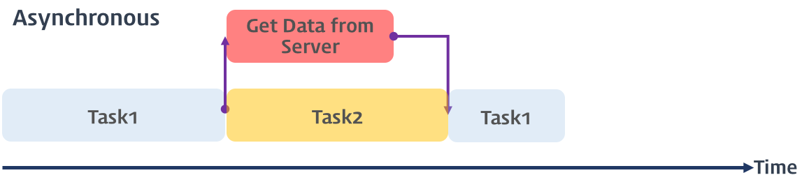
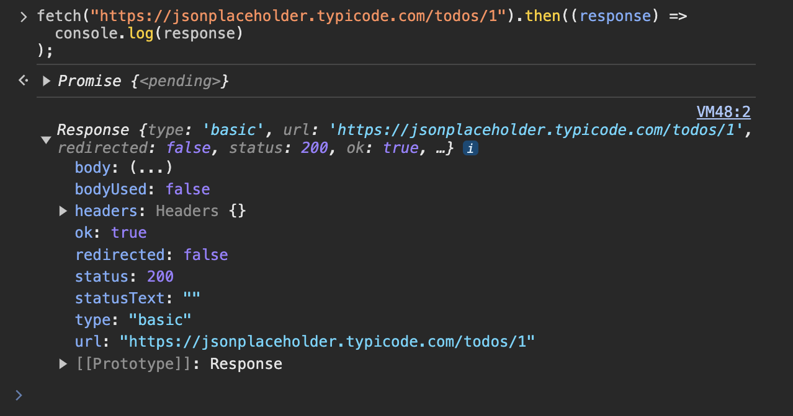

# 📖 프로미스

자바스크립트는 비동기 처리를 위한 하나의 패턴으로 콜백 함수를 사용한다. 하지만 콜백 헬로 인해 가독성이 나쁘고 비동기 처리 중 발생한 에러 처리가 곤란하고 여러개의 비동기 처리를 한 번에 처리하는 것도 한계가 있다.

이러한 단점을 보완하기 위해 ES6에서 도입된 것이 프로미스 패턴이다.

<br/>

## 비동기 처리를 위한 콜백 패턴의 단점

### ✅ 콜백 헬

비동기식 처리 모델은 병렬적으로 태스크를 수행한다.
태스크가 종료되지 않응 상태라고 하더라도 대기하지 않고 즉시 다음 태스크를 실행한다.



이후 서버로부터 데이터가 응답되면 이벤트가 발생하고 이벤트 핸들러가 데이터를 가지고 수행할 태스크를 계속해서 수행한다. 자바스크립트 대부분의 `DOM 이벤트와 Timer 함수(setTimeout, setInterval), Ajax 요청`은 비동기식 처리 모델로 동작한다.

비동기식 처리 모델은 요청을 병렬로 처리하기 때문에 다른 요청이 블로킹(작업 중단)되지 않는 장점이 있다.

👉 하지만 비동기 처리를 위해 콜백 패턴을 사용하면 처리 순서를 보장하기 위해 여러 개의 콜백 함수가 네스팅(중첩)되어 복잡도가 높아지는 콜백 헬(Callback Hell)이 발생될 수 있다. 콜백 헬은 가독성이 나쁘고 실수를 유발하는 원인이 된다.

```js
<!DOCTYPE html>
<html>
<body>
  <script>
    // 비동기 함수
    function get(url) {
      // XMLHttpRequest 객체 생성
      const xhr = new XMLHttpRequest();

      // 서버 응답 시 호출될 이벤트 핸들러
      xhr.onreadystatechange = function () {
        // 서버 응답 완료가 아니면 무시
        if (xhr.readyState !== XMLHttpRequest.DONE) return;

        if (xhr.status === 200) { // 정상 응답
          console.log(xhr.response);
          // 비동기 함수의 결과에 대한 처리는 반환할 수 없다.
          return xhr.response; // ①
        } else { // 비정상 응답
          console.log('Error: ' + xhr.status);
        }
      };

      // 비동기 방식으로 Request 오픈
      xhr.open('GET', url);
      // Request 전송
      xhr.send();
    }

    // 비동기 함수 내의 readystatechange 이벤트 핸들러에서 처리 결과를 반환(①)하면 순서가 보장되지 않는다.
    const res = get('http://jsonplaceholder.typicode.com/posts/1');
    console.log(res); // ② undefined
  </script>
</body>
</html>
```

get 함수가 호출되면 get 함수의 실행 컨텍스트가 생성되고 호출 스택(실행 컨텍스트 스택)에서 실행된다. get 함수가 반환하는 xhr.response는 readystatechange 이벤트 핸들러가 반환한다.

get 함수가 종료하면 곧바로 console.log(②)가 호출되어 호출 스택에 들어가 실행된다. console.log가 호출되기 직전에 readystatechange 이벤트가 이미 발생했다하더라도 이벤트 핸들러는 console.log보다 먼저 실행되지 않는다.

console.log 호출 시점 이전에 readystatechange 이벤트가 이미 발생했다하더라도 get 함수가 종료하면 곧바로 console.log가 호출되어 호출 스택에 들어가기 때문에 readystatechange 이벤트의 이벤트 핸들러는 console.log가 종료되어 호출 스택에서 빠진 이후 실행된다. 만약 get 함수 이후에 console.log가 100번 호출된다면 readystatechange 이벤트의 이벤트 핸들러는 모든 console.log가 종료한 이후에나 실행된다.

때문에 get 함수의 반환 결과를 가지고 후속 처리를 할 수 없다. 즉, 비동기 함수의 처리 결과를 반환하는 경우, 순서가 보장되지 않기 때문에 그 반환 결과를 가지고 후속 처리를 할 수 없다. 즉, 비동기 함수의 처리 결과에 대한 처리는 비동기 함수의 콜백 함수 내에서 처리해야 한다. 이로 인해 콜백 헬이 발생한다.

### ✅ 에러 처리의 한계

```js
try {
  setTimeout(() => {
    throw new Error("Error!");
  }, 1000);
} catch (e) {
  console.log("에러를 캐치하지 못한다..");
  console.log(e);
}
```

비동기 처리 함수의 콜백 함수는 해당 이벤트가 발생하면 태스트 큐(Task queue)로 이동한 후 호출 스택이 비어졌을 때, 호출 스택으로 이동되어 실행된다.

setTimeout 함수는 비동기 함수이므로 콜백 함수가 실행될 때까지 기다리지 않고 즉시 종료되어 호출 스택에서 제거된다. 이후 이벤트가 발생하면 setTimeout 함수의 콜백 함수는 태스트 큐로 이동한 후 호출 스택이 비어졌을 때 호출 스택으로 이동되어 실행된다. 이때 setTimeout 함수는 이미 호출 스택에서 제거된 상태이다.

예외(exception)는 호출자(caller) 방향으로 전파된다. 하지만 위에서 살펴본 바와 같이 setTimeout 함수의 콜백 함수를 호출한 것은 setTimeout 함수가 아니다. 따라서 setTimeout 함수의 콜백 함수 내에서 발생시킨 에러는 catch 블록에서 캐치되지 않아 프로세스는 종료된다.

<br/>

## 프로미스의 생성

프로미스는 Promise 생성자 함수를 통해 인스턴스화 하여 생성한다.

```js
// Promise 객체의 생성
const promise = new Promise((resolve, reject) => {
  // 비동기 작업을 수행한다.

  if (/* 비동기 작업 수행 성공 */) {
    resolve('result');
  }
  else { /* 비동기 작업 수행 실패 */
    reject('failure reason');
  }
});
```

Promise는 비동기 처리가 성공(fulfilled)하였는지 또는 실패(rejected)하였는지 등의 상태(state) 정보를 갖는다.
Promise 생성자 함수가 인자로 전달받은 콜백 함수는 내부에서 비동기 처리 작업을 수행한다.

| 상태      | 의미                                       | 구현                                               |
| --------- | ------------------------------------------ | -------------------------------------------------- |
| pending   | 비동기 처리가 아직 수행되지 않은 상태      | resolve 또는 reject 함수가 아직 호출되지 않은 상태 |
| fulfilled | 비동기 처리가 수행된 상태 (성공)           | resolve 함수가 호출된 상태                         |
| rejected  | 비동기 처리가 수행된 상태 (실패)           | reject 함수가 호출된 상태                          |
| settled   | 비동기 처리가 수행된 상태 (성공 또는 실패) | resolve 또는 reject 함수가 호출된 상태             |

<br/>

## 프로미스의 후속 처리 메서드

Promise로 구현된 비동기 함수는 Promise 객체를 반환하여야 한다. Promise로 구현된 비동기 함수를 호출하는 측(promise consumer)에서는 Promise 객체의 후속 처리 메소드(then, catch)를 통해 비동기 처리 결과 또는 에러 메시지를 전달받아 처리한다.

Promise 객체는 상태를 갖는다고 하였다. 이 상태에 따라 후속 처리 메소드를 체이닝 방식으로 호출한다. Promise의 후속 처리 메소드는 아래와 같다.

### ✅ then

then 메소드는 두 개의 콜백 함수를 인자로 전달 받는다. 첫 번째 콜백 함수는 성공(fulfilled, resolve 함수가 호출된 상태) 시 호출되고 두 번째 함수는 실패(rejected, reject 함수가 호출된 상태) 시 호출된다.
then 메소드는 Promise를 반환한다.

### ✅ catch

예외(비동기 처리에서 발생한 에러와 then 메소드에서 발생한 에러)가 발생하면 호출된다. catch 메소드는 Promise를 반환한다.

<br/>

## 프로미스의 에러 처리

비동기 처리 결과에 대한 후속 처리는 Promise 객체가 제공하는 후속 처리 메서드 then, catch, finally를 사용하여 수행한다. 비동기 처리 시에 발생한 에러는 then 메서드의 두 번째 콜백 함수로 처리할 수 있다.

```js
const wrongUrl = "https://jsonplaceholder.typicode.com/XXX/1";

// 부적절한 URL이 지정되었기 때문에 에러가 발생한다.
promiseAjax(wrongUrl).then(
  (res) => console.log(res),
  (err) => console.error(err)
); // Error: 404
```

catch 메서드를 모든 then 메서드를 호출한 이후에 호출하면 비동기 처리에서 발생한 에러(reject 함수가 호출된 상태)뿐만 아니라 then 메서드 내부에서 발생한 에러까지 모두 캐치할 수 있다.

또한 then 메서드에 두 번째 콜백 함수를 전달하는 것보다 catch 메서드를 사용하는 것이 가독성이 좋고 명확하다. 따라서 에러 처리는 then 메서드에서 하지 말고 catch 메서드를 사용하는 것을 권장한다.

```js
promiseAjax("https://jsonplaceholder.typicode.com/todos/1")
  .then((res) => console.xxx(res))
  .catch((err) => console.error(err)); // TypeError: console.xxx is not a function
```

<br/>

## 프로미스 체이닝

비동기 함수의 처리 결과를 가지고 다른 비동기 함수를 호출해야 하는 경우, 함수의 호출이 중첩(nesting)이 되어 복잡도가 높아지는 콜백 헬이 발생한다. `프로미스는 후속 처리 메소드를 체이닝(chainning)하여 여러 개의 프로미스를 연결하여 사용`할 수 있다. 이로써 콜백 헬을 해결한다.

Promise 객체를 반환한 비동기 함수는 프로미스 후속 처리 메소드인 then이나 catch 메소드를 사용할 수 있다. 따라서 then 메소드가 Promise 객체를 반환하도록 하면(then 메소드는 기본적으로 Promise를 반환한다.) 여러 개의 프로미스를 연결하여 사용할 수 있다.

<br/>

## 프로미스의 정적 메서드

Promise는 주로 생성자 함수로 사용되지만 함수도 객체이므로 메소드를 갖을 수 있다. Promise 객체는 4가지 정적 메소드를 제공한다.

### ✅ Promise.resolve / Promise.reject

존재하는 값을 Promise로 래핑하기 위해 사용한다.

```js
const resolvedPromise = Promise.resolve([1, 2, 3]);
resolvedPromise.then(console.log); // [ 1, 2, 3 ]
```

정적 메소드 Promise.resolve 메소드는 인자로 전달된 값을 resolve하는 Promise를 생성한다.

```js
const rejectedPromise = Promise.reject(new Error("Error!"));
rejectedPromise.catch(console.log); // Error: Error!
```

Promise.reject 메소드는 인자로 전달된 값을 reject하는 프로미스를 생성한다.

### ✅ Promise.all

Promise.all 메소드는 프로미스가 담겨 있는 배열 등의 이터러블을 인자로 전달 받는다. 그리고 전달받은 모든 프로미스를 병렬로 처리하고 그 처리 결과를 resolve하는 새로운 프로미스를 반환한다.

```js
const githubIds = ["jeresig", "ahejlsberg", "ungmo2"];

Promise.all(githubIds.map((id) => fetch(`https://api.github.com/users/${id}`)))
  // [Response, Response, Response] => Promise
  .then((responses) => Promise.all(responses.map((res) => res.json())))
  // [user, user, user] => Promise
  .then((users) => users.map((user) => user.name))
  // [ 'John Resig', 'Anders Hejlsberg', 'Ungmo Lee' ]
  .then(console.log)
  .catch(console.log);
```

### ✅ Promise.race

Promise.race 메소드는 Promise.all 메소드와 동일하게 프로미스가 담겨 있는 배열 등의 이터러블을 인자로 전달 받는다. 그리고 Promise.race 메소드는 Promise.all 메소드처럼 모든 프로미스를 병렬 처리하는 것이 아니라 가장 먼저 처리된 프로미스가 resolve한 처리 결과를 resolve하는 새로운 프로미스를 반환한다. 에러가 발생한 경우는 Promise.all 메소드와 동일하게 처리된다.

```js
Promise.race([
  new Promise((resolve) => setTimeout(() => resolve(1), 3000)), // 1
  new Promise((resolve) => setTimeout(() => resolve(2), 2000)), // 2
  new Promise((resolve) => setTimeout(() => resolve(3), 1000)), // 3
])
  .then(console.log) // 3
  .catch(console.log);
```

<br/>

## 마이크로태스크 큐

콜백 함수와 이벤트 핸들러를 일시 저장하는 태스크 큐와 동일한 개념이지만, 마이크로태스크 큐는 태스크 큐 보다 우선순위가 높다.

```js
setTimeout(() => console.log(1), 0);

Promise.resolve()
  .then(() => console.log(2))
  .then(() => console.log(3));
```

1 -> 2 -> 3 으로 출력될 것처럼 보이지만, 2 -> 3 -> 1 순으로 출력된다. 프로미스의 후속처리 메서드의 콜백 함수는 태스크 큐가 아니라 마이크로태스크 큐에 저장되기 때문이다.

<br/>

## fetch

fetch 함수는 XMLHttpRequest 객체와 마찬가지로 HTTP 요청 전송 기능을 제공하는 클라이언트 사이드 Web API이다. XMLHttpRequest 객체 보다 사용법이 간단하고 프로미스를 지원하기 때문에 비동기 처리를 위한 콜백 패턴의 단점에서 자유롭다.

```js
fetch("https://jsonplaceholder.typicode.com/todos/1").then((response) =>
  console.log(response)
);
```

fetch 함수는 Response 객체를 래핑한 Promise 객체를 반환하고, 프로미스가 resolve한 Response 객체는 HTTP 응답을 나타내는 다양한 프로퍼티를 제공한다.



fetch 함수가 반환하는 프로미스는 기본적으로 404 NOT FOUND나 500 INTERNAL SERVER ERROR와 같은 HTTP 에러가 발생해도 에러를 reject 하지 않고 불리언 타입의 OK 상태를 false로 설정한 Response 객체를 resolve 한다. 오프라인 등의 네트워크 장애나 CORS 에러에 의해 요청이 완료되지 못한 경우에만 프로미스를 reject한다.

(🤔 참고로 axios는 모든 HTTP 에러를 reject하는 프로미스를 반환하므로 모든 에러를 catch에서 처리할 수 있어서 편리하다. 또한 인터셉터, 요청 설정 등 fetch 보다 좀 더 다양한 기능을 지원한다.)

<br/>
