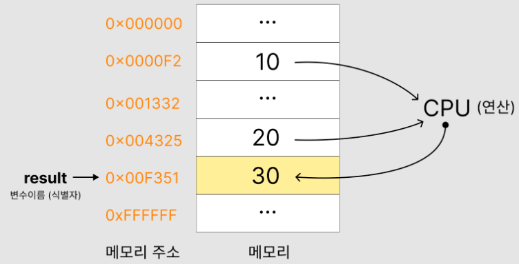
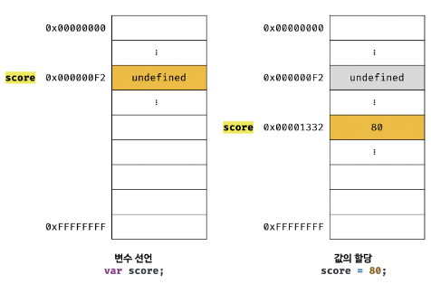
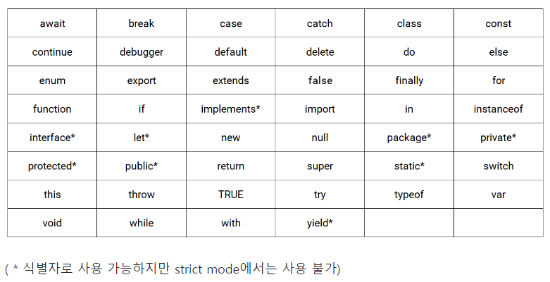

## 4.1 변수란 무엇인가? 왜 필요한가?

**변수** 는 프로그래밍 언어에서 데이터를 관리하기 위한 핵심 개념
<br/>

```javascript
10 + 20
```
컴퓨터는 위 식을 해결하기 위해 cpu를 사용해서 연산하고 메모리를 사용해 데이터를 기억
<br/>
<p align="center">
    
</p>

- 메모리는 데이터를 저장할 수 있는 셀의 집합체
- 메모리 셀 하나의 크기는 1바이트(8비트)
- 컴퓨터는 메모리 셀의 크기. 즉 1바이트 단위로 데이터를 저장하거나 읽음
- 각 셀은 고유의 메모리 주소를 갖는다

<br/>
위 예제를 해석한다면<br/> 
<br/>

```
10과 20은 임의의 위치(메모리주소)에 저장되고 cpu는 이 값을 읽어 연산하고
연산된 값 30은 임의의 위치에 저장됨
```

💡**컴퓨터는 모든 데이터를 2진수로 처리한다.**

⚠️30을 재사용 하려면 30이 저장된 메모리 공간에 직접 접근해야하는데 직접 접근하게되면
치명적 오류를 발생시킬 가능성이 높기 때문에 우리는 프로그래밍 언어에서 제공하는
변수라는 메커니즘을 사용할 수 있다.

**변수는 하나의 값을 저장하기 위해 확보한 메모리 공간 자체 또는 그 메모리 공간을 식별하기 위해 붙인 이름**

간단하게 정리한다면 값을 저장하고 참조하는 메커니즘으로 값의 위치를 가리키는 상징적인 이름

```javascript
var result = 10 + 20
```
<br/>
<p align="center">
    
</p>

- **할당(대입, 저장)** : 변수에 값을 저장하는것
- **참조** : 변수에 저장된 값을 읽어 들이는 것

**💡저장된 값의 의미를 파악할 수 있는 변수 이름은 가독성을 높이는 부수적인 효과가 있다**

## 4.2 식별자
<br/>
<p align="center">
    
</p>

- 식별자는 언떤 값을 구별해서 식별할 수 있는 고유한 이름을 말한다
- 변수 이름을 식별자라고도 한다
- 식별자는 값이 아니라 메모리 주소를 기억하고 있다
- 메모리 상에 존재하는 어떤 값을 식별할 수 있는 이름은 모두 식별자라고 부른다<br/>
(변수, 함수, 클래스 등등)
<br>

<details>
<summary>비밀의 공간</summary>

<!--summary 아래 빈칸 공백 두고 내용을 적는공간-->
그러니깐 위 이미지 보면 result -> 0x00F351 = 30 이렇게 적혀있는데 
식별자 result 는 30을 기억하는게 아니라 30이 할당된 메모리 주소 0x00F351 를 기억함
그래서 식별자가 기억하고 있는 메모리 주소를 통해 메모리 공간에 접근가능할 수 있음<br>
오오오 대박 ✌️✌️✌️✌️✌️✌️
</details>

## 4.3 변수 선언

**변수 선언** : 값을 저장하기 위한 메모리 공간을 확보하고 변수 이름과 확보된 메모리 공간의 주소를 연결해서 값을 저장할 수 있게 준비. 간단하게 정리하자면
<span style='background-color: #fff5b1; color: black'> **변수를 생성하는 것** </span>

변수를 사용 하려면 반드시 선언이 필요함.<br> 
**let, var, const 키워드를 사용**

<details>
<summary>😁😁참고~참고~</summary>
차후에 13장 scope에서 다뤄보겠지만 짧게 정리한다면
let과 const 가 나오기 전 ES5에서는 var 키워드를 사용하였는데 단점이 
var는 블록스코프를 지원하지 않고 함수 스코프를 지원함
이로 인해 의도치 않게 전역 변수가 선언되어 심각한 부작용이 발생함
이러한 단점을 보완하기 위해 ES6에서 let과 const 키워드를 도입함
</details>
<br>

```javascript
var score;
```
<br/>
<p align="center">
    
</p>


위 변수 선언 과정은 2단계로 나누어 진다
1. 변수 이름 등록 (선언 단계)
2. 값을 저장할 메모리 공간 확보 (초기화 단계)
3. 확보된 메모리 공간에는 자바스크립트 엔진에 의해 <span style='background-color: #fff5b1; color: black'>undefined값이 암묵적으로 할당되어 초기화</span>(초기화 단계)

**💡변수 선언은 선언 단계와 초기화 단계 동시에 진행됨**

**초기화** : 변수가 선언된 이후 최초로 값을 할당하는 것

<br>
📀변수 이름이 등록되는 곳<br>
<br>

**실행 컨텍스트** : 모든 식별자가 등록됨<br>
자바스크립트 엔진이 소스코드를 평가하고 실행하기 위해 필요한 환경을 제공하고 실행 결과를 실제로 관리하는 영역
<br><br>
💡나중에 13장, 23장에서 자세하게 알아볼 예정이니 실행 컨텍스트에 의해 변수의 존재를 알린다정도만 알아봐용
<br><br>

<details>
<summary>😁😁참고~참고~</summary>

1. 만약 초기화 단계를 거치치 않으면 확보된 메모리 공간에는 이전에 다른 애플리케이션이 사용했던 값이 남아 있을 수 있다. 이러한 값을 쓰레기 값이라고 함

2. 선언하지 않는 식별자에 접근 하면 ReferenceError(참조에러) 발생
</details>


## 4.4 변수 선언의 실행 지점과 변수 호이스팅

```javascript
console.log(score); //undefined
var score; //변수 선언문
```

자바스크립트는 인터프리터에 의해 위에서 아래로 한줄씩 순차적으로 실행 됨

근데 위 코드를 봤을 때 score가 선언되기 전에 값이 출력된 걸 볼 수 있는데<br>
**<span style='background-color: #fff5b1; color: black'>그 이유는 소스코드가 한줄씩 순차적으로 실행되는 시점, 즉 런타임이 아니라 그 이전 단계에서 실행되기 때문</span>**

런타임 이전 단계는 소스코드 실행을 위한 준비 단계인 소스코드의 평가 과정에서 모든 선언문을 찾아서 먼저 실행함

다시 정리하자면
1. 실행 컨텍스트에서 소스코드의 평가 과정에서 자바스크립트 엔진은 <span style='background-color: #fff5b1; color: black'>소스코드 어디에 있든 상관 없이 모든 선언문 찾아서 실행</span>
2. 소스코드 위에서부터 실행

**<span style='background-color: #fff5b1; color: black'>이처럼 변수 선언문이 코드의 위로 끌어 올려진 것처럼 동작하는 자바스크립트 고유의 특징을 변수 호이스팅이라고 한다</span>**

**💡var, let, const, function, class 키워드를 사용해서 선언하는 모든 식별자(변수,함수, 클래스 등)는 호이스팅 됨**

## 4.5 값의 할당
변수의 값을 할당할 때는 할당 연산자 '='을 사용한다.

```javascript
var score; //변수 선언문
score = 80; // 값 할당

//단축표현
var score = 80; //선언과 값 할당
```
💡변수의 선언과 값 할당을 하나의 문으로 단축 표현해도 2개의 문으로 각각 나누어 실행

변수선언은 실행 컨텍스트에서 소스코드 평가 과정에서 실행되고 <br>
값의 할당은 소스 코드에서 순차적으로 실행
<br/>
<p align="center">
    
</p>

**값을 할당하게 되면 이전 값 undefined가 저장되어 있던 메모리 공간을 지우는게 아니라 80을 저장할 새로운 메모리 공간을 확보하고 그 안에 80을 저장함**

## 4.6 값의 재할당
**재할당** : 이미 값이 할당되어 있는 변수에 새로운 값을 또다시 할당하는 것

```javascript
var score = 80; //선언과 값 할당
score = 90; // 값을 재할당
```

<br/>
<p align="center">
    
</p>


위 이미지의 과정을 보면(값의 할당에서의 설명과 같음)

90을 저장할 새로운 메모리 공간을 확보하고 그 안에 90을 저장한다

**<span style='font-size:20px;'>🤔근데 전의 값이 있던 메모리 공간은 어떻게 될까요?</span>**

가비지 콜렉터에 의해 메모리에서 자동 해제된다.<br> 단, 메모리에서 언제 해제될지는 예측 불가

**가비지 콜렉터** : 애플리케이션이 할당한 메모리 공간을 주기적으로 검사하여 더 이상 사용되지 않는 메모리를 해제하는 기능을 말함

**<span style='font-size:20px;'>🔧메모리 관리 방식에는 언매니지드 언어와 매니지드 언어!!</span>**

**언매니지드 언어** 
- 메모리 제어를 개발자가 주도할 수 있음
- 개발자의 역량에 따라 최적의 성능을 확보할 수 있음
- 치명적 오류를 생산할 가능성도 있음
- 대표적으로 C언어 있음


**매니지드 언어**
- 개발자가 명시적으로 메모리를 할당하고 해제할 수 없다
- 더이상 사용하지 않는 메모리의 해제는 가비지 콜렉터가 수행하며, 이또한 개발자가 관여 할 수 없다.
- 개발자의 역량에 의존하는 부분이 상대적으로 작아져 어느정도 일정한 생산성을 확보할 수 있다
- 성능면에서는 어느정도의 손실 감수해야함
- 대표적으로 자바스크립트 있음


## 4.7 식별자 네이밍 규칙
<span style='font-size:18px;'>네이밍 규칙</span>
- 식별자는 특수문자를 제외한 문자, 숫자, 언더스코어(_), 달러기호($)를 포함 할 수 있음
- 단 식별자는 특수문자를 제외한 문자, 언더스코어(_), 달러기호($)로 시작해야한다. 숫자로 시작하는 것은 허용하지 않음
- 예약어는 식별자로 사용할 수 없다

<span style='font-size:18px;'>예약어 종류</span><br>
<p align="center">
    
</p>


```javascript
//여러개 한번에 선언 가능하지만 가독성이 떨어짐
var person, $elem, _name, first_name, val1;

//알파벳 외의 유니코드 문자로 명명된 식별자를 사용하는것은 바람직하지 않음
var ネーム;

//자바스크립트는 대소문자 구별하므로 다음 변수는 별개의 변수이다
var firstname;
var firstName;
var FIRSTNAME;

//의미 있고 좋은 변수 이름은 가독성을 높인다
var score = 100;
```

<span style='font-size:18px;'>4가지 유형의 네이밍 컨벤션</span>
```javascript
//카멜 케이스(cameCase)
var firstName;

//스네이크 케이스(snake_case)
var first_name;

//파스칼 케이스(PascalCase)
var FirstName;

//헝가리언 케이스(typeHungarianCase)
var strFirstName; //type + identifier
var $elem = document.getElementById('myId'); //DOM노드
var observable$ = fromEvent(document, 'click'); //RxJS 옵저버블
```